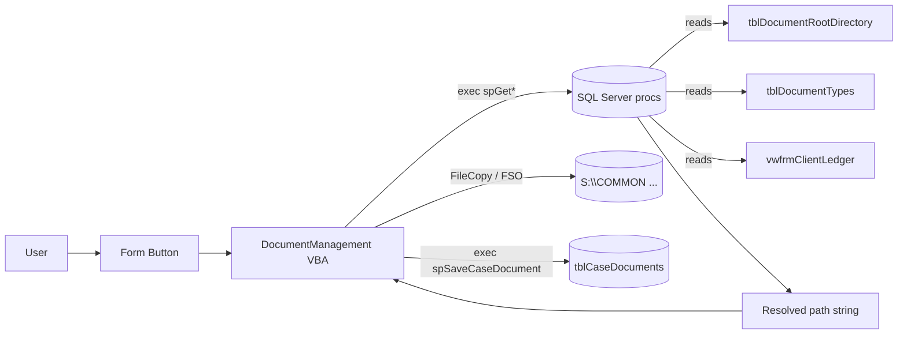

# TBCMS Document Management — Current-State Analysis

This document captures the document/file management subsystem of TBCMS as it
exists today, grounded in both the VBA extract under
`msaccess/TBCMS/extract/` and a live review of the SQL Server database
`TateByWater` on `awsql2022dev` (mirror of production `tbf-cms`).

## 1. Architecture at a glance

TBCMS is a split application:

- **Frontend** — per-user `.accdb`/`.accde` (Access). Holds all VBA, no
  business data except a small `z_PCASettings` table. Connection strings
  live in `z_PCADataSources.csv` (Development → `awsql2022dev`,
  Production → `tbf-cms`).
- **Backend** — SQL Server 2022. All business tables, views, and the
  document/file logic live here. Frontend reaches them over ODBC linked
  tables and ADO (`ADODB.Connection` + `PcaGetConnnectionString()`).

All path/folder resolution is delegated to SQL Server stored procedures.
VBA never builds a path itself — it asks SQL Server.



## 2. Storage roots — `tblDocumentRootDirectory` (1 row, all NOT NULL)

| Column | Production value |
|---|---|
| `DocumentRootDirectory` | `S:\COMMON` |
| `ScannerDirectory` | `S:\COMMON\_SCANNER` |
| `AllInvoicesDirectory` | `S:\COMMON\_ALL INVOICES` |
| `ClosedFileScanDirectory` | `S:\CLOSED FILE SCANS` |
| `IntakeDirectory` | `S:\Closed File Scans\TB\Intakes` |
| `DocumentRootNaming` | `\ [Orig_Atty] \_CLIENTS\ [Case_Letter] \ [Last_Name] , ~ [First_Name] ~ [FileNo] \` |
| `DocumentClosedNaming` | `\ [Orig_Atty] \_CLIENTS\ [Case_Letter] \ _CLOSED \ [Last_Name] , ~ [First_Name] ~ [FileNo] \` |
| `ClosedFileScanNaming` | ` \ TB \ [Yr] \` |
| `AllInvoicesNaming` | *(empty)* |

A resolved open-case folder looks like:

```
S:\COMMON\PM\_CLIENTS\Criminal\Khalid, Ali Waleed C24-251-PM\
```

Closed cases inject `\_CLOSED\` as the 3rd path segment from the
office-letter onward:

```
S:\COMMON\PM\_CLIENTS\_CLOSED\Criminal\Khalid, Ali Waleed C24-251-PM\
```

`~` in a naming template is a literal space placeholder. `[Case_Letter]`
is resolved against `tblDropD.CodeVal` via the join in
`vwfrmClientLedger`.

## 3. Document type catalog — `tblDocumentTypes` (29 rows)

Unique index on `DocumentType` (the string is the natural key and the FK
target for `tblCaseDocuments.DocumentType`).

| ID | DocumentType | DocumentFolder | Visible |
|---:|---|---|---:|
| 1 | Init Intake, Notes, Documents | *(root of case folder)* | yes |
| 2 | Client ID | *(root)* | yes |
| 3 | Retainer / Contract | *(root)* | yes |
| 4 | Financial: Payments, Advanced AR, Checks | `Finance\` | yes |
| 5 | Client Documents | `Client Documents\` | yes |
| 6 | Case Notes | `Case Notes\` | yes |
| 7 | Correspondence: Letters and Emails | `Correspondence\` | yes |
| 8 | Intraoffice Emails | `Intraoffice Emails\` | yes |
| 9 | Pleadings: Charges, Motions, Memos | `Pleadings\` | yes |
| 10 | Discovery | `Discovery\` | yes |
| 11 | TB Disc Requests | `Discovery\TB Disc Requests\` | yes |
| 12 | TB Disc Responses | `Discovery\TB Disc Responses\` | yes |
| 13 | TB Client Disc Documents | `Discovery\TB Client Disc Documents\` | yes |
| 14 | OC Disc Requests | `Discovery\OC Disc Requests\` | yes |
| 15 | OC Disc Responses | `Discovery\OC Disc Responses\` | yes |
| 16 | Exhibits | `Exhibits\` | yes |
| 17 | Jury Instructions | `Jury Instructions\` | yes |
| 18 | Trial Notes | `Trial Notes\` | yes |
| 19 | Court Orders | `Court Orders\` | yes |
| 20 | Drafted Contracts, MSA | `Drafted Contracts\` | yes |
| 21 | Deeds | `Deeds\` | yes |
| 22 | Client Medical Records | `Client Medical Records\` | yes |
| 23 | Insurance Documents | `Insurance Docs\` | yes |
| 24 | Estate Documents | `Estate Docs\` | yes |
| 25 | Client Invoices | `Invoices\` | yes |
| 26 | Miscellaneous | `Misc\` | yes |
| 27 | Closed Final | *(root)* | yes |
| 30 | General | *(root)* | yes |
| 31 | Intake | *(intake folder)* | **hidden** |

`DocumentNamingRule` templates use four token kinds, all evaluated by
`fnGetListOfWords` + dynamic SQL:

- `[Field]` → substituted from `vwfrmClientLedger` (`Last_Name`,
  `First_Name`, `FileNo`, `Yr`, `Orig_Atty`, `Case_Letter`,
  `CaseOpenDate`).
- `[CaseOpenDate]` → ISO date formatted.
- `<currentdate>` → today, ISO formatted.
- `(customuserentry)` → literal placeholder `<type here>` that the user
  is expected to overwrite in the Save As dialog.
- `~` → literal space placeholder (since the tokenizer splits on space).

Example: `[Last_Name] [FileNo] <CurrentDate> (customuserentry)` →
`Hodge D24-329-RLF 2025-05-11 <type here>`.

The `Intake` type uses an unusual `[GI#Last#Name]` token form where `#`
is `REPLACE`d with space after tokenization — a workaround because the
tokenizer would otherwise split `GI Last Name` into three tokens.

## 4. Case document ledger — `tblCaseDocuments` (18,561 rows)

```
CaseDocumentID INT PK
CaseID         INT NOT NULL  -- FK → tblCase
DocumentType   VARCHAR(250) NOT NULL  -- FK → tblDocumentTypes(DocumentType)
DocumentFileName VARCHAR(500) NOT NULL  -- full UNC path
CreatedOn      DATETIME NOT NULL
```

- **No uniqueness on `(CaseID, DocumentType)`**. Multiple rows per pair
  are normal: 10,190 distinct pairs across 18,561 rows (avg 1.83 files
  per pair). Outliers exist (one case has 243 "General" rows).
- `spGetCaseDocument` returns `TOP 1 ... ORDER BY CreatedOn DESC` — only
  the most-recent file is reachable from the UI; older rows are
  effectively orphaned but still present.
- Top types by row count: `Closed Final` 5,750, `General` 5,714,
  `Client Invoices` 2,933, `Retainer / Contract` 1,023,
  `Init Intake, Notes, Documents` 916.
- **Coverage gap**: only 6,610 of 10,959 cases (60.3%) have any row
  here. Older cases were never indexed into the ledger.

## 5. Stored procedures — all path/file logic

| Procedure | Inputs | Returns | Purpose |
|---|---|---|---|
| `spGetDocumentFolderName` | `@DocumentType, @CaseID` | folder path | Open-case folder. Reads `DocumentRootNaming`, runs dynamic SQL through `vwfrmClientLedger`. |
| `spGetClosedDocumentFolderName` | `@DocumentType, @CaseID` | folder path | Same but uses `DocumentClosedNaming` (injects `\_CLOSED\`). |
| `spGetClosedFileScanFolderName` | `@DocumentType, @CaseID` | folder path | Archive folder under `S:\CLOSED FILE SCANS`. Needs `Yr` column. |
| `spGetAllInvoicesFolderName` | `@CaseID` | folder path | Firm-wide invoice mirror. Hardcodes `DocumentType='General'` to fetch the trailing per-type folder. |
| `spGetIntakeFolderName` | none | folder path | Trivial `SELECT IntakeDirectory FROM tblDocumentRootDirectory`. |
| `spGetDocumentFileName` | `@DocumentType, @CaseID` | filename | Resolves `DocumentNamingRule` for the type. `[CaseOpenDate]` gets ISO formatting; `<currentdate>` becomes today; `(customuserentry)` becomes literal `<type here>`. |
| `spGetIntakeDocumentFileName` | `@IntakeID` | filename | Same template engine against `[TB Intakes]` with the hidden `Intake` type. |
| `spGetCaseDocument` | `@CaseID, @DocumentType` | one row | `TOP 1` of `tblCaseDocuments` by `CreatedOn DESC`. |
| `spSaveCaseDocument` | `@CaseID, @DocumentType, @DocumentName` | — | First `DELETE` where `(CaseID, DocumentFileName)` match (regardless of type), then `INSERT`. So re-saving an existing path replaces; new path adds. |
| `spMoveDocumentFolder` | `@CaseID, @CaseStatus` | — | DB-only path rewrite. For each `tblCaseDocuments` row of the case: split on `\`, drop any `_CLOSED` segment, inject `\_CLOSED` after the 3rd segment if closing, write back. **Does not move files** — VBA's `FSO.CopyFolder`/`DeleteFolder` does that separately. |
| `spGetCaseClosedStatus` | `@CaseID` | bit | Reads `tblCase.Closed`. |

Helper UDF `fnGetListOfWords(@string, @delimiter)` is the tokenizer used
by every template-resolving proc. Recursive CTE returning `(Word,
Position)` tuples.

All path-resolving procs build a dynamic SQL string and `EXEC()` it —
the result-set is the path. Any change to the substitution language or
to `vwfrmClientLedger` columns ripples through all of them.

## 6. VBA wrappers and form entry points

### Core module — `extract/vba/modules/DocumentManagement.txt`

Wraps every SP above (one VBA function per SP). Adds three filesystem
operations:

- `FolderExistsCreate(path, createIfNotExist)` — walks segments and
  `MkDir`s each missing piece. Lazy folder creation.
- `SaveScannedFileAs(CaseID, DocumentType, sourceFile, CaseStatus)` —
  resolves destination folder/file, shows Save As dialog pre-filled,
  `FileCopy` from source, conditionally double-copies to "CLOSED FILE
  SCANS" if `DocumentType = "Closed Final"`, finally calls
  `SaveCaseDocument`.
- `MoveDocumentByCaseStatus(CaseID, "Closed"|"Open")` —
  `FSO.CopyFolder` source → target, `FSO.DeleteFolder` source, then
  `spMoveDocumentFolder` rewrites the DB rows.

### Form callers

| Form | Document-management actions |
|---|---|
| `frmClientLedger` | Master file panel: open folder per type, scan save (`cmdScan_Click`), close/reopen case (calls `CopyDocumentToClosedFileScan` and `MoveDocumentByCaseStatus`), Sub-folder creation (`cmdCreateFolderSub_Click`) is blocked for the 5 root types. |
| `Intakes` | Intake scan: writes file to `IntakeDirectory`, stores full path on the intake row's `Scan Location GI` column (not in `tblCaseDocuments`). |
| `frmInvoiceSent`, `frm_invoices_summary`, `Time_Keeping`, `frmTimeKeepingClosed` | Invoice PDF generation. `DoCmd.OutputTo acFormatPDF` writes to *both* the case folder and `AllInvoicesFolderName` (firm mirror), then `SaveCaseDocument` records one path. |
| `frmPersInjProvider` | Opens "Client Medical Records" folder. |
| `frmScansubform` / `frmScanLocation` | Read-only view of legacy `tblScans`. |

## 7. Parallel "scanned?" tracking — three sources of truth

A single concept ("has this case been scanned?") is recorded in three
places that do **not** stay in sync:

1. **`tblCaseDocuments`** — modern, write-through. Rows inserted by
   `SaveCaseDocument`.
2. **`tblCase` legacy flags** —
   - `Closed BIT`, `Scan BIT`, `[Scan Location] VARCHAR(MAX)`,
     `ScanNotAvail BIT`.
   - Distribution (10,959 rows): 1,470 open-unscanned, 4,046
     closed-unscanned, 5,400 closed-scanned, 6 unavailable, 37 open-
     scanned (anomalous).
   - Drives the work-queues `qryToBeScanned`,
     `qryCaseIDclientsclosednotscanned`.
   - Set only when `CopyDocumentToClosedFileScan` succeeds or a
     "Closed Final" doc is saved.
3. **`tblScans`** (4,678 rows, untouched by current procs):
   - `ScansID PK`, `CaseID NULL`, `ScanLocation VARCHAR(MAX) NULL`,
     `TypeofScan VARCHAR(255) NULL`, `SSMA_TimeStamp`.
   - Paths are wrapped in `#...#` markers (Access hyperlink residue).
   - Most reference `S:\CLOSED FILE SCANS\Closed Final\TB\YYYY Cases
     Closed\<Last>, <First> <FileNo>.pdf` — a pre-`_CLIENTS` layout.
   - `TypeofScan` is free-text with 57 distinct values, 66% NULL.
     Examples: `Full`, `Let`, `Pl`, `ACTIVE`, `Part 1`…`Part 7`, `RA`,
     plus typos like `Correspondencs` and one-off labels.

Intakes are a fourth, separate model: `TB Intakes.Scan Location GI`
holds the path; `Scanned GI` flags it. **Intake scans never enter
`tblCaseDocuments`** — there is no automated promotion from intake to
case for documents.

## 8. Data quality findings

These are real defects in production data, surfaced during the review:

1. **7 broken `tblCaseDocuments` rows** still have unresolved naming
   placeholders in the path, e.g.
   `S:\COMMON\RLF\CLIENTS\[Case_Letter]\Smith, John C20-...\`. These
   point at non-existent files. Likely created when the
   `vwfrmClientLedger` row was incomplete at save time.
2. **Path casing inconsistency** — `S:\CLOSED FILE SCANS\…` and
   `S:\Closed File Scans\…` both appear. NTFS doesn't care, but
   Dropbox, Linux, and URL-based systems do.
3. **Non-canonical roots** — some rows point at
   `S:\COMMON\<Atty>\Domestic\…` directly (no `_CLIENTS\` segment).
   These pre-date the current `DocumentRootNaming` value and were
   never realigned.
4. **Up to 243 files per (CaseID, DocumentType)** — `spGetCaseDocument`
   only ever returns the latest, so older rows are unreachable from
   the UI.
5. **4,349 cases (39.7%) have no row in `tblCaseDocuments`** — these
   pre-date the ledger or were never indexed. Their files (if any)
   exist on disk only.
6. **`tblCase.Scan` flag drift** — set independently of
   `tblCaseDocuments` writes. Cannot be trusted as a "has documents"
   indicator.
7. **`tblScans` is unmanaged** — no writes from current procs, no FK
   to types, no constraint on the `#…#` path format. It is a
   historical log, not part of the live workflow.
8. **Cleartext SQL Server credentials** in
   `msaccess/TBCMS/extract/z_PCADataSources.csv` — both Dev and Prod
   passwords are committed. Should be rotated before any external
   sharing of this repo.

## 9. Fragility hotspots for any future change

- **`spMoveDocumentFolder` hard-codes position 3** of the path as the
  injection point for `\_CLOSED\`. If `DocumentRootNaming` is edited
  (e.g., to add a region segment), the move silently writes paths to
  the wrong segment.
- **All path procs depend on the column set of `vwfrmClientLedger`** —
  any rename/drop of `Last_Name`, `First_Name`, `Orig_Atty`,
  `Case_Letter`, `FileNo`, `Yr`, or `CaseOpenDate` breaks every
  resolution at runtime via dynamic-SQL error.
- **`EXEC(@sql)` returns a result-set, not a scalar** — every consumer
  pulls the value via ADODB recordset. Any rewrite to scalar-returning
  procs (`sp_executesql` with OUTPUT param) is a wire-format break.
- **Folder creation is unilateral** — `FolderExistsCreate(_, True)`
  walks segments and `MkDir`s without permission checks. On a path
  the user cannot write, the failure mode is mid-walk and leaves a
  half-created tree.
- **`SaveScannedFileAs` uses a user-visible Save As dialog** —
  filenames can be overridden in the UI to anything the user types,
  diverging from `spGetDocumentFileName`'s suggested name. So the
  stored `DocumentFileName` is "whatever the user chose", not
  "whatever the rule produced".

## 10. Inventory summary

| Asset | Count | Location |
|---|---:|---|
| Document types | 29 (28 visible + 1 hidden) | `tblDocumentTypes` |
| Stored procs (file/folder) | 11 | SQL Server, all `sp%Document%`/`sp%Folder%`/`sp%Intake%`/`sp%Case*Doc*%` |
| Helper UDF | 1 | `fnGetListOfWords` |
| Case-document rows | 18,561 | `tblCaseDocuments` |
| Legacy scan rows | 4,678 | `tblScans` |
| Total cases | 10,959 | `tblCase` |
| Cases with any doc row | 6,610 (60.3%) | `tblCaseDocuments` |
| VBA module functions | 17 | `DocumentManagement.txt` |
| Form callers | 8 main forms | `extract/vba/forms/` |

## 11. Pre-migration deliverables

Anything that wants to replace this subsystem must produce, before
any code change:

1. A **DocumentType → target-folder mapping table** that is reviewed
   by legal staff (some categories like
   `Correspondence: Letters and Emails` carry compliance significance).
2. A **data-quality fix list**: the 7 broken rows, the casing
   inconsistency, the non-canonical roots, and a policy for the 243-
   row outliers (keep all? keep latest? archive older?).
3. A **scan-tracker reconciliation plan**: which of
   `tblCaseDocuments`, `tblCase.Scan`, `tblScans`, `Scanned GI`
   becomes the source of truth post-migration, and how the others
   are merged or deprecated.
4. A **`vwfrmClientLedger` column freeze** — the columns currently
   used by the path procs become part of the migration contract.
5. **Credential rotation** for the SQL Server logins committed in
   `z_PCADataSources.csv`.

See `dropbox-migration-plan.md` for the proposed target architecture
and phased rollout.
