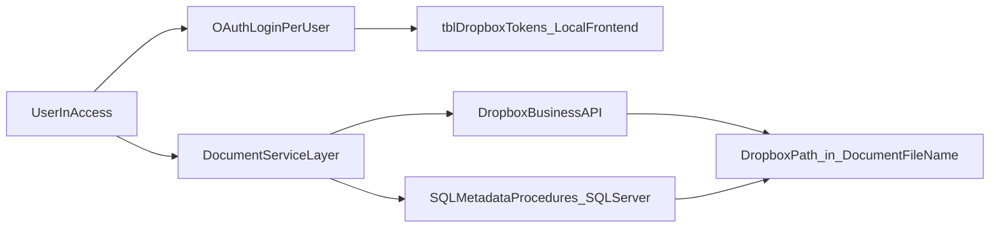

# TBCMS Dropbox Business Migration Plan

---

> **CURRENT STATE (May 2026)**
> **Production is still on S:\.** All TBCMS open/save/scan/invoice/case-move operations resolve against `S:\` paths and are working normally for end users. Firm files have been **manually copy/synced** to `/Company` on Dropbox Business, but TBCMS does not yet read or write that copy — the Dropbox tree exists as a parallel mirror, kept current by users dragging files into a desktop-synced Dropbox folder.
>
> **This plan is staged in two parts:**
> 1. **Test-environment build (Phases 0–6)** — implement the full Dropbox migration against an **isolated test environment**: a separate SQL database (`awsql2022dev/TateByWater`, the existing dev mirror) and a separate MS Access front-end (`TBCMS_Test.accde`). The test front-end is the **only** TBCMS build pointed at Dropbox. Production users keep their existing `.accde` and S:\ access untouched throughout. Test-env operations against `/Company` are **read-only** (open document + `VerificationReport`); write-flow validation strategy is a deferred decision (see Phase 0a, Test-Env Decision D1).
> 2. **Production cutover (Phase 7)** — only after the test environment passes its acceptance criteria. The production cutover itself is a separately scheduled, separately gated activity covered as the final phase of this plan; it is **not** in flight today and S:\ is **not** being decommissioned in this phase of work.
>
> Anywhere the document says "post-cutover", "after cutover", or "once Dropbox is live", read it as "after the production cutover scheduled in Phase 7" — not "today".

---

## ▶ NEXT SESSION: START HERE (paused 2026-05-17, end-to-end write verification complete)

**Phase 4 is fully complete, and the write path is now verified end-to-end against the real Dropbox tenant. You are between Phase 4 and the Phase 6.5 readiness work (specifically, Deliverable #7).**

**What changed this session (2026-05-17):**

- **Dropbox desktop client is no longer a deployment prerequisite** (deliberate design decision — see also `memory/feedback_no_dropbox_desktop.md`):
  - `OpenDocumentFolder` simplified to web-only: stripped the Explorer-first branch, now always opens the Dropbox web URL via `Application.FollowHyperlink`. Users accept the cosmetic "Unsupported path provided" banner Dropbox emits for `/work/` team-namespace deep links.
  - `GetScannerFolder` simplified to a one-line `return ""` by design. `Office.FileDialog.InitialFileName = ""` opens at the user's last-used folder. The previous `DropboxPathToLocalPath` translation was removed.
  - `DropboxService.bas` helpers `ResolveLocalSyncedRoot` / `DropboxPathToLocalPath` / `LocalPathToDropboxPath` are kept but no longer invoked from any live `DocumentManagement` flow. They fail closed (return `""` / log "skipped") if `%LOCALAPPDATA%\Dropbox\info.json` is absent.
  - File-header status block in `DocumentManagement.bas` updated: Phase 4b marked SUPERSEDED.

- **Real-tenant write verification — two new smoke tests added + passed against `/Company`**:
  - **`DropboxService.Phase4d_UploadSmokeTest`** (Section 25b in `DropboxService.bas`) — self-contained `UploadFile` → `GetMetadata` (verify) → `DeleteFile` (cleanup) cycle against `/Company/__smoke_test__/upload_<ts>_<guid>.txt`. ✅ OK 2026-05-17 (102 bytes round-tripped, audit trail in `tblDropboxAuditLog`). Use this anytime to re-verify the raw upload primitive.
  - **`DocumentManagement.Phase5_E2E_HappyPathTest(testCaseID)`** (end of `DocumentManagement.bas`) — sequenced run of all three Phase 4d write workflows (`CopyDocumentToClosedFileScan` → `SaveScannedFileAs` → `MoveDocumentByCaseStatus` forward + reverse) with strict cleanup between steps. Step 2 is semi-interactive (SaveAs dialog requires user click). ✅ OK against `CaseID = 30405` (Bold Jr., Estate Planning, KDB — Open case with 0 docs/scans) on 2026-05-17.
  - **`ALLOW_DROPBOX_WRITES` is back to `False`** in the committed source. To re-run write tests: flip in `DropboxService.bas:71`, save module, run, flip back.

**What's done across all sessions through 2026-05-17:**

- **Phase 3a–3e** — `DropboxService.bas` (~3432 lines after Phase4d_UploadSmokeTest addition, sections 1–27 + 25b). DPAPI, kill-switch, namespace header, audit/local logging, full OAuth code-exchange flow (PowerShell HttpListener + identity + revocation + refresh), read-only API ops (`OpenDocument`, `GetMetadata`, `ListFolder`, `GetTemporaryLink`, `CleanupTempFiles`), gated write API ops (`UploadFile`, `UploadLargeFile`, `MoveFile`, `CopyFile`, `DeleteFile`, `CreateFolder` — every entrypoint calls `GuardWritesEnabled`), startup orchestration (`StartupBootstrap` / `StartupShutdown` wired into `frmHome.Form_Open` / `Form_Unload`). Smoke tests: `Phase3a_SmokeTest`, `Phase3b_Pass1_SmokeTest` / `Pass2_UnitTest` / `Pass2_AuthFlowTest`, `Phase3c_SmokeTest` / `OpenDocumentTest`, `Phase3d_SmokeTest`, `Phase3e_SmokeTest`, `Phase4b_SmokeTest`, `Phase4d_UploadSmokeTest` (new) — all green on the dev machine. Authenticated as `sugianto@tatebywater.com`.

- **Phase 4a–4d** — `DocumentManagement.bas` (~1905 lines after the Phase4 follow-up trims + `Phase5_E2E_HappyPathTest` addition). Every document operation delegates to `DropboxService`:
  - `OpenDocumentFile` → `DropboxService.OpenDocument` (download to `%TEMP%\TBCMS\` + native-app launch). Validated end-to-end against real cases on `awsql2022dev/TateByWater`.
  - `OpenDocumentFolder` → web-only (see "What changed this session" above). `GetMetadata` pre-check still gates the URL launch with a friendly "folder doesn't exist yet" message when applicable.
  - `GetDocumentRootFolder` → reads `tblDropboxRootConfig.TeamRootPath` and converts via `DropboxPathToLocalPath`. Returns `""` without the desktop client. Zero callers in the project (kept for contract stability).
  - `GetScannerFolder` → returns `""` by design (see above).
  - `SaveScannedFileAs` → SP-driven destination resolution + override-with-confirmation Save-As + size-routed `UploadFile`/`UploadLargeFile` + `SaveCaseDocument` (G13 token guard) + orphan-file compensation policy (compensating `DeleteFile` on SP failure; `tblDropboxOrphanQueue` INSERT via private `QueueOrphanFile` helper if the delete also fails). Closed Final special-case copies to Closed File Scans via `CopyFile`.
  - `MoveDocumentByCaseStatus` → G2 caller: `DropboxService.MoveFile` + new `spMoveDocumentFolder(@CaseID, @OldFolderPath, @NewFolderPath)` + three-branch SP outcome handling (both>0 commit, exactly-one-zero warn+commit, throw → reverse-move compensation with CRITICAL-state surface if the reverse also fails).
  - `CopyDocumentToClosedFileScan` → `DropboxService.CopyFile` against `<ClosedFileScanRoot>/<basename(source)>`.
  - Test-environment UX polish: every write-flow `Err_Handler` intercepts `vbObjectError + 6001` specifically and shows the friendly "Dropbox writes are disabled in this test build" MsgBox (vbInformation) instead of the generic `pcaStdErrMsg` "PCA Error Message" dialog.

- **Phase 4c SQL** — `Dropbox-Migration-SQL-Install.sql` Section 8 (file is 2251 lines total). Drop+recreate of the 7 path-building / write SPs against `tblDropboxRootConfig` instead of `tblDocumentRootDirectory`:
  - `spGetIntakeFolderName`, `spGetDocumentFolderName`, `spGetClosedDocumentFolderName`, `spGetClosedFileScanFolderName`, `spGetAllInvoicesFolderName` — all wrap their dynamic SQL output in `REPLACE(..., '\', '/')` so the result is forward-slash form.
  - `spMoveDocumentFolder` (G2) — new signature, `SET XACT_ABORT ON`, both-table transaction, both-zero-rowcount THROW.
  - `spSaveCaseDocument` (G13) — token-validation guard that THROWs on `[Token]`, `<currentdate>`, `(customuserentry)` substrings.
  - Section 8.8 verification: exec each path-building SP against QUAIL/30337 and print the resolved `/Company/` path.
  - All 7 SPs live on `awsql2022dev/TateByWater`. G2 hard-fail and G13 guards confirmed via smoke tests.
  - Legacy SP bodies preserved as commented-out blocks for rollback.

- **Rollback safety pattern (file-internal)** — every rewired function in `DocumentManagement.bas` and every rewritten SP in `Dropbox-Migration-SQL-Install.sql` is preceded by a `LEGACY (pre-Phase 4x)` commented-out block holding the original body. To roll back a single function: comment out the active version, uncomment the LEGACY block, re-import / re-run. Documented in the file header of each file.

**State of artifacts on disk (committed to GitHub, branch `main`):**
- `Dropbox-Migration/DropboxService.bas` — ~3432 lines, sections 1–27 (plus Section 25b for `Phase4d_UploadSmokeTest`). No further changes anticipated for Phases 5–6 _besides_ smoke tests; production code is stable.
- `Dropbox-Migration/DocumentManagement.bas` — ~1905 lines, 20 public functions (all SP wrappers preserved with stable signatures + 5 workflow functions rewired + 2 config functions rewired) + 1 private helper + `Phase5_E2E_HappyPathTest` at the end. All 8 form callers in the plan's Phase 4 table call the same public functions with the same signatures as before.
- `Dropbox-Migration/Dropbox-Migration-SQL-Install.sql` — 2251 lines, Sections 1–8. Idempotent end-to-end installer.

**Next concrete step — Deliverable #7 (the pre-cutover `tblDropboxVerificationReport` population script):**

This is the **Phase 6.5 acceptance-gate prerequisite**. It iterates the three source tables (`tblCaseDocuments` 26,043 rows, `tblScans` 4,678 rows, `[TB Intakes]` 951 rows ≈ 30,721 paths total) and calls `DropboxService.GetMetadata` on each stored `/Company/...` path, inserting one `Found` / `NotFound` / `Error` row per check into `tblDropboxVerificationReport` (the SQL Server table created in installer Section 1.6).

**Acceptance criteria for Phase 6.5 gate (per the plan):** zero `NotFound` and zero `Error` rows in `tblDropboxVerificationReport` across all three source tables. Reach that state by running the script, triaging `NotFound` rows (usually = file missing from `/Company` because the manual sync from S:\ missed it; fixable by an IT admin copying the file into Dropbox), and re-running until counts are zero.

**Suggested implementation shape:**
1. New VBA module `Dropbox-Migration/VerificationReport.bas` (or appended into `DocumentManagement.bas` — designer's choice).
2. Public function `PopulateVerificationReport()` that:
   - Truncates `tblDropboxVerificationReport` (or accepts an `@AppendMode` flag).
   - SELECTs `(CaseDocumentID, DocumentFileName)` from `tblCaseDocuments` WHERE `DocumentFileName IS NOT NULL`.
   - For each row, calls `DropboxService.GetMetadata(path, found, errDetail, json)`, then INSERTs `(SourceTable='tblCaseDocuments', SourceRowID=CaseDocumentID, DropboxPath=path, Status=<Found|NotFound|Error>, ErrorDetail=<...>)`.
   - Same for `tblScans.ScansID` / `ScanLocation` and `[TB Intakes].[ID]` / `[Scan Location GI]`.
   - Throttling: at 1,200 calls/min Dropbox rate limit, 30,721 paths run in ~26 min minimum. Add a small `DoEvents` + progress display so the user can see progress; respect `429 Retry-After` (already handled by `DropboxService.HttpRequest` per Phase 3c).
3. After population, run summary queries against `tblDropboxVerificationReport` in SSMS — count by `Status`, count by `SourceTable`, listing of all `NotFound` for IT-admin triage.
4. Loop: fix NotFound rows (manual sync of files from S:\ to `/Company`), re-run the population script, repeat until clean.

This deliverable is **mostly read-only against Dropbox** (only `files/get_metadata`), so it can run end-to-end in the test environment without the `ALLOW_DROPBOX_WRITES` constraint affecting anything.

**Smoke-test gates before resuming:**
1. (Optional, ~5s) `? DropboxService.Phase3c_SmokeTest` — auto-validates the read-only ops still work.
2. (Optional, ~1s) `? DropboxService.Phase3d_SmokeTest` — re-confirms every write entrypoint guard fires.
3. (Optional, ~3s) `? DropboxService.Phase3e_SmokeTest` — re-runs the startup bootstrap and validates `IsTokenLoaded` / `GetDropboxAccountEmail`.
4. (Optional) `? DropboxService.Phase4b_SmokeTest` — returns `SKIP` now that the desktop-client routing has been retired (this is the expected result; the helpers still compile but aren't wired up).
5. Confirm the current token is still loaded: `? DropboxService.IsTokenLoaded()` should return `True`. If False, just reopen `TBCMS_Test.accdb` — `frmHome.Form_Open` runs the bootstrap automatically.
6. (Optional, write-path re-verification — requires `ALLOW_DROPBOX_WRITES = True` flip + revert):
   - `? DropboxService.Phase4d_UploadSmokeTest` — single-shot real upload/verify/delete against `/Company/__smoke_test__/`.
   - `? DocumentManagement.Phase5_E2E_HappyPathTest(30405)` — three-workflow end-to-end on the Bold Jr. test case (semi-interactive: SaveAs dialog on step 2). Pick a different `testCaseID` if 30405 has accumulated documents since 2026-05-17 — the pre-flight enforces `tblCaseDocuments` count = 0.

**Open decisions still blocking later phases (unchanged from prior session):**
- **D1**: write-flow validation strategy (carved-out `/Company-Test/`, sandbox team, or production dry-run) — blocks Phase 6.5
- **DocumentType folder mapping**: legal-staff sign-off on 5 special-type folder names — blocks any future intake-folder refactor
- **243-rows-per-pair policy** for `(26211, General)`: keep all / keep latest / archive — blocks Phase 1b sign-off
- **Four-tracker reconciliation policy**: which becomes source-of-truth post-cutover — blocks Phase 1b sign-off

---

## Implementation status snapshot (2026-05-17)

What's been built vs what's still planned. Cross-references the phase sections below. For the full session-by-session detail and the next concrete step, see the NEXT SESSION block above.

| Phase | Status | What exists today |
|---|---|---|
| **0a** Test environment setup | **Partial** | `TBCMS_Test.accde` runs against `awsql2022dev/TateByWater`; pre-mutation backup taken; TEST-ENVIRONMENT banner + write-guard logging wired (Phase 3d/3e). Pending: `TateBywaterTestUser` provisioning + SSMS proof it cannot reach production (currently Windows auth) |
| **0b** Dropbox prerequisites intake | Mostly done | App key `dqleswbnux8k3m5`, AppSecret captured, namespace `14334595683`, scopes + redirect URIs confirmed; D1 (write-flow validation strategy) open |
| **1a** Workflow inventory + contract freeze | Done | Captured in `.docs/document-management-analysis.md`; `vwfrmClientLedger` contract columns frozen |
| **1b** Data-quality remediation | **Partial** (see status table inside Phase 1b) | Installer auto-applies 3 fixes (`DocumentTypes` typo, B-5 intake natural-key for 4 rows, path migration); B-4 (13 rows), B-6 (198 rows), B-7 (9 rows), B-8 (1 row) surfaced via Section 7 listings but per-row triage pending |
| **2** Data model + config foundation | Done | `Dropbox-Migration-SQL-Install.sql` Section 1 creates all 6 tables + `spLogDropboxAuditEvent` + seed config rows. Verified on test DB. |
| **3** DropboxService.bas hardening | **Done** (3a–3e) | `DropboxService.bas` (3432 lines, sections 1–27 + 25b). SQL config load, DPAPI, kill-switch, namespace header, audit/local logging; `tblDropboxTokens` upgrade + DPAPI token persistence; full OAuth code-exchange flow (PowerShell HttpListener, identity, revocation, refresh, `EnsureValidToken`); read-only ops (`OpenDocument`, `GetMetadata`, `ListFolder`, `GetTemporaryLink`); six gated write entrypoints + chunked upload, each guarded by `GuardWritesEnabled`; `StartupBootstrap`/`StartupShutdown` wired into `frmHome`, TEST-ENVIRONMENT banner via `SetOption "Application Title"`. Smoke tests green on the dev machine. |
| **4** DocumentManagement compatibility | **Done** (4a–4d) | `DocumentManagement.bas` (1905 lines); all 20 public functions preserved verbatim (SP wrappers) or rewired to delegate to `DropboxService`. Installer Section 8 (live on `awsql2022dev/TateByWater`) recreates the path-building SPs against `tblDropboxRootConfig`, plus the G2 `spMoveDocumentFolder` rewrite and G13 `spSaveCaseDocument` guard. Document-open round-trip validated on real cases; folder-open opens the Dropbox web URL (desktop dependency dropped); write flows guard-block cleanly with a friendly test-env MsgBox. Legacy bodies preserved for rollback. |
| **5** Workflow-by-workflow migration | **Done** (built in Phase 4) | All 5 workflows (document-open, scan-save, invoice PDF, case close/reopen, intake) are wired in `DocumentManagement.bas`. **The write path is verified end-to-end against the real `/Company` tenant (2026-05-17 — `Phase4d_UploadSmokeTest` + `Phase5_E2E_HappyPathTest`, kill-switch temporarily flipped, with cleanup)**; routine builds keep writes gated. Pending: mail-merge inventory (Phase 5 step 5, no callers identified yet) and a repeatable UAT write-validation strategy (D1). |
| **6** Security + governance | **Not started** | Pre-cutover credential rotation (`TateBywaterSQLUser` + AppSecret in lockstep) pending; permission-matrix sign-off pending |
| **6.5** Test-env acceptance gate | **Eligible — pending Deliverable #7 + manual triage** | Gates: D1 resolved, IT-only validation against 50 rows, UAT signed off, Phase 3–6 complete. **Code work for the gate is the `VerificationReport` population script — see Deliverable #7 + the NEXT SESSION block.** |
| **7** Production cutover | **Not in flight** | Schedule TBD by IT + firm leadership after Phase 6.5 gate passes |

**Key open decisions** are listed in the NEXT SESSION block above — D1 (write-flow validation strategy), DocumentType folder mapping, the 243-rows-per-pair policy, and four-tracker reconciliation.

---

## System Context

**TBCMS** (Tate By Water Case Management System) is a law firm case management application with a split architecture:

- **Access frontend** — each user runs their own copy of `TBCMS.accdb` (a compiled/distributed `.accde`). All VBA code and local per-user tables live here. Local tables are accessed via DAO (`CurrentDb`).
- **SQL Server backend** — shared database containing all case data, documents metadata, and stored procedures. Accessed from VBA via ADO using the existing helper `PcaGetConnnectionString()` (defined in the shared utilities module). Stored procedures are called via `cn.Execute "exec spName @Param = value"`.

**Key distinction**: any table described as "local frontend" lives in the user's `TBCMS.accdb` and is accessed with `CurrentDb`. Any table described as "backend" lives in SQL Server and is accessed via `ADODB.Connection` using `PcaGetConnnectionString()`.

### Production vs. test environment

This plan operates against **two distinct environments** for the duration of Phases 0–6. Mixing them is the single largest risk in the project.

| Concern | Production (live, untouched in Phases 0–6) | Test environment (this plan, Phases 0–6) |
|---|---|---|
| SQL Server database | Production SQL host / production DB (not touched by any script in this plan until Phase 7) | `awsql2022dev/TateByWater` — the existing dev mirror. **All Phase 1b remediation, schema additions, path-migration scripts, and SP changes apply here only.** |
| MS Access front-end | Existing `TBCMS.accde` — distributed to all users, S:\-routed, unchanged | `TBCMS_Test.accde` — a separately compiled build with the test SQL connection baked in. Distributed only to designated testers (see Phase 0a). |
| File storage | `S:\COMMON\…` and `S:\Closed File Scans\…` — authoritative; users open/save/scan/close cases against S:\ as today | Dropbox `/Company/COMMON/…` and `/Company/Closed File Scans/…` — kept current by **manual user copy/sync** from S:\. Treated as **read-only** by the test front-end. |
| Dropbox app credentials | Not used | One Dropbox app (key `dqleswbnux8k3m5`) — the **same** AppKey/AppSecret pair as production, since the team has only one Dropbox tenant and `/Company` is shared. The test front-end's credential boundary is the test SQL DB, not a separate Dropbox app. |
| Write operations against `/Company` | Not applicable | **Forbidden by policy** in the test environment. `DropboxService` save/move/copy/delete code is implemented and unit-tested but is gated behind a kill-switch (`ALLOW_DROPBOX_WRITES = False`) in `TBCMS_Test.accde`. Validation strategy for the write paths is a deferred decision — see Phase 0a, Test-Env Decision D1. |

**Existing document data volumes** (verified against live `awsql2022dev/TateByWater` mirror, reassessed 2026-05-14 — this is now the test DB):
- `tblCaseDocuments`: 26,043 rows — canonical case document references; 13,571 distinct `(CaseID, DocumentType)` pairs; one outlier `(26211, General)` has 243 rows. **100% start with `S:\`** (the installer's path migration rewrites all of them).
- `tblScans`: 4,678 rows — additional scan path records; 66% of `TypeofScan` is NULL; paths are predominantly wrapped in legacy `#...#` Access-hyperlink markers. Prefix breakdown: 3,880 (83%) start `#S:\`, 26 start `S:\` (displaytext that begins `S:\`, followed by a `#…#` UNC URL suffix), 61 are NULL/empty, **and 711 (15%) are non-canonical** — see Phase 1b for the breakdown and remediation. Casing across `tblScans` is heterogeneous: 2,657 title-case "Closed File Scans" vs. 1,293 uppercase "CLOSED FILE SCANS" vs. 606 URL-encoded uppercase. **The installer does not case-normalise**; mixed casing survives. Dropbox's API lookup is case-insensitive so this is functionally fine, but the 1,293+606 uppercase rows are an ugly-data follow-up if anyone later runs case-sensitive tooling against these paths.
- `tblCase`: 11,933 rows total; only **7,634 (64.0%)** have any row in `tblCaseDocuments`. 4,299 cases pre-date the ledger.
- 29 rows in `tblDocumentTypes` (28 visible + 1 hidden `Intake` type).
- Single configuration row in `tblDocumentRootDirectory` controls all path templates and root directories (see Path Template Syntax below).

Volumes above match production at the 2026-05-14 mirror refresh. A Phase 0a checklist item re-refreshes the mirror immediately before Phase 1b remediation begins so the test DB starts from a known-recent production state.

See `document-management-analysis.md` for the full grounded review.

---

## POC Baseline

The existing POC is at `database_assessment/DropboxPOC/vba_code/DropboxAPI_POC.bas` (module name: `DropboxAPI_POC_Updated`).

**What the POC already provides (reuse as starting point):**
- OAuth 2.0 authorization code flow with `token_access_type=offline` (refresh tokens)
- `tblDropboxTokens` and `tblDropboxConfig` local Access table schemas and DDL (`CreateConfigTables`) — in production, `tblDropboxConfig` moves to SQL Server backend (shared across users); only `tblDropboxTokens` and `tblDropboxLog` remain local
- Token load/save/refresh lifecycle (`InitializeDropboxAPI`, `RefreshAccessToken`, `LoadTokens`, `SaveTokens`)
- `UploadFile`, `DownloadFile`, `CreateFolder`, `ListFolder` API wrappers
- Retry logic with exponential backoff (2s, 4s, 8s; max 3 retries) and `429` handling
- `tblDropboxLog` table and `LogError`/`LogActivity` helpers
- Hex-based token encryption (`EncryptValue`/`DecryptValue`) — **replace with DPAPI in production**

**What the POC lacks (must be built for production):**
- Multi-user token isolation — POC is single-identity/global-token
- DPAPI encryption replacing hex encoding
- `state` parameter in OAuth flow (CSRF protection)
- Local HTTP listener (`localhost:8765`) replacing manual URL-paste — **validated in `DropboxOAuthTest.bas` (May 2026)**
- `Dropbox-API-Path-Root` namespace header on every API call — **confirmed required, namespace ID `14334595683`**
- Direct Dropbox path storage — `DocumentFileName` / `ScanLocation` are rewritten to `/Company/` paths by the installer's path migration (Section 5) before cutover; no runtime translation formula required, no new DB columns
- `files/move_v2`, `files/copy_v2`, `files/delete_v2` operations
- `files/download` to `%TEMP%\TBCMS\` for document-open native-app launch (`files/get_temporary_link` retained as a utility for future link-distribution use, not the primary open path)
- Chunked upload (`files/upload_session`) for files > 150 MB
- `DropboxAccountEmail` capture and identity validation at startup
- Admin revocation check against backend `tblDropboxRevocationList`
- Shared SQL Server `tblDropboxConfig` (POC scopes config to local frontend only)

---

## Objectives

- **Build a working, validated Dropbox migration in an isolated test environment** (`awsql2022dev/TateByWater` + `TBCMS_Test.accde`) without touching production SQL, production .accde, or end-user S:\ workflows.
- Replace local/shared-folder document operations with Dropbox API operations in the test build of TBCMS.
- Require each tester to authenticate with their own Dropbox Business account.
- Preserve current business workflows (open folder/file, scan save, invoice PDF save, close/reopen case moves) in the test build's code paths, while improving auditability and reducing shared-drive dependency.
- Produce a go/no-go signal for a separately scheduled **production cutover** (Phase 7) based on test-environment acceptance criteria.

---

## Current-State Findings

### Production environment (untouched in Phases 0–6)
- **S:\ is live and authoritative.** All firm users open, save, scan, and move documents against `S:\COMMON\…` and `S:\Closed File Scans\…` exactly as they have historically.
- **`/Company` on Dropbox is a manual mirror.** Files are copy/synced to `/Company` by users using the Dropbox desktop client. There is no automated mirror job, no atomic guarantee that `/Company` matches S:\ at any given moment, and no expectation that the manual mirror is complete or current for every case. The plan must not assume `/Company` is up to date.
- The production .accde resolves paths from `tblDocumentRootDirectory` (S:\ roots) — unchanged from historical behavior.

### Code and schema (applies to both environments — test DB is a mirror of production schema)
- Core file-management logic is centralized in `database_assessment/TBCMS/extract/vba/modules/DocumentManagement.txt`.
- Main UI entry points are in `database_assessment/TBCMS/extract/vba/forms/frmClientLedger.txt` and related forms (invoice, intake, provider modules).
- Current implementation stores and opens local/UNC full file paths via SQL procedures (`spSaveCaseDocument`, `spGetCaseDocument`) and uses `FileCopy`, `Dir`, `FollowHyperlink`, and `Scripting.FileSystemObject`.
- `SaveCaseDocument(CaseID, DocumentType, DocumentFileName)` current signature — passes a full path as `DocumentFileName`. In the test environment, after the installer's path migration runs against `awsql2022dev/TateByWater`, callers pass a `/Company/`-rooted Dropbox path. **The SP signature is unchanged** — no new Dropbox-specific parameters are added.
- All stored procedure calls in `DocumentManagement` use `ADODB.Connection` with `PcaGetConnnectionString()` — new SP calls must follow this same pattern.
- **All 10 file/folder SPs** (`spGetAllInvoicesFolderName`, `spGetCaseDocument`, `spGetClosedDocumentFolderName`, `spGetClosedFileScanFolderName`, `spGetDocumentFileName`, `spGetDocumentFolderName`, `spGetIntakeDocumentFileName`, `spGetIntakeFolderName`, `spMoveDocumentFolder`, `spSaveCaseDocument`) build their result paths with **dynamic SQL** that tokenizes a naming template through `fnGetListOfWords`, substitutes columns from `vwfrmClientLedger`, and `EXEC`s the result. The naming templates and root directories live in a single row in `tblDocumentRootDirectory`. Any rewrite must preserve the template language or replace it wholesale.
- **`spMoveDocumentFolder` hard-codes position 3** of the existing path as the `_CLOSED` injection point. It cannot be retargeted to a different layout without a rewrite.
- **Three parallel "scanned?" tracking systems** exist that do not stay in sync: `tblCaseDocuments`, `tblCase.Scan`/`tblCase.[Scan Location]`/`tblCase.ScanNotAvail`, and `tblScans`. Intakes are a fourth tracker (`TB Intakes.Scan Location GI` + `Scanned GI`). Production cutover requires an explicit reconciliation policy — see Phase 1.
- **Data-quality defects observed in the dev mirror** (Phase 1 remediation backlog; presumed to exist in production likewise):
  - **13 bracket-literal rows** in `tblCaseDocuments` (`DocumentFileName LIKE '%[[]%'`) — 9 unresolved template literals + 4 truncated `[df` filenames. Both classes require per-row triage. See Phase 1b for full detail and the installer's Section 7.2 for the classified listing.
  - **Mixed path casing** (`S:\CLOSED FILE SCANS\…` vs `S:\Closed File Scans\…`). Dropbox lookup is case-insensitive so all variants resolve correctly, but the data is heterogeneous (~1,400 uppercase rows in `tblCaseDocuments`; ~1,900 uppercase / URL-encoded rows in `tblScans`). The installer does **not** case-normalise; mixed casing survives. Functionally fine, flagged as a follow-up if any downstream case-sensitive tooling lands later.
  - **198 non-canonical roots in `tblCaseDocuments`** (cases pointing at `S:\COMMON\<Atty>\<Practice>\…` without `_CLIENTS\`) that pre-date the current `DocumentRootNaming` template. None are caught by the canonical `S:\COMMON\…\_CLIENTS\…` template — each must be remediated by hand (realign to canonical path, or map to a known Dropbox path) before Phase 7 verification. **"Skip" is not an option.** See Phase 1b for the full 11-prefix breakdown.
  - **711 non-canonical `tblScans.ScanLocation` rows** (15% of `tblScans`) that a simple `S:\` → `/Company/` rewrite would not catch — the installer handles them via per-category passes B-1 through B-6. See Phase 1b for the category breakdown.
  - **4,299 cases (36.0%) have no row in `tblCaseDocuments` at all** — out of scope for TBCMS post-cutover; users access those documents directly via the Dropbox web/desktop client.
- **Workflow inventory is complete** in `.docs/document-management-analysis.md`. Phase 1 validates and freezes that contract rather than re-inventorying.

---

## Target Architecture



---

## Design Decisions (confirmed)

- **Two-stage migration**: this plan delivers an **isolated test environment** in Phases 0–6 (separate SQL DB `awsql2022dev/TateByWater`, separate front-end `TBCMS_Test.accde`, read-only against `/Company`), then a **separately scheduled production cutover** in Phase 7. Production stays on S:\ and the existing `.accde` throughout Phases 0–6. The decision to schedule Phase 7 is made by IT + firm leadership based on the test-environment acceptance gate, not by this plan.
- **Test-environment read-only constraint**: in `TBCMS_Test.accde`, `DropboxService` is built with a module-level kill-switch `ALLOW_DROPBOX_WRITES = False`. Every write entrypoint (`UploadFile`, `MoveFile`, `CopyFile`, `DeleteFile`, `CreateFolder`) checks this flag at the top and raises a "test environment is read-only against /Company" error if true. The flag is only flipped (a) inside a future test-write strategy approved per Decision D1 in Phase 0a, or (b) at production cutover, in the new production `.accde`. This is the single most important safety boundary in the project — the test DB is a mirror but `/Company` on Dropbox is **shared** with the manually-synced production content.
- **Integration mode**: API-native Dropbox operations, not filesystem sync dependency.
- **Token scope**: per-user tokens stored in each tester's local Access frontend in `tblDropboxTokens` (DAO/`CurrentDb`).
- **File reference strategy**: no new columns added to `tblCaseDocuments`, `tblScans`, or the Intakes table. `DocumentFileName` (and `tblScans.ScanLocation`, and `[TB Intakes].[Scan Location GI]`) stores the Dropbox path directly after the one-time path-migration script. All Dropbox API calls use the stored path as-is. No runtime translation is required.
- **Path migration — one consolidated installer**: `Dropbox-Migration/Dropbox-Migration-SQL-Install.sql` is the single end-to-end script. It applies Phase 2 schema, every automated Phase 1b fix, the path migration (eleven per-category rewrite passes — see Phase 1b for the category table), verification, and diagnostic listings in one run. Idempotent. Auto-commits the path migration only if the leftover-offender count is zero, otherwise rolls back and raises. Section map:

  | Section | Content |
  |---|---|
  | 1 | Phase 2 schema: DROP+CREATE the 6 Dropbox tables and `spLogDropboxAuditEvent`; seed singleton config rows |
  | 2 | Manual-triage tables (create-if-missing so prior triage notes survive re-runs) |
  | 3 | `tblDocumentTypes` row-30 typo fix |
  | 4 | Phase 1b B-5 intake natural-key fixes (IDs 183, 185, 193, 2482) |
  | 5 | Path migration: 11 passes across `tblCaseDocuments`, `tblScans`, `[TB Intakes]`. Unrewritable rows quarantined to `dbo.tblScans_ManualTriage` / `dbo.TBIntakes_ManualTriage` |
  | 6 | Verification: leftover-offender check + path-prefix distribution |
  | 7 | Phase 1b listings (output only): B-9 path-length, B-4 bracket rows, B-6 non-canonical roots, B-7/B-8 triage queues |

  **In Phases 0–6 the installer runs against `awsql2022dev/TateByWater` only.** It must NOT run against the production SQL database. The same script is re-run against production as part of Phase 7 (Production Cutover).

  The rewritten `spMoveDocumentFolder` (see G2) writes updated paths in the same `/Company/` format going forward. It now lives in installer Section 8 (Phase 4c, live on `awsql2022dev/TateByWater`). The `files/move_v2` it pairs with is gated behind `ALLOW_DROPBOX_WRITES = False` in routine builds; the full move + SP path was verified end-to-end against the real tenant on 2026-05-17.
- **Migration style (production target)**: direct cutover at Phase 7 — no hybrid period, no per-row provider flag, and **no `StorageProvider` flag at all**. The post-cutover production TBCMS routes every document operation through the Dropbox API unconditionally. There is no provider abstraction layer and no `LocalProvider`: `DocumentManagement` delegates directly to `DropboxService`. See Rollback section for failure recovery.
- **OAuth flow**: authorization code grant with `token_access_type=offline`. VBA shells a PowerShell `HttpListener` on `http://localhost:8765` before opening the browser. When the user clicks Allow, Dropbox redirects to `localhost:8765` automatically — PowerShell captures the code, displays a green "Authorization complete — you can close this tab" page in the browser, and writes the redirect URL to a temp file VBA polls. No copy-paste required. The redirect URI `http://localhost:8765` must be registered in the Dropbox App Console (Settings → OAuth 2 → Redirect URIs) exactly as written. A manual paste fallback (redirect to `http://localhost`, no port) is retained in the codebase via `USE_LOCAL_LISTENER = False` for environments where port 8765 is blocked or PowerShell execution policy prevents the listener script from running. Both redirect URIs must be registered in the App Console.
- **OAuth frequency — once per user**: The full browser OAuth flow runs exactly once per user. Dropbox returns both an `access_token` (4-hour lifetime) and a `refresh_token` (long-lived, no expiry under normal conditions). Both are DPAPI-encrypted and stored in `tblDropboxTokens`. On every subsequent session, `InitializeDropboxAPI` loads the stored tokens silently — no browser, no user interaction. If the access token is within 5 minutes of expiry, it is refreshed silently using the refresh token before any API call is made. Users are only prompted to re-authorize in the following situations:

  | Situation | Reason |
  |---|---|
  | IT admin inserts row in `tblDropboxRevocationList` | Intentional deprovisioning — forced re-auth on next startup |
  | User revokes app in their own Dropbox account settings | Dropbox invalidates the refresh token |
  | User's Windows profile is rebuilt or reset | DPAPI blob is bound to the original Windows session; cannot be decrypted on a new profile |
  | `tblDropboxTokens` is deleted or corrupted | No stored token to load |

  The user runbook must document all four recovery paths (re-auth steps with screenshots). See G18 for DPAPI profile-reset handling.
- **Conflict policy**: **overwrite** for save/scan workflows; **fail explicitly** (no `autorename`) for move operations during case close/reopen — surfaces a user-facing error requiring manual resolution.
- **Temporary downloaded files**: stored in `%TEMP%\TBCMS\` as `<GUID>_<original_filename>`. Deleted on `Workbook_BeforeClose` equivalent (`Form_Unload` of the Access startup form) and at next session open. Directory is user-profile-scoped.
- **Document open**: `files/download` → write bytes to `%TEMP%\TBCMS\<GUID>_<filename>` → hand the local path to `Application.FollowHyperlink` / `ShellExecute` so the document opens in the native app (Word/Acrobat/Excel). Preserves today's attorney UX. Edits are not re-uploaded automatically — users save changes back through the Save flow (parity with the legacy UNC-share flow's implicit save semantics is **not** maintained; document this in the user runbook). `files/get_temporary_link` is retained in `DropboxService` for future link-distribution scenarios (e.g., emailed links to opposing counsel) but is not used by the routine open path. When it is used, links last 24 hours; never permanent shared links.
- **Token encryption (per-user, local)**: Windows DPAPI (`CryptProtectData` / `CryptUnprotectData`) declared via VBA `Declare` statements, applied to access/refresh tokens stored in the local frontend `tblDropboxTokens`. Encrypted blobs are bound to the current user's Windows session and cannot be decrypted on another machine or by another Windows user. Replaces the POC's trivial hex encoding.
- **AppKey and AppSecret location**: stored once in the SQL Server backend table `tblDropboxConfig` (single row, ConfigID = 1). All TBCMS frontends read the row on startup via ADO using `PcaGetConnnectionString()` and cache the values in module-level variables for the session. The values are stored **plaintext**; protection at rest is the SQL Server credential boundary (`TateBywaterSQLUser`), the same boundary that already protects every other SQL Server secret. Trade-off accepted: provisioning simplicity (one row, one update for rotation) over per-user DPAPI encryption. DPAPI is not used here because DPAPI blobs are user-session-bound and cannot be shared across users via a SQL row. Implication: AppSecret rotation is tightly coupled to `TateBywaterSQLUser` rotation — if the SQL credential is compromised, rotate the Dropbox AppSecret in lockstep (see Phase 6).
- **Write failure**: if a Dropbox write fails (production, post-cutover), the operation fails with an error and is logged to `tblDropboxAuditLog`. No silent fallback — avoids invisible data loss. In the test environment, writes are gated off in routine operation (see kill-switch above).
- **Rollback — test environment**: restore `awsql2022dev/TateByWater` from the `TateByWater_PreDropboxMigration_<date>.bak` snapshot taken at Phase 0a (this is the canonical rollback path — it wipes the Dropbox tables, reverts `DocumentFileName` / `ScanLocation` / `[Scan Location GI]`, and restores everything to the pre-migration baseline in one operation). Decommission `TBCMS_Test.accde` from tester workstations. Production is untouched throughout, so there is no rollback impact on end users.
- **Rollback — production cutover (Phase 7)**: S:\ is still live at the point Phase 7 begins. The cutover sequence (Phase 7) keeps S:\ accessible as a fallback for a defined cooldown window (default: 30 days) by leaving the SQL `DocumentFileName` rewrite reversible via a pre-snapshot backup table. Within the cooldown window, an emergency revert restores the previous `.accde` and reverts the SQL paths. Beyond the cooldown window, S:\ may be decommissioned and rollback becomes the irreversible scenario described in the original plan. The pre-cutover `VerificationReport` must show zero `NotFound` rows before Phase 7 deployment regardless.
- **Upload size limit**: Dropbox `files/upload` supports up to 150 MB. Files exceeding 150 MB must use `files/upload_session/start` + `files/upload_session/append_v2` + `files/upload_session/finish` (chunked upload). This applies to large TIF/PDF case scan files. `DropboxService` must detect file size before upload and route accordingly.
- **VBA unit testing framework**: Rubberduck (https://rubberduckvba.com).
- **Access startup hook**: initialization code (`InitializeDropboxAPI`, shared-config load from `tblDropboxConfig`, revocation check) runs in the `Form_Open` event of the application's startup form (whichever form is set as the Display Form in Access Options). Do not use an `AutoExec` macro — it cannot call VBA with error handling.
- **Team namespace header (required on every API call)**: The Tate Bywater Dropbox Business team uses a dedicated team root namespace (confirmed ID: `14334595683`). All `DropboxService` API calls — list, upload, download, move, copy, delete, metadata, temporary link — **must** include the header `Dropbox-API-Path-Root: {"namespace_id": "14334595683", ".tag": "namespace_id"}`. Without this header, calls resolve against the user's personal home namespace (which is empty) rather than the shared team folder tree. The namespace ID is read from `tblDropboxRootConfig.NamespaceId` at startup; `DropboxService` stores it in a module-level variable and injects it into every request.

---

## Path Template Syntax

### Two-template design

Dropbox case folder paths are built in two passes — matching the current
SQL Server design, where `tblDocumentRootDirectory.DocumentRootNaming`
produces the per-case folder and `tblDocumentTypes.DocumentFolder` adds
the per-type subfolder.

The Dropbox replacement preserves this two-template shape so the
familiar mental model is kept and so that `tblDocumentTypes.DocumentFolder`
can stay populated without modification.

`tblDropboxRootConfig` holds the **per-case-folder** templates.
`tblDocumentTypes.DocumentFolder` (unchanged) holds the per-type
**suffix** appended to the resolved case folder.

Templates use the same token language as today (so the same
`fnGetListOfWords` parser remains valid):

- `[Field]` — substituted from `vwfrmClientLedger` (the contract
  columns frozen in Phase 1: `Last_Name`, `First_Name`, `FileNo`,
  `Yr`, `Orig_Atty`, `Case_Letter`, `CaseOpenDate`).
- `~` — literal space placeholder (tokenizer artifact).
- `<currentdate>` — today, ISO formatted.
- `(customuserentry)` — placeholder for user-editable filename
  segment; resolved to literal `<type here>` in the Save As preview.

Dropbox templates (confirmed against live Dropbox team — namespace `14334595683`,
verified May 2026):

| Field | Confirmed value |
|-------|----------------|
| `TeamRootPath` | `/Company/COMMON` |
| `OpenCasesFolderTemplate` | `\ [Orig_Atty] \_CLIENTS\ [Case_Letter] \ [Last_Name] , ~ [First_Name] ~ [FileNo] \` |
| `ClosedCasesFolderTemplate` | `\ [Orig_Atty] \_CLIENTS\ [Case_Letter] \ _CLOSED \ [Last_Name] , ~ [First_Name] ~ [FileNo] \` |
| `AllInvoicesFolderTemplate` | *(empty — root only)* |
| `AllInvoicesDirectory` | `/Company/COMMON/_ALL INVOICES` |
| `ClosedFileScanFolderTemplate` | `\ TB \ [Yr] \` |
| `ClosedFileScanDirectory` | `/Company/Closed File Scans` |
| `ScannerDirectory` | `/Company/COMMON/_SCANNER` |
| `IntakeFolderTemplate` | `/Company/COMMON/Intakes` |

> `IntakeFolderTemplate` path does not yet exist in Dropbox. IT must create
> `/Company/COMMON/Intakes` before Phase 5 intake flows go live. All other paths
> above are confirmed to exist in the live team namespace.

> The shape exactly mirrors the existing `tblDocumentRootDirectory`
> row, only with Dropbox `/`-rooted paths replacing `S:\` UNC roots.
> This keeps the migration semantics-preserving: a closed-case folder
> resolves to the same logical structure on either provider.
>
> **Critical**: `Closed File Scans` uses title case in Dropbox (not `CLOSED FILE SCANS`
> as on the legacy S: drive). Use the Dropbox casing exactly to avoid creating a
> duplicate folder.

### Canonical DocumentType folder mapping

`tblCaseDocuments.DocumentType` has 29 distinct active values, all of
which must map cleanly to Dropbox folder segments. Most already map to
their `tblDocumentTypes.DocumentFolder` value verbatim and **need no
mapping table** — keep `tblDocumentTypes.DocumentFolder` as the source
of truth and reuse it for Dropbox paths.

A flat mapping override table is added only for the 5 special types
that have no `DocumentFolder` (they currently save to the case root):

| DocumentType | Current behavior | Dropbox folder segment (proposed) |
|---|---|---|
| `Init Intake, Notes, Documents` | case root | `_Intake\` |
| `Client ID` | case root | `_Client ID\` |
| `Retainer / Contract` | case root | `_Retainer\` |
| `Closed Final` | case root | `_Closed Final\` |
| `General` | case root | *(case root — unchanged)* |

The remaining 23 visible types (e.g., `Client Invoices` → `Invoices\`,
`Correspondence: Letters and Emails` → `Correspondence\`, `Client
Medical Records` → `Client Medical Records\`, all `Discovery\*`
variants) inherit their folder from `tblDocumentTypes.DocumentFolder`
unchanged. (Arithmetic: 28 visible − 5 in the mapping override above = 23.
The hidden `Intake` type — id 31 — routes to `IntakeDirectory` via a
separate code path; see G15.)

Legal-staff sign-off is required on this proposed mapping (Phase 1
deliverable). Categories like `Correspondence: Letters and Emails` and
`Closed Final` may have compliance implications for folder placement.

### Naming-template parity for filenames

`tblDocumentTypes.DocumentNamingRule` (per-type filename templates,
e.g., `[Last_Name] [FileNo] <CurrentDate> (customuserentry)`) **must
remain authoritative** for Dropbox saves. Wire the same tokenizer
through `DropboxService.BuildFileName(documentType, caseID)` → calls
the existing `spGetDocumentFileName` SP and uses its output verbatim.

Do not invent a new filename language. The 29 existing rules in
`tblDocumentTypes` already encode legal-staff conventions and have
been stable for years.

---

## Implementation Phases

### Phase 0a: Test Environment Setup

The test environment is the bounded, reversible workspace where Phases 1–6 are implemented and validated. Until it is stood up correctly and proven isolated from production, no Phase 1b remediation script, schema change, or path migration may be run anywhere.

#### Test SQL Server database

- **Target**: `awsql2022dev/TateByWater` (the existing dev mirror). All Phase 1b remediation, Phase 2 schema additions, Phase 4–5 SP changes, and the installer's path migration apply to this DB only during Phases 0–6.
- **Refresh from production**: before Phase 1b begins, refresh `awsql2022dev/TateByWater` from a current production backup so the test DB starts from the same row counts and content as production. Record the production backup timestamp in the runbook (e.g., "test DB refreshed from prod backup taken 2026-05-12 23:00").
- **Snapshot-before-mutate**: immediately after refresh, take a backup of `awsql2022dev/TateByWater` named `TateByWater_PreDropboxMigration_<date>.bak`. Every Phase 1b/2 mutating script restores from this snapshot before re-running, so each iteration starts from a known baseline.
- **Connection-string isolation**: provision a separate SQL login `TateBywaterTestUser` (distinct credential from `TateBywaterSQLUser`) with read/write only on `awsql2022dev/TateByWater`. `TBCMS_Test.accde` is built with this login baked into its `z_PCADataSources` row — it has no permission to reach the production SQL DB even if a tester somehow re-pointed it.
- **No cross-server views, no linked-server queries**: nothing in `awsql2022dev/TateByWater` should reach back to production SQL during Phases 0–6.

#### Test MS Access front-end

- **Artifact**: `TBCMS_Test.accde` — a compiled distributable built from the same VBA source tree as production `TBCMS.accde` (this repository), with the following differences baked in at build time:
  - `z_PCADataSources` row points at `awsql2022dev/TateByWater` with the `TateBywaterTestUser` credential.
  - `DropboxService.bas` ships with `ALLOW_DROPBOX_WRITES = False` as a module-level constant.
  - The Access startup form sets a visible UI banner — "TEST ENVIRONMENT — Dropbox read-only — `awsql2022dev/TateByWater`" — that is impossible to dismiss. This protects against a tester accidentally believing they are in production.
  - Filename is intentionally distinct (`TBCMS_Test.accde`, not `TBCMS.accde`) so an Explorer listing cannot confuse the two.
- **Build flow**: a separate build configuration in the existing TBCMS build process (or a one-off compiled `.accde` from the developer's `.accdb` if no formal pipeline exists) — to be confirmed in the IT runbook deliverable.
- **Distribution model**:
  - **Phase A (IT-only)**: `TBCMS_Test.accde` installed on the IT developer/admin workstation(s) only. IT validates Phases 1–6 end-to-end against the test environment with no other testers present. This is the minimum-blast-radius validation phase.
  - **Phase B (small UAT cohort)**: after IT-only validation passes the Phase 6 acceptance criteria, `TBCMS_Test.accde` is distributed to **1–2 designated UAT testers** (typically one attorney and one paralegal nominated by firm leadership). UAT testers run scripted scenarios; their access is revoked once the UAT report is signed off.
  - **No broad rollout**: under no circumstances does `TBCMS_Test.accde` reach general firm users while in Phases 0–6. Distribution to general users is what Phase 7 (Production Cutover) is for, and at that point the build is `TBCMS.accde` (production), not `TBCMS_Test.accde`.

#### Test Dropbox scope — read-only against `/Company`

- **Same Dropbox tenant, same `/Company` tree** as production (the firm has only one Dropbox Business tenant). There is no separate test Dropbox app — Phases 0–6 use the same AppKey/AppSecret captured in Phase 0b.
- **Read-only operations only**: `files/download`, `files/get_metadata`, `files/list_folder`, `files/get_temporary_link`, `users/get_current_account`. These exercise the document-open flow and the `VerificationReport`, which together cover the highest-value test-env validation paths.
- **All write operations gated in routine operation**: `files/upload`, `files/upload_session/*`, `files/move_v2`, `files/copy_v2`, `files/delete_v2`, `files/create_folder_v2` are implemented in `DropboxService.bas` and not called during normal test-build use — the `ALLOW_DROPBOX_WRITES` kill-switch enforces this at the API-wrapper layer. They were exercised once against the real tenant on 2026-05-17 with the switch temporarily flipped (self-cleaning smoke tests against `/Company/__smoke_test__/` and a zero-doc test case), then re-gated.

#### Test-Env Decision D1 (deferred — must be resolved before Phase 7 readiness review)

> **D1. Write-flow validation strategy.** The read-only constraint on `/Company` means save / scan / invoice / case-close write flows cannot be validated end-to-end in the test environment. Three options to pick from before Phase 7 begins:
>
> 1. **Carved-out `/Company-Test/` sub-tree** — IT creates `/Company-Test/` as a sibling of `/Company` and seeds it with a representative slice of case data (e.g., a known closed case folder + a known open case folder). `TBCMS_Test.accde` ships a second build variant `TBCMS_Test_Write.accde` with `ALLOW_DROPBOX_WRITES = True` and the path templates re-rooted at `/Company-Test/`. Test SQL DB is re-seeded with `/Company-Test/`-rooted paths for that slice. Pros: validates write flows on real Dropbox infrastructure. Cons: requires building a second test SQL slice and a second compiled `.accde`; sub-tree must be deleted before Phase 7.
> 2. **Dropbox sandbox team** — IT provisions a separate Dropbox Business team (sandbox), uploads a representative slice of files, and points the write-enabled test build at it. Pros: cleanest isolation. Cons: requires a separate Dropbox seat purchase or trial; mirroring permissions takes effort.
> 3. **Production-cutover dry-run** — accept that write flows will be exercised for the first time on the actual `/Company` tree during a tightly scoped Phase 7 pre-deployment dry-run, with a single test case file the IT admin moves and rolls back manually. Cheapest, but means the first real `files/move_v2` against a case folder happens in production.
>
> No option is preferred by default. The choice has cost/risk/time-to-cutover trade-offs that need firm leadership input. This plan **does not depend** on D1 being resolved for Phases 1–6 to proceed; D1 only gates the Phase 7 readiness review.

#### Acceptance criteria for Phase 0a

- [x] `TBCMS_Test.accde` installed on the IT workstation and starts successfully against `awsql2022dev/TateByWater`.
- [x] Startup banner present — `StartupBootstrap` sets it via `SetOption "Application Title"` (Access title bar) and `Me.Caption` on `frmHome` (Phase 3e).
- [x] An attempt to call any `DropboxService` write entrypoint surfaces the "read-only" error and writes a log row to `tblDropboxLog`. `Phase3d_SmokeTest` confirms all six entrypoints raise `vbObjectError + 6001` under `ALLOW_DROPBOX_WRITES = False`.
- [ ] `TateBywaterTestUser` credential cannot reach production SQL (verified manually with SSMS). *(pending — `TateBywaterTestUser` not yet provisioned; current SQL access is via Windows auth)*
- [x] Test DB backup `TateByWater_PreDropboxMigration_<date>.bak` exists and a test restore from it has been validated.
- [ ] D1 is recorded as an open decision in this plan with an explicit owner and target resolution date. *(open — needs firm-leadership input)*

---

### Phase 0b: Dropbox Prerequisites Intake

Nothing in Phase 1 onward can start until the items below are collected.
Items flagged **(blocking)** must be resolved before Phase 2 schema work
begins. Items in section D may be collected in parallel with Phase 1
but can influence Phase 7 verification and cutover design.

#### A. From the Dropbox App Console (https://www.dropbox.com/developers/apps)

App created for TBCMS (May 2026). App key: `dqleswbnux8k3m5`.

| Item | Where it goes | Notes |
|---|---|---|
| **App key** ✅ captured | `tblDropboxConfig.AppKey` (SQL Server, plaintext, single shared row — sole source of truth). | Value: `dqleswbnux8k3m5` |
| **App secret** ✅ captured | `tblDropboxConfig.AppSecret` (SQL Server, plaintext, single shared row). Protected at rest by `TateBywaterSQLUser` credentials. | Rotate immediately if compromised; rotate in lockstep with `TateBywaterSQLUser` |
| Permission type ✅ | App configuration | "Scoped access" + "Full Dropbox" confirmed |
| Scopes ✅ | App configuration | `files.content.read`, `files.content.write`, `files.metadata.read`, `sharing.read`, `account_info.read` confirmed enabled |
| Redirect URIs ✅ confirmed | App configuration | `http://localhost:8765` (primary — local HTTP listener, no copy-paste) and `http://localhost` (fallback — manual paste) both registered. Both confirmed working in `DropboxOAuthTest.bas` (May 2026). |
| OAuth 2 settings | App configuration | Confirm "Allow implicit grant" is **off**. We use authorization code flow with `token_access_type=offline` |
| App status | Production submission | Development apps cap at 250 linked users. If headcount exceeds 250, **submit for production approval** — 1–2 week turnaround |

#### B. From the Dropbox Business Admin Console (and the team admin)

| Item | Why it matters |
|---|---|
| **Plan tier** (blocking) | Standard / Advanced / Business Plus / Enterprise. Determines whether **Team Spaces** is available (Advanced+) vs. classic shared folders, and affects API rate limits |
| Licensed seats vs. headcount | Are there enough Dropbox Business seats for all TBCMS users? Procurement lead time if not |
| Storage quota | Current consumption (case content already migrated to `/Company`) + headroom for ongoing growth. No bulk-upload event remaining — file content already lives in Dropbox. |
| **Team root** ✅ confirmed | Root namespace ID `14334595683` (team: "Tate Bywater"). TBCMS case data lives under `/Company/COMMON`. Attorney folders (`RLF`, `PM`, `TDT`, etc.), `_ALL INVOICES`, and `_SCANNER` confirmed present. `Closed File Scans` confirmed at `/Company/Closed File Scans`. No collision with existing content. |
| **Permission model** | Shared-folder-per-attorney? Per-role groups (attorneys, paralegals, admin assistants)? Ethical-wall constraints? Drives the Dropbox Business group/folder design |
| Data residency | US or EU storage region. Some legal contracts dictate this |
| Audit log access | Confirm team admin can pull Dropbox's native audit feed. Complements `tblDropboxAuditLog`, does not replace it |
| SSO / SCIM | Is the firm using Okta / Azure AD SSO for Dropbox? Affects the OAuth UX users see during initial auth |
| Network allowlist | Corporate firewall must allow outbound 443 to `api.dropboxapi.com`, `content.dropboxapi.com`, `www.dropbox.com` |

#### C. From the firm's internal records

| Item | Purpose |
|---|---|
| Roster of Dropbox-Business-licensed users | Email + display name + role. Feeds the identity-validation check at startup and the permission matrix |
| TBCMS user → Dropbox email mapping | The Windows account running Access is not necessarily the Dropbox account; both identities must align in `tblDropboxTokens.DropboxAccountEmail` |
| Office-letter ↔ team-folder mapping | `[Orig_Atty]` is the 2nd path segment in `DocumentRootNaming` (`PM`, `RLF`, `TDT`, etc.). Each office letter needs a corresponding Dropbox folder or group |
| Migration cutover window | When the installer runs against production and is verified, the `VerificationReport` passes, and the new TBCMS `.accde` is ready to deploy. Files are already in Dropbox — no file transfer is needed. The window is gated by IT scheduling the installer run and the code deployment, not by bandwidth. |

#### D. From Dropbox documentation or a sales engineer

| Item | Why we care |
|---|---|
| API rate limit for the firm's tier | Baseline is 1,200 calls/min/app. Expected peak is the pre-cutover `VerificationReport` pass: ~30,721 `files/get_metadata` calls across `tblCaseDocuments` (26,043) and `tblScans` (4,678). Steady-state usage is well below this. No bulk file-upload event in the plan. |
| `upload_session` quotas | Concurrent open sessions per user, session lifetime (default 48 h), chunk size limits (4–150 MB; plan uses 100 MB) |
| **`get_temporary_link` lifetime** ✅ resolved | Standardized on 24 hours across Design Decisions, Phase 3, and Testing Strategy. See G1. |
| Path length limit | Dropbox enforces ~260 chars in most contexts. Existing `[Last_Name], [First_Name] [FileNo]` folder names plus subfolders can push limits. The 13 broken `[Case_Letter]` rows in `tblCaseDocuments` (see Phase 1b) are an early warning. Reassess 2026-05-14 confirms max path length in `tblCaseDocuments` is 247 chars (avg 108); 17 rows exceed 200 chars, 0 exceed 260 — no immediate truncation risk. |
| Atomicity guarantees on `files/move_v2` | The case close/reopen design assumes folder-level atomicity. If only file-level atomicity is guaranteed, redesign the close sequence with per-file moves and explicit rollback |
| Team Spaces vs. classic shared folders | If using Team Spaces (Advanced+), paths route through a namespace ID. Confirm `DropboxService.BuildCasePath` design handles this or capture the namespace logic needed |

#### Exit criteria for Phase 0b

- [x] All "(blocking)" items in sections A and B captured and recorded.
- [ ] Section C roster locked (open issues like missing seats raised to procurement). For Phases 0–6 the roster is narrowed to the IT admin + the 1–2 UAT testers selected in Phase 0a; the full firm roster is only required for Phase 7.
- [x] Section D answers documented in this plan — `get_temporary_link` lifetime (24h, G1) and path length limit (260 chars, G14) confirmed. Rate limit (1,200 calls/min default) and `files/move_v2` atomicity to be re-confirmed against firm's actual Dropbox tier at Phase 7 staging dry-run.
- [ ] IT-admin runbook draft started, anchored on the actual app key and team root values from A and B.

---

> **Scope note for Phases 1–6.** All work below is performed against the **test environment** stood up in Phase 0a — i.e., `awsql2022dev/TateByWater` and `TBCMS_Test.accde`. References to "production", "post-cutover", or behavior that takes effect "once S:\ is gone" describe the **design intent** that is rehearsed in the test environment with the `ALLOW_DROPBOX_WRITES = False` kill-switch enabled. None of the SQL scripts, schema changes, or `.accde` deployments described in Phases 1–6 are executed against production SQL or distributed as `TBCMS.accde` to general firm users. Production cutover is Phase 7.

### Phase 1: Discovery, Mapping, Data-Quality Remediation, and Contract Freeze

#### 1a. Validation
- [x] Validate the workflow inventory in `document-management-analysis.md` against the live SQL Server database — confirm all `DocumentType` values, stored procedures, and table fields are current.
- [x] Freeze the **`vwfrmClientLedger` contract**: list the exact columns currently referenced by token substitution (`Last_Name`, `First_Name`, `FileNo`, `Yr`, `Orig_Atty`, `Case_Letter`, `CaseOpenDate`) and forbid breaking changes to those columns for the duration of the migration.
- [ ] Confirm the proposed DocumentType folder mapping (see Path Template Syntax above) with legal staff.

#### 1b. Data-quality remediation (must complete before Phase 7 verification)

> **Phase 1b status snapshot (test DB, as of 2026-05-14)** — what's automated vs what still needs human triage. Every item below is surfaced by the installer; the table answers "what does the installer do for me vs leave for me to fix?"
>
> | Item | What | Status | Where in installer |
> |---|---|---|---|
> | `tblDocumentTypes` typo | Row 30 `(customeruserentry)` → `(customuserentry)` | **Auto-applied** | Section 3 |
> | B-5 intake natural-key | 4 rows with recoverable Last/First fixed; 5 NULL-Date rows left (non-blocker — verification report uses `[TB Intakes].[ID]`) | **Auto-applied (4 of 9)** | Section 4 |
> | Path migration | 26,043 case docs + 4,617 scans + 951 intakes rewritten; mixed casing survives (Dropbox case-insensitive — see follow-up below) | **Auto-applied** | Section 5 |
> | B-7 `tblScans` quarantine | 9 corrupted/hash-less rows isolated to `dbo.tblScans_ManualTriage` | **Auto-quarantined**; per-row triage pending | Section 5 + listing in 7.4 |
> | B-8 `[TB Intakes]` quarantine | 1 row (`Mejia Amaya, Manuel de Jesus.pdf`, missing `S:` root) isolated to `dbo.TBIntakes_ManualTriage` | **Auto-quarantined**; per-row triage pending | Section 5 + listing in 7.5 |
> | B-9 path-length | Max post-rewrite length 253 chars; 0 over 260 | **Verified clean** | Section 7.1 |
> | B-4 bracket-literal rows | 9 unresolved-template + 4 truncated `[df` filenames | **Surfaced**; per-row triage pending (file-system access required) | Listing in 7.2 |
> | B-6 non-canonical roots | 198 rows across 11+ prefix variants (no `_CLIENTS\` segment) | **Surfaced**; per-prefix mapping decision pending | Listing in 7.3 |
> | DocumentType folder mapping (5 special types) | Legal-staff sign-off | **Pending** | Out of installer scope |
> | 243-rows-per-pair policy (outlier `(26211, General)`) | Keep all / keep latest / archive older | **Pending decision** | Out of installer scope |
> | Four-tracker reconciliation (`tblCase.Scan` ↔ `tblCaseDocuments` ↔ `tblScans` ↔ `[TB Intakes]`) | Reconciliation SQL aligning the four sources | **Pending design + script** | Out of installer scope |
> | G21 `/Company/company` duplicate folder | Dropbox admin task | **Pending** | Dropbox-side |
> | G22 loose files at `/Company` root | Dropbox admin housekeeping | **Pending** | Dropbox-side |
>
> The detailed prose below covers every line item.

- **Fix the 13 bracket-literal rows** in `tblCaseDocuments` where `DocumentFileName LIKE '%[[]%'`. Heterogeneous defect: **9 rows** are unresolved template literals (`[Case_Letter]` survived into the stored path because the `vwfrmClientLedger` row was incomplete at save time) — re-resolve by re-running `spGetDocumentFolderName` + `spGetDocumentFileName` with the now-complete ledger row, or delete if the underlying file does not exist on disk. **4 rows** are truncated-filename corruption ending in `[df` (e.g., `…Namuleme, Dorothy - Entered Order of Nonsuit .[df`) — inspect the on-disk file to recover the intended filename. The installer's Section 7.2 listing classifies each row as `unresolved template (re-resolve via SPs)` vs `truncated filename ending [df (inspect on-disk file)` so the two queues can be triaged separately. The path-migration step rewrites the root of these 13 rows to `/Company/` but leaves the defective tail intact — they still fail Dropbox `files/get_metadata` until fixed.
- **Path-casing follow-up (not blocking)**: the installer's path migration does **not** case-normalise — it's a literal `S:\` → `/Company/` rewrite. Dropbox lookup is case-insensitive so all variants resolve correctly, but the data is mixed: `tblCaseDocuments` has 2,882 title-case + 1,376 uppercase closed-scans rows; `tblScans` has 2,657 title + 1,293 uppercase + 606 URL-encoded uppercase. If a future migration to a case-sensitive store is contemplated, a one-shot UPDATE to canonicalize casing should run before that migration. Out of scope for this plan.
- **Survey non-canonical roots in `tblCaseDocuments`**: enumerate distinct path prefixes (legacy roots without `_CLIENTS\`, plus the `S:\COMMON\File Scans\…` / `S:\COMMON\FILE SCANS\…` branch). Reassess 2026-05-14 counts **198 such rows total** across 11+ prefix variants: `S:\COMMON\PM\…` = 65, `TDT` = 31, `BA` = 25, `RLF` = 22, `FILE SCANS` = 18, `JRT` = 17, `NH` = 13, `MK`/`KDB`/`CMH` = 2 each, `DEB` = 1, plus 3 rows using `CLIENTS\` without the canonical underscore. For each prefix, decide: realign to current template, or map to a known Dropbox path. **"Skip" is not an option** — at production cutover, skipped rows will produce "file not found" errors at open time with no S:\ fallback once S:\ is decommissioned in Phase 7. Every non-null, non-blank `DocumentFileName` row must have a verified Dropbox path in the `VerificationReport` before Phase 7 deployment. In the test environment the same gate is enforced so the verification logic is itself validated.
- **Remediate the 711 non-canonical `tblScans.ScanLocation` rows.** The installer's path migration (Section 5, passes B-1 through B-6) handles the first five categories automatically; the OTHER category is copied to `dbo.tblScans_ManualTriage` for hand-fixing. Reassess 2026-05-14 breakdown:

  | Category | Count | Pattern | Handled by |
  |---|---|---|---|
  | URL-encoded S:\ with `file:///` wrapper | 617 | `#file:///S:\CLOSED%20FILE%20SCANS\Closed%20Final\TB\…#` | Pass B-3: strip `#…#` wrap, strip `file:///`, URL-decode `%20`, then `S:\` → `/Company/` and `\` → `/` |
  | Display-text `S:\…` with hyperlink URL suffix | 26 | `S:\…path.pdf#\\TBF-SRVR12\company\…path.pdf#` | Pass B-2: truncate at first `#` (keeps displaytext), URL-decode, then `S:\` → `/Company/` and `\` → `/` |
  | `#?` typo prefix | 60 | `#?S:\CLOSED FILE SCANS\…#` and `#?S:\COMMON\…#` | Pass B-4: strip leading `#?` and trailing `#`, then `S:\` → `/Company/` and `\` → `/` |
  | Legacy UNC, file:// wrapped | 19 | `#file:///\\TBF-SRVR12\<co>\…#` | Pass B-5: strip `#…#` wrap, strip `file:///`, URL-decode, then `\\TBF-SRVR12\Company\` → `/Company/` and `\` → `/` |
  | Legacy UNC, bare | 6 | `#\\TBF-SRVR12\<co>\…#` | Pass B-6: strip `#…#` wrap, then `\\TBF-SRVR12\Company\` → `/Company/` and `\` → `/` |
  | Hash-less or corrupted | 9 | Bare client names with no root, `y#http://y#`, `#Simms, EdwaS:\Close…` (concatenation corruption), `#FILE SCANS\Closed F…` (missing `S:`) | **Quarantined** in `dbo.tblScans_ManualTriage` — manual review per row: fix, archive, or delete |

  The migration must produce zero rows still containing `\`, `S:`, leading or trailing `#`, `file:///`, `\\TBF-SRVR12\`, or `%20` substrings on completion outside the manual-triage table. Section 6 of the installer enforces this with a per-table offender count, and Section 5 auto-rolls-back if the count is non-zero. Skipped rows produce hard 404s at open time — same gate as `tblCaseDocuments` above.
- **Migrate `[TB Intakes].[Scan Location GI]` paths** (Phase 6.5 scope: intake records are in scope for `VerificationReport`). Reassess 2026-05-14 counts: 1,674 rows total; 951 non-null S:\-rooted rows; 723 NULL/empty; 1 quarantined OTHER row. Installer Section 5 Part C handles four categories — bare `S:\…` (849 rows), `#S:\…#` (43), `#file:///S:\…#` (57), `?S:\…` (1) — using the same multi-pass pattern as `tblScans`. The 1 OTHER row (`# FILE SCANS\Closed Final\TB\Intakes\Mejia Amaya, Manuel de Jesus.pdf#`, missing the `S:` root) is quarantined to `dbo.TBIntakes_ManualTriage`. **Note on intake path mapping**: the rewrite is like-for-like — `S:\Closed File Scans\TB\Intakes\…` becomes `/Company/Closed File Scans/TB/Intakes/…`. The migration plan's `tblDropboxRootConfig.IntakeDirectory` proposes a structural relocation to `/Company/COMMON/Intakes` (folder does not yet exist); that relocation is a separate Phase 5 decision and a separate one-off SQL, not part of the installer.
- **Fix `[TB Intakes]` rows with NULL natural-key fields** (Phase 1b — item B-5). `[TB Intakes]` has a surrogate primary key column `[ID]` (identity, unique — confirmed 2026-05-14 via `sys.indexes` against `awsql2022dev/TateByWater`). The verification report addresses intake rows by this PK (see Phase 2 — `tblDropboxVerificationReport`), so NULL natural-key columns no longer block verification. They still matter for application-side Access form workflows that look up intakes by `([GI Last Name], [GI First Name], [GI Date])`.
  - 9 rows have a populated `[Scan Location GI]` and at least one NULL among the three natural-key columns (2 NULL Last, 3 NULL First, 7 NULL Date — verified 2026-05-14).
  - 4 of the 9 rows have a recoverable Last/First from the scan filename. Decisions captured 2026-05-14: ID 183 (`JJM & Associates of VA`) — business entity, `[GI First Name] = ''`; ID 185 — split crammed name into `Last = 'Morales Bolanos', First = 'Marvin Eduardo'`; ID 193 — fill `Last = 'Carpio', First = 'Alejandro'` from path; ID 2482 — fill `Last = 'Kerr'` from path.
  - 5 rows have only a NULL `[GI Date]` (the inquiry date) with no recoverable signal — the filename's date is the scan date, not the inquiry date. Left as-is; fix manually if the source intake document can be retrieved.
  - Applied by `Dropbox-Migration-SQL-Install.sql` Section 4 (idempotent — re-applies harmlessly via `WHERE [ID] = N AND [field] IS NULL` guards). Independent of the path migration step (Section 5); order doesn't matter.
- **Decide the 243-rows-per-pair policy** for `tblCaseDocuments`: keep all (multi-version history), keep latest only, or archive older with a `Status` column. Current `spGetCaseDocument` only ever reads the latest by `CreatedOn`, so older rows are operationally dead.
- **Reconcile the four scan-trackers**: produce a written decision on which becomes source-of-truth post-cutover:
  - `tblCaseDocuments` (modern; only 64.0% case coverage)
  - `tblCase.Scan` / `tblCase.[Scan Location]` / `tblCase.ScanNotAvail` (drives work-queue queries; drifts from `tblCaseDocuments`)
  - `tblScans` (legacy; `#…#`-wrapped paths; **partially active post-cutover** — see below)
  - `TB Intakes.Scan Location GI` + `Scanned GI` (pre-case)
  - Output: a reconciliation plan including the SQL backfill that brings `tblCase.Scan = 1` into agreement with `EXISTS(SELECT 1 FROM tblCaseDocuments WHERE CaseID = tblCase.CaseID)` for the post-cutover model.
  - **`tblScans` lifecycle decision (May 2026)**: `tblScans` remains legacy-read in the active workflows (no INSERTs from current procs), **but `ScanLocation` is rewritten on case close/reopen** by the new `spMoveDocumentFolder` (G2). Required because at Phase 7 production cutover, S:\ is decommissioned — leaving `ScanLocation` pointing at the open-case path after the Dropbox folder has been moved would produce a hard 404 at open time with no fallback. Read-only forms (`frmScansubform`, `frmScanLocation`) display whatever path is currently stored, so the rewrite keeps them functional. The live `files/move_v2` + this SP were verified end-to-end against the real tenant on 2026-05-17 (`Phase5_E2E_HappyPathTest`, forward + reverse, with cleanup); routine builds keep the move gated (`ALLOW_DROPBOX_WRITES = False`).
- **Scope decision: SQL is authoritative; orphan Dropbox content is out of scope.** Files that exist in Dropbox without a `tblCaseDocuments` row remain invisible to TBCMS. The 4,299 cases with no ledger entry stay invisible to the app post-cutover — users access those documents directly via the Dropbox web/desktop client. No pre-cutover walk of `/Company` to synthesize ledger rows. Document this in the user runbook so users know which cases will require Dropbox-direct access after Phase 7. The same scope decision applies in the test environment.

#### 1c. Contract freeze
- Confirm no schema changes to `tblCaseDocuments`, `tblScans`, or the Intakes table — sign off on the zero-new-columns decision.
- Confirm `tblDropboxRootConfig` carries no `StorageProvider` flag — the post-Phase 7 TBCMS routes every document operation through the Dropbox API unconditionally. There is no `Local` or `Hybrid` mode. In the test environment, the same code is exercised with `ALLOW_DROPBOX_WRITES = False` as the only behavioral difference from the production target.
- Identify stored procedures whose **signatures remain unchanged** but whose callers now pass `/Company/`-rooted Dropbox paths instead of `S:\`-rooted UNC paths: `spSaveCaseDocument`, `spGetCaseDocument`, `spGetDocumentFileName`, `spGetDocumentFolderName`, `spGetClosedDocumentFolderName`, `spGetClosedFileScanFolderName`, `spGetAllInvoicesFolderName`, `spGetIntakeFolderName`, `spGetIntakeDocumentFileName`. All remain callable from VBA via `ADODB.Connection` with no signature changes. Exception: `spMoveDocumentFolder` requires a signature change (see G2) — it must accept `@OldFolderPath` / `@NewFolderPath` Dropbox paths instead of reconstructing paths from positional splits.
- **Result-set wire format (per G4)**: every updated path-resolving SP — `spGetDocumentFolderName`, `spGetDocumentFileName`, `spGetClosedDocumentFolderName`, `spGetClosedFileScanFolderName`, `spGetAllInvoicesFolderName`, `spGetIntakeFolderName`, `spGetIntakeDocumentFileName` — must continue to return its resolved path as a **single-row, single-column `ADODB.Recordset`**, readable by every existing VBA caller without changes. Any future migration of one of these SPs to scalar `OUTPUT` parameters must be done behind a **new SP name**; the existing names retain the recordset contract indefinitely. This rule binds rewrites in this migration and any subsequent maintenance.
- **`spSaveCaseDocument` unresolved-token guard (per G13)**: the updated `spSaveCaseDocument` validates that `@DocumentName` contains no unresolved template tokens — i.e., no substrings matching `[…]`, `<…>`, or `(…)` — and raises (`THROW`) rather than inserting. This prevents the recurring "broken bracket rows" defect class identified in Phase 1b at its source.
- Mark `tblDocumentRootDirectory` as deprecated-after-cutover in a schema comment.

---

### Phase 2: Data Model and Config Foundation

#### SQL Server backend schema additions

**No new columns on `tblCaseDocuments`, `tblScans`, or the Intakes table.**

**Target post-cutover state** (after Phase 7 completes — describes the end state of the migration, not the current state of production). Files live in Dropbox under `/Company`; S:\ has been decommissioned at the end of the Phase 7 cooldown window; there is no hybrid period and no per-row storage provider tracking. `DocumentFileName` (in `tblCaseDocuments`), `ScanLocation` (in `tblScans`), and `[Scan Location GI]` (in `[TB Intakes]`) all store `/Company/`-rooted Dropbox paths and are passed to Dropbox API calls verbatim — no runtime translation. **Today (Phases 0–6)** the production database still holds `S:\`-rooted values and production users still resolve against S:\ as authoritative; the rewrite described below runs against the test DB `awsql2022dev/TateByWater` only, and is re-run against production as part of Phase 7 (see Design Decisions — Path migration).

> **Confirmed from live database (reassess 2026-05-14, verified by the installer run):** all 26,043 rows in `tblCaseDocuments` use exactly two root prefixes — `S:\COMMON\` (21,712 rows) and `S:\Closed File Scans\` (4,331 rows) — with zero exceptions. The installer maps these losslessly to `/Company/COMMON/` and `/Company/Closed File Scans/`. `tblScans` is messier: 3,880 rows match `#S:\…#` (Access-hyperlink wrapped), 26 match `S:\…` (display-text-starts-with-S:\ followed by `#URL#` suffix — not actually bare), 61 are NULL/empty, and **711 rows are non-canonical** (617 URL-encoded `#file:///S:\…#`, 60 `#?S:\…#`, 25 legacy UNC, 9 corrupted) — see Phase 1b for the remediation table. `[TB Intakes].[Scan Location GI]` adds 951 non-null S:\-rooted rows (849 `S:\…`, 57 `#file:///S:\…#`, 43 `#S:\…#`, 1 `?S:\…`, 1 OTHER quarantined).

**Create `tblDropboxRootConfig`** (SQL Server backend, single admin-managed row — schema mirrors the existing `tblDocumentRootDirectory` so both providers share the same template semantics):

| Column | Type | Description |
|--------|------|-------------|
| `ConfigID` | INT PK | Single row, ConfigID = 1 |
| `NamespaceId` | NVARCHAR(50) | Dropbox team root namespace ID. **Confirmed value: `14334595683`**. Required in `Dropbox-API-Path-Root` header on every API call. Store here so it can be updated without a code change. |
| `TeamRootPath` | NVARCHAR(500) | Dropbox path to firm's case document root. **Confirmed value: `/Company/COMMON`** — equivalent of `S:\COMMON`. |
| `DocumentRootNaming` | NVARCHAR(500) | Open-case folder template using existing token language. Mirrors `tblDocumentRootDirectory.DocumentRootNaming`. |
| `DocumentClosedNaming` | NVARCHAR(500) | Closed-case folder template. Mirrors `tblDocumentRootDirectory.DocumentClosedNaming`. |
| `AllInvoicesDirectory` | NVARCHAR(500) | Firm-wide invoices root. **Confirmed value: `/Company/COMMON/_ALL INVOICES`**. Mirrors `tblDocumentRootDirectory.AllInvoicesDirectory`. |
| `AllInvoicesNaming` | NVARCHAR(500) | Suffix template under `AllInvoicesDirectory`. Empty in current production. |
| `ClosedFileScanDirectory` | NVARCHAR(500) | Closed-file-scans root. **Confirmed value: `/Company/Closed File Scans`** (title case — not all-caps). Mirrors `tblDocumentRootDirectory.ClosedFileScanDirectory`. |
| `ClosedFileScanNaming` | NVARCHAR(500) | Suffix template under `ClosedFileScanDirectory` (confirmed value: `\ TB \ [Yr] \`). |
| `ScannerDirectory` | NVARCHAR(500) | Scanner hardware drop folder. **Confirmed value: `/Company/COMMON/_SCANNER`**. Read-only source for scan ingest; never a write target for TBCMS uploads. |
| `IntakeDirectory` | NVARCHAR(500) | Intake scans root (case-independent). Proposed value: `/Company/COMMON/Intakes`. **This folder does not yet exist — IT must create it before Phase 5.** |

> Schema parity with `tblDocumentRootDirectory` is intentional: the new Dropbox path procs (Phase 4) take this row as input the same way the current procs take `tblDocumentRootDirectory`, so the dynamic-SQL tokenizer logic is reused verbatim. Only the root paths and the `\` → `/` separator differ.

**Create `tblDropboxConfig`** (SQL Server backend, single shared row, accessible by all TBCMS users):

| Column | Type | Description |
|--------|------|-------------|
| `ConfigID` | INT PK | Single row, ConfigID = 1 |
| `AppKey` | NVARCHAR(200) NOT NULL | Dropbox app key (plaintext — public per OAuth spec) |
| `AppSecret` | NVARCHAR(200) NOT NULL | Dropbox app secret (plaintext; protected at rest by `TateBywaterSQLUser` SQL credentials). Rotate immediately on compromise. |
| `RedirectUri` | NVARCHAR(500) NOT NULL | Default `http://localhost:8765` (primary local-listener flow). Fallback `http://localhost` (manual paste) used only when `USE_LOCAL_LISTENER = False` in `DropboxService.bas`. Both URIs must be registered in the Dropbox App Console. |

> Note: DPAPI cannot encrypt rows shared across users (DPAPI blobs are bound to a single Windows session). The trade-off accepted is plaintext-in-SQL with SQL credential auth as the protection boundary — see Design Decisions ("AppKey and AppSecret location"). This means a `TateBywaterSQLUser` (production) or `TateBywaterTestUser` (test environment) compromise must trigger a paired AppSecret rotation. Because the test environment uses the same Dropbox tenant as production, a rotation event triggered in either environment forces an AppSecret rotation in both.

**Create `tblDropboxRevocationList`** (SQL Server backend, IT-admin-managed):

| Column | Type | Description |
|--------|------|-------------|
| `RevocationID` | INT PK IDENTITY |  |
| `DropboxAccountEmail` | NVARCHAR(320) NOT NULL | Dropbox account email of the user being revoked. Matched against `tblDropboxTokens.DropboxAccountEmail` in the local frontend. |
| `RevokedAt` | DATETIME NOT NULL | When the revocation was issued |
| `RevokedBy` | NVARCHAR(200) | IT admin who issued the revocation |
| `Reason` | NVARCHAR(500) | Reason for revocation (audit) |

#### Local Access frontend schema (per-user, accessed via DAO/`CurrentDb`)

> `tblDropboxConfig` is no longer a local-frontend table — it has been moved to the SQL Server backend (see above) so AppKey, AppSecret, and RedirectUri can be provisioned once and shared across all users. The POC's local `tblDropboxConfig` is dropped in the upgrade script.

**`tblDropboxTokens`** (replace POC schema with production schema):

| Column | Type | Description |
|--------|------|-------------|
| `TokenID` | AUTOINCREMENT PK |  |
| `DropboxAccountEmail` | TEXT(320) | Dropbox account email — populated from `/users/get_current_account` at auth time. Used for identity validation and revocation matching. |
| `AccessToken` | MEMO | DPAPI-encrypted |
| `RefreshToken` | MEMO | DPAPI-encrypted |
| `TokenType` | TEXT(50) | Always `"Bearer"` |
| `ExpiresAt` | DATETIME | Expiry of the access token |
| `CreatedDate` | DATETIME |  |
| `TokenStatus` | TEXT(20) | `Active`, `Expired`, or `Revoked`. Replaces POC's `IsActive YESNO` — more states needed for revocation. |

> The POC's `IsActive YESNO` column must be migrated to `TokenStatus TEXT(20)` via the `UpgradeTokenTable` pattern already in the POC.

**`tblDropboxLog`** (local frontend — session-level debug log):
- Retain POC schema: `LogID`, `LogDate`, `LogLevel`, `FunctionName`, `ErrorNumber`, `ErrorDescription`, `Details`
- Never write token values or file content to this table
- **Audit-critical events** (upload, move, copy, delete, link generation) are additionally written to a SQL Server audit table `tblDropboxAuditLog` via a new SP `spLogDropboxAuditEvent(CaseID, DocumentType, DropboxPath, ActionType, Outcome, ErrorDetail)`. Called via `ADODB.Connection` using `PcaGetConnnectionString()`.

**Create `tblDropboxVerificationReport`** (SQL Server backend, pre-cutover artifact):

| Column | Type | Description |
|--------|------|-------------|
| `VerificationID` | INT PK IDENTITY |  |
| `SourceTable` | NVARCHAR(50) NOT NULL | One of `tblCaseDocuments`, `tblScans`, or `TB Intakes` |
| `SourceRowID` | INT NOT NULL | Surrogate PK of the source row. `tblCaseDocuments.CaseDocumentID`, `tblScans.ScansID`, or `[TB Intakes].[ID]` (verified 2026-05-14: `[TB Intakes].[ID]` is an IDENTITY PK; an earlier draft of this plan assumed no surrogate PK existed and added natural-key columns to compensate — that workaround has been removed). |
| `DropboxPath` | NVARCHAR(MAX) NOT NULL | The `DocumentFileName` / `ScanLocation` / `[Scan Location GI]` value used for the `files/get_metadata` check |
| `Status` | NVARCHAR(20) NOT NULL | `Found`, `NotFound`, or `Error` |
| `ErrorDetail` | NVARCHAR(MAX) NULL | Dropbox error code/message when `Status = Error` |
| `CheckedAt` | DATETIME NOT NULL |  |

> Source-row identification contract: `(SourceTable, SourceRowID)` uniquely identifies the row in the source table for all three source tables. The IT admin replays a `NotFound` or `Error` row by joining back to the source PK directly. No natural-key columns are stored — the surrogate PK is sufficient, and intake natural-key NULL gaps (see Phase 1b — item B-5) no longer block verification.
>
> Lives on SQL Server (not in a local Access file) so IT can run the verification pass from any workstation, query results from SSMS, and retain the report after cutover for audit. UPDATE permission locked to the IT admin SQL login.

**Create `tblDropboxAuditLog`** (SQL Server backend):

| Column | Type | Description |
|--------|------|-------------|
| `AuditID` | INT PK IDENTITY |  |
| `EventDate` | DATETIME NOT NULL |  |
| `DropboxAccountEmail` | NVARCHAR(320) | Who performed the action |
| `CaseID` | INT NULL |  |
| `DocumentType` | NVARCHAR(100) NULL |  |
| `DropboxPath` | NVARCHAR(MAX) NULL |  |
| `ActionType` | NVARCHAR(50) | `Upload`, `Move`, `Copy`, `Delete`, `LinkGenerate` |
| `Outcome` | NVARCHAR(20) | `Success` or `Failure` |
| `ErrorDetail` | NVARCHAR(MAX) NULL | Dropbox error code/message on failure |

**Create `tblDropboxOrphanQueue`** (SQL Server backend, IT-admin-drained):

| Column | Type | Description |
|--------|------|-------------|
| `OrphanID` | INT PK IDENTITY |  |
| `EventDate` | DATETIME NOT NULL | When the orphan was detected |
| `DropboxAccountEmail` | NVARCHAR(320) | Who triggered the workflow |
| `OrphanDropboxPath` | NVARCHAR(MAX) NOT NULL | The Dropbox path of the file that was uploaded but not registered (or registered then not deleted on compensation) |
| `WorkflowName` | NVARCHAR(50) NOT NULL | `ScanSave`, `InvoiceSave`, `IntakeScan`, etc. |
| `CaseID` | INT NULL | When applicable |
| `DocumentType` | NVARCHAR(100) NULL | When applicable |
| `OriginalSPError` | NVARCHAR(MAX) NOT NULL | The SQL error message that triggered the compensation attempt |
| `CompensatingDeleteError` | NVARCHAR(MAX) NULL | NULL if the compensating `files/delete_v2` succeeded (in which case no orphan exists and no row should be inserted — column is here only for cases where the delete also failed). Required when row exists. |
| `Resolution` | NVARCHAR(20) NOT NULL DEFAULT 'Open' | `Open`, `RetriedSP`, `DeletedManually`, `KeptAsIs` |
| `ResolvedAt` | DATETIME NULL |  |
| `ResolvedBy` | NVARCHAR(200) NULL |  |
| `ResolutionNote` | NVARCHAR(MAX) NULL |  |

> Drained by the IT admin from the runbook: query `WHERE Resolution = 'Open'`, decide per row (retry the SP with a fixed payload, delete the orphan file manually, or accept and mark `KeptAsIs`), update the row. The queue exists because the upload+SP+compensating-delete sequence has a non-zero failure rate at scale, and silently leaving Dropbox files unreferenced creates audit and storage problems over time.

---

### Phase 3: Dropbox Service Module Hardening

Create the `DropboxService.bas` module based on the POC. This is the same module that will eventually ship in production `TBCMS.accde` after Phase 7; in Phases 0–6 it ships in `TBCMS_Test.accde` with the `ALLOW_DROPBOX_WRITES = False` module-level constant set at compile time.

**Write-path gating** (test-env safety boundary):

```vba
' Module-level constant set at compile time in TBCMS_Test.accde:
Public Const ALLOW_DROPBOX_WRITES As Boolean = False   ' True only in production TBCMS.accde

Private Sub GuardWritesEnabled(callerName As String)
    If Not ALLOW_DROPBOX_WRITES Then
        LogActivity "GuardWritesEnabled", "Write blocked: " & callerName & _
                    " (ALLOW_DROPBOX_WRITES = False — test environment)"
        Err.Raise vbObjectError + 6001, callerName, _
                  "Dropbox writes are disabled in this build (test environment, /Company is read-only)."
    End If
End Sub
```

Every write entrypoint in this module (`UploadFile`, `UploadLargeFile`, `MoveFile`, `CopyFile`, `DeleteFile`, `CreateFolder`) calls `GuardWritesEnabled Me.ProcedureName` as its first executable statement. The guard is bypassed only by changing the compile-time constant — i.e., by producing a different `.accde`. The current build cannot be re-purposed at runtime.

All items below are changes from or additions to the POC:

**Authentication:**
- `state` parameter: at auth initiation, generate a random GUID (`CreateObject("Scriptlet.TypeLib").GUID`), store in a module-level `m_OAuthState` variable. The local HTTP listener captures the redirect URL automatically; VBA extracts `state` from it and compares to `m_OAuthState`. If they do not match, abort and log an error — do not exchange the code for tokens. (In the paste fallback, the user-provided URL is validated the same way.)
- After successful token exchange, call `/users/get_current_account` and store the returned `email` in `tblDropboxTokens.DropboxAccountEmail`.

**Encryption:**
- Replace POC `EncryptValue`/`DecryptValue` (hex) with `EncryptDPAPI(plaintext As String) As String` and `DecryptDPAPI(ciphertext As String) As String` using Windows DPAPI via `Declare` statements for `CryptProtectData` and `CryptUnprotectData` from `crypt32.dll`.
- DPAPI is applied **only to per-user OAuth tokens** in the local frontend `tblDropboxTokens` (access token + refresh token). AppKey and AppSecret are **not** DPAPI-encrypted — they live in the shared SQL Server `tblDropboxConfig` and are protected at rest by the SQL credential boundary.

**Startup sequence** (called from startup form `Form_Open`):
1. Load Dropbox config from SQL Server `tblDropboxConfig` and `tblDropboxRootConfig` via ADO (AppKey, AppSecret, RedirectUri, NamespaceId, root paths). Cache in module-level variables for the session.
2. Call `InitializeDropboxAPI` (loads tokens from local `tblDropboxTokens` via DAO). If no token exists, run the OAuth flow now.
3. Check `tblDropboxRevocationList` (SQL Server) for any row matching `tblDropboxTokens.DropboxAccountEmail`. If found: set `TokenStatus = "Revoked"`, clear module-level token variables, prompt user to re-authenticate.
4. Validate identity: call `/users/get_current_account`, compare returned email to `tblDropboxTokens.DropboxAccountEmail`. If mismatch: clear tokens, prompt re-auth.
5. If token expiring within 5 minutes: auto-refresh silently.

**Required API operations:**

All calls except `users/get_current_account` **must** include the header:
```
Dropbox-API-Path-Root: {"namespace_id": "14334595683", ".tag": "namespace_id"}
```
Read namespace ID from `tblDropboxRootConfig.NamespaceId` at startup; store in module-level `m_NamespaceId`. Without this header, paths resolve against the user's personal home namespace (empty), not the team folder tree.

| Operation | Endpoint | Key parameters |
|-----------|----------|---------------|
| Upload ≤ 150 MB | `POST content.dropboxapi.com/2/files/upload` | `mode: overwrite`, `mute: false` |
| Upload > 150 MB | `files/upload_session/start` → `append_v2` → `finish` | Chunk size: 100 MB |
| Download to temp | `POST content.dropboxapi.com/2/files/download` | Writes to `%TEMP%\TBCMS\<GUID>_<filename>` |
| Create folder | `POST api.dropboxapi.com/2/files/create_folder_v2` | `autorename: false`; treat `path/conflict/folder` as success |
| Move | `POST api.dropboxapi.com/2/files/move_v2` | `autorename: false`; on conflict, surface error — do not silent-rename |
| Copy | `POST api.dropboxapi.com/2/files/copy_v2` | `autorename: false` |
| Delete | `POST api.dropboxapi.com/2/files/delete_v2` | Only called after confirmed successful copy in move sequence |
| Get metadata | `POST api.dropboxapi.com/2/files/get_metadata` | Used by the pre-cutover `VerificationReport` to confirm a file exists at a given Dropbox path; pass `{"path": "/Company/..."}` |
| Temporary link | `POST api.dropboxapi.com/2/files/get_temporary_link` | Returns link valid for 24 hours; open via `Application.FollowHyperlink` |
| List folder | `POST api.dropboxapi.com/2/files/list_folder` | Used for folder-browse actions |
| Current account | `POST api.dropboxapi.com/2/users/get_current_account` | Used at startup for identity validation — namespace header not required for this call |

**Retry policy**: `429` → wait `Retry-After` seconds; `500`/`503` → exponential backoff (2s, 4s, 8s); `401` → attempt one token refresh then re-raise; other errors → fail immediately with translated user message. Max 3 retries total.

**Logging**: every API call logs to `tblDropboxLog` (local). Write/move/copy/delete/link events additionally call `spLogDropboxAuditEvent` (SQL Server). Never log token values or file content bytes.

---

### Phase 4: Document Management Compatibility Layer

- Refactor `DocumentManagement` module to delegate every document operation to `DropboxService`. There is no provider abstraction layer and no `LocalProvider` — TBCMS is Dropbox-only post-cutover.
- **All 8 forms that touch `DocumentManagement` keep their current call signatures.** The Dropbox delegation is fully internal to `DocumentManagement`; forms call the same public functions they call today.

  | Form | Role in document workflows | Phase 4 treatment |
  |---|---|---|
  | `frmClientLedger` | Primary case ledger — open/save/scan/close/reopen entry points | Signatures unchanged; internal dispatch to `DropboxService` |
  | `frmInvoiceSent` | Invoice PDF export + dual save (case folder + `_ALL INVOICES`) | Signatures unchanged; render-to-temp + upload (Phase 5 step 3) |
  | `frm_invoices_summary` | Invoice list / open existing invoice | Signatures unchanged; open uses download-to-temp (Phase 5 step 1) |
  | `Time_Keeping` | Active-case invoice generation | Signatures unchanged; same invoice flow as `frmInvoiceSent` |
  | `frmTimeKeepingClosed` | Closed-case invoice generation | Signatures unchanged; same invoice flow but writes to `ClosedCasesFolderTemplate` |
  | `Intakes` | Intake scan ingest (case-independent) | Signatures unchanged; intake flow (Phase 5 step 5) |
  | `frmPersInjProvider` | Medical-provider folder/document open | Signatures unchanged; open uses download-to-temp; folder open uses Dropbox web URL |
  | `frmScansubform` / `frmScanLocation` | Read-only views over `tblScans` | Signatures unchanged. Display the `ScanLocation` column verbatim (now a `/Company/`-rooted Dropbox path post-migration). On click, route through `DropboxService.OpenDocument(ScanLocation)` (same download-to-temp pattern as Phase 5 step 1). No new write paths — these forms remain read-only on `tblScans`. |

- Updated stored procedures (`spSaveCaseDocument`, `spMoveDocumentFolder`, etc.) must remain callable via `cn.Execute "exec spName @Param = value"` using `ADODB.Connection` — consistent with all existing SP calls in `DocumentManagement`.

---

### Phase 5: Workflow-by-Workflow Migration

> **Test-environment scope reminder.** Workflow **1 (Open document file/folder)** runs end-to-end against live Dropbox in routine test-build use, because it is read-only. The write workflows (scan save, invoice PDF, case close/reopen, intake) are implemented and were verified end-to-end against the real `/Company` tenant on 2026-05-17 — `Phase4d_UploadSmokeTest` (upload/verify/delete) and `Phase5_E2E_HappyPathTest` (scan-save + case close/reopen forward+reverse + closed-file-scan copy), run with the kill-switch temporarily flipped and strict cleanup. Routine builds keep `ALLOW_DROPBOX_WRITES = False`, so `GuardWritesEnabled` blocks the live write calls; a **repeatable** write-validation strategy for non-developer UAT testers (Test-Env Decision D1) is still open. The invoice-PDF and intake workflows have not yet had a dedicated real-tenant run.

> **File-origin distinction.** TBCMS workflows fall into two patterns based on who creates the file:
>
> - **Access-generated** — Access itself produces the file via `DoCmd.OutputTo acFormatPDF` (invoices only; historical count was 2,933 of 18,561 ledger rows — the current 26,043-row total has not been re-bucketed by `DocumentType`; treat as approximate until re-queried). The implementation pattern is **render-to-temp → upload → cleanup**: write to `%TEMP%\TBCMS\<GUID>.pdf`, call `files/upload`, then delete the temp file.
> - **External-source ingest** — the file already exists on disk (scanner drop folder, user's local machine, Outlook attachment save, Word "Save As" target). VBA only relocates it. The implementation pattern is **upload-from-source-path → register**: `files/upload` reads directly from the source path; no temp staging is needed.
>
> Do not build a "save to temp first" shim for ingest flows — it's wasted I/O and creates a second cleanup obligation. Each workflow below explicitly states which pattern applies.

Migrate and validate in this order:

**1. Open document file/folder actions** *(no file creation — read-only for the open flow)*
- **Document open — download-to-temp + native open**: replace `FollowHyperlink(localPath)` with `DropboxService.OpenDocument(DocumentFileName)`, which:
  1. Calls `files/download` against the Dropbox path stored in `DocumentFileName` (e.g. `/Company/COMMON/RLF/...`).
  2. Writes the bytes to `%TEMP%\TBCMS\<GUID>_<original_filename>`.
  3. Hands the local file path to `Application.FollowHyperlink` (or `ShellExecute` if hyperlink behavior is unreliable) so it opens in the native app (Word/Acrobat/Excel) — preserves today's attorney UX.
- **Edits are not re-uploaded automatically.** Opening a document yields a working copy in `%TEMP%`; if the user makes edits, they must explicitly save back through the Save flow to persist them. Document this as a known limitation in the user runbook (today's UNC-share flow has the same constraint — edits go straight back to the share — so the change is meaningful and must be communicated).
- **Temp file cleanup**: `%TEMP%\TBCMS\` is purged on the startup form's `Form_Unload` and at next session open (already specified for the invoice flow — this extends the same hook to cover open-document downloads).
- **No local fallback in the post-Phase 7 production build.** S:\ will be decommissioned at the end of Phase 7. If Dropbox returns a 404, surface an error: "Document not found in Dropbox — please contact IT." In the test environment, this is also the behavior — but a 404 frequently indicates that the file was never manually copy/synced from S:\ to `/Company`, not a real bug; the IT admin investigates by checking S:\ directly.
- **Folder open**: download is not meaningful for a folder. Open the Dropbox web URL (`https://www.dropbox.com/home` + folder path from `DocumentFileName`) in the user's browser. Confirm UX approach with users before implementing.
- No conflict possible on the open path — read-only operation. `files/get_temporary_link` is not used here; it remains available in `DropboxService` for any future link-distribution use case (e.g., emailed links).

> **Local-synced-path convention for ingest workflows (lazy resolution).**
>
> ⚠ **Superseded (2026-05-17).** The Dropbox desktop client is no longer a TBCMS prerequisite. Scan-save and intake now open the file picker at the user's last-used folder (`GetScannerFolder` returns `""`); the user picks the source file and `DropboxService.UploadFile` uploads it via the API directly from that local path, while the destination Dropbox path comes from the path-building SPs. `ResolveLocalSyncedRoot` / `LocalPathToDropboxPath` and the scanner-folder source-validation described below are retained in `DropboxService.bas` but **no longer invoked from any live flow**. Everything below documents the original design, kept for reference.
>
> Workflows 2 (scan save) and 5 (intake scan) take a file the user already has on disk — typically in a Dropbox-desktop-synced folder. `Application.FileDialog` returns a Windows local path (e.g. `C:\Users\jdoe\Tate Bywater Dropbox\John Doe\Company\COMMON\_SCANNER\scan_20260514.pdf`), not a Dropbox API path. `DropboxService` resolves the conversion on-demand — it is **not** a startup prerequisite:
>
> 1. **At startup**: attempt `DropboxService.ResolveLocalSyncedRoot` once. Read `%LOCALAPPDATA%\Dropbox\info.json` (created by the Dropbox desktop client). Parse the `business.path` field — this is the authoritative local mount of the Dropbox Business team root for this user (e.g., `C:\Users\jdoe\Tate Bywater Dropbox\John Doe`). Cache in module-level `m_LocalSyncedRoot`. **If the file is missing, do not fail**: set `m_LocalSyncedRoot = ""` (sentinel for "not resolved") and write a single non-fatal INFO row to `tblDropboxLog` (`LogLevel='Info'`, `Details='Dropbox desktop client not detected; file-ingest workflows will require it before use'`). Read-only flows (document open, folder open, `VerificationReport`) proceed normally without the synced root.
> 2. **At ingest-workflow entry** (`SaveScannedFileAs`, intake `cmdScan_Click`, any other future workflow that picks a local file): re-attempt resolution if `m_LocalSyncedRoot = ""`. If still unresolved, surface a workflow-scoped error: "This workflow needs the Dropbox desktop client installed and signed in to the firm's Business account. Install it from https://www.dropbox.com/install and retry." Do not enter the file picker.
> 3. **Convert local → Dropbox API path** via `DropboxService.LocalPathToDropboxPath(localPath As String) As String` (only callable when `m_LocalSyncedRoot <> ""`):
>    a. Reject if `localPath` does not begin with `m_LocalSyncedRoot` (file is outside the Dropbox-synced tree — user picked something from elsewhere; surface a clear error rather than uploading from the wrong root).
>    b. Strip the `m_LocalSyncedRoot` prefix.
>    c. Replace `\` with `/`.
>    d. Result is a Dropbox API path rooted at the team namespace, e.g. `/Company/COMMON/_SCANNER/scan_20260514.pdf`.
> 4. **Compare against `tblDropboxRootConfig.ScannerDirectory` / `IntakeDirectory`** to confirm the user selected a file from the expected source folder. If the converted path is not under the expected directory, surface a warning ("Selected file is outside the scanner / intake folder; proceed anyway?") before upload.
>
> `info.json` location and `business.path` field name are documented Dropbox client behavior. The IT runbook records this as a per-workstation prerequisite for ingest workflows only — read-only and verification workflows do not require the desktop client.

> **Orphan-file compensation policy (applies to every upload+SP flow below: workflows 2, 3, 5).**
> When a workflow uploads to Dropbox and then registers in SQL via `spSaveCaseDocument` (or equivalent), the two are not atomic. The contract is:
>
> 1. **Upload first, register second.** The Dropbox upload's response (path + content hash) is what the SP record references; reversing the order would require a pre-allocated path that the upload might rename on conflict.
> 2. **On SP failure after successful upload, compensate by deletion.** Wrap the SP call in `On Error` handling. If the SP raises (e.g., G13 unresolved-template guard, dedupe violation, deadlock), call `files/delete_v2` on the just-uploaded Dropbox path. Log a row to `tblDropboxAuditLog` with `ActionType='Upload'`, `Outcome='Failure'`, `ErrorDetail='SP-error: <message>; compensating delete: <Success|Failure>'`. Surface the SP error to the user — do not silently swallow.
> 3. **On compensating-delete failure** (Dropbox returned an error or timed out), the file is now orphaned in Dropbox with no SQL record. Insert a row into `tblDropboxOrphanQueue` (SQL Server, see Phase 2) capturing the orphan path, the original SP error, and the delete error. The IT admin runbook documents how to drain the queue (list orphans nightly; for each, either retry the SP with a synthesised record, or delete the orphan file manually).
> 4. **Never retry the SP automatically** after an unresolved-template guard failure — that defect requires user/data fixup, not retry. Retry only for transient errors (deadlock, network glitch), and at most once.

**2. Scan save flow** (`SaveScannedFileAs`) *(external-source ingest — file already exists in scanner drop folder)*
- Source file selected by user via `Application.FileDialog(msoFileDialogFilePicker)` from the local Dropbox-synced scanner folder. Use `DropboxService.LocalPathToDropboxPath` (see convention block above) to convert the selected Windows path to its Dropbox API equivalent. Confirm the converted path is rooted at `tblDropboxRootConfig.ScannerDirectory` (`/Company/COMMON/_SCANNER`) — surface a warning if not.
- Compute Dropbox destination path: `DropboxService.BuildCasePath(DocumentRootNaming, CaseID)` + `tblDocumentTypes.DocumentFolder` for the type + generated filename from `spGetDocumentFileName`
- **Save-As filename — override-with-confirmation**: show the Save-As dialog pre-filled with the SP-generated filename. If the user submits the dialog with the filename unchanged, upload silently. If the user has edited the filename, show a confirmation prompt — *"You have changed the suggested filename from `<sp-name>` to `<user-name>`. Save with the new name?"* — and only proceed on Yes. This catches accidental edits and surface-area-typos that caused the 7 unresolved-template rows surfaced in Phase 1b, while preserving legal-staff freedom to add intentional context. The confirmed filename (SP-generated or user-edited) is what ends up in both Dropbox and `tblCaseDocuments.DocumentFileName`.
- `files/upload` reads **directly from the local source path** — no copy to `%TEMP%` first
- If file > 150 MB: use chunked upload session against the same source path
- On `path/conflict/file`: overwrite (user is intentionally saving a new version)
- On success: call `spSaveCaseDocument` with `@DocumentName` (signature unchanged — no new Dropbox columns). `spSaveCaseDocument` validates that `@DocumentName` contains no unresolved template tokens (see G13) and raises if so. **If the SP raises, the orphan-file compensation policy above applies** — compensating `files/delete_v2`, audit log, orphan queue on delete failure.
- Source file in `_SCANNER`: leave alone (scanner workflow rotates its own folder)

**3. Invoice PDF save + metadata persistence** *(Access-generated — render-to-temp pattern)*
- `DoCmd.OutputTo acOutputReport, strReportName, acFormatPDF, "%TEMP%\TBCMS\<GUID>_invoice.pdf"`
- Upload the temp file to the case invoice folder (`DocumentRootNaming` + `Invoices\`) and the firm-wide all-invoices folder (`AllInvoicesDirectory` + `AllInvoicesNaming`) — two separate `files/upload` calls reading the same temp source
- Register both document references via `spSaveCaseDocument` calls (same `DocumentType = 'Client Invoices'`, two rows — signature unchanged). **Orphan-file compensation policy applies per upload** (the two uploads + two SP calls form four upload+register pairs; treat each independently). If either SP call fails, compensate by `files/delete_v2` on the corresponding Dropbox upload; if both uploads have already happened but only the second SP fails, compensate by deleting the second upload only (the first is correctly registered).
- Delete the temp PDF after **both** uploads succeed and **both** SP calls succeed; on partial failure, retain the temp file and surface a user-facing retry option
- This is the only workflow that requires `%TEMP%\TBCMS\` write access; the directory cleanup logic in `Form_Unload` removes any orphans from failed runs

**4. Case close/reopen move/copy operations**

All routing is through the existing wrapper `MoveDocumentByCaseStatus(CaseID, CaseStatus)` in `DocumentManagement.bas`. The two button handlers in `frmClientLedger` (`cmdCloseCase_Click`, `cmdReopenCase_Click`) keep their current signatures; only the wrapper body is rewritten. Today's wrapper does `FileSystemObject.CopyFolder` + `DeleteFolder` then calls the SP; the new wrapper does `files/move_v2` then calls the rewritten SP.

- **Close sequence** (`MoveDocumentByCaseStatus(CaseID, "Closed")`):
  1. Derive `@OldFolderPath` from `OpenCasesFolderTemplate` resolved for the case; derive `@NewFolderPath` from `ClosedCasesFolderTemplate` resolved for the case.
  2. **Optional first step (only if user confirms the `CLOSED FILE SCANS` prompt)**: `files/copy_v2` of the case folder to `ClosedFileScanFolderTemplate`. This is a copy, not a move — does not affect the SP call. (`CopyDocumentToClosedFileScan` is a separate function and remains the caller for this step.)
  3. `files/move_v2` from `@OldFolderPath` → `@NewFolderPath` with `autorename = false`.
  4. On move success: `EXEC dbo.spMoveDocumentFolder @CaseID, @OldFolderPath, @NewFolderPath` (new G2 signature). Three branches:
     - **SP returns with both rowcounts > 0** (the normal case): commit the workflow — case is closed.
     - **SP returns with exactly one rowcount = 0** (case had documents but no scans, or vice versa): write a warning row to `tblDropboxAuditLog` (`ActionType='Move'`, `Outcome='Success'`, `ErrorDetail='one-table-zero-rowcount: <tablename>'`) and commit — case is closed. This is common for cases without scans.
     - **SP throws (both rowcounts = 0, or any runtime error)**: the SQL ledger has no record of this case under `@OldFolderPath`. The Dropbox move already succeeded, so the caller **must compensate**: issue `files/move_v2` from `@NewFolderPath` back to `@OldFolderPath` to restore the pre-call state, write a failure row to `tblDropboxAuditLog` (`ActionType='Move'`, `Outcome='Failure'`, `ErrorDetail=<SQL error message>`), and surface the error to the user as "Case close failed — SQL ledger mismatch; case has been reverted. Contact IT." If the compensating `files/move_v2` itself fails, log a `Critical` row to `tblDropboxAuditLog` describing both the original SP error and the compensating-move error, and surface a stronger user message ("Case is in an inconsistent state — Dropbox folder at new location, SQL still references old. DO NOT retry; contact IT immediately.").
  5. On move conflict (`path/conflict/folder`): surface error with full path details, abort — do not call the SP, do not delete any source content.
- **Reopen sequence** (`MoveDocumentByCaseStatus(CaseID, "Open")`):
  - Same shape as close, with `@OldFolderPath` = closed path, `@NewFolderPath` = open path.
- **Both tables are rewritten in one SP transaction**: `tblCaseDocuments.DocumentFileName` and `tblScans.ScanLocation` for the case. Required because once S:\ is decommissioned at Phase 7, any stale path becomes a hard error at open time. See G2 for the SP body. The full sequence (`files/move_v2` → this SP, forward + reverse) was verified end-to-end against the real tenant on 2026-05-17 (`Phase5_E2E_HappyPathTest`); routine builds keep the surrounding `files/move_v2` gated.
- **Partial state protection**: `files/delete_v2` is never called in these workflows. Dropbox `move_v2` is atomic server-side per folder.

**5. Intake and provider-specialized document flows**
- **Intake scan** (`Intakes.txt` form, `cmdScan_Click`): *(external-source ingest — file already exists in the local Dropbox-synced scanner folder)*. User selects via `Application.FileDialog(msoFileDialogFilePicker)`; `DropboxService.LocalPathToDropboxPath` converts the Windows path to the Dropbox API path; confirm the converted path is rooted at `tblDropboxRootConfig.ScannerDirectory`. Compute the destination using `tblDropboxRootConfig.IntakeDirectory` and the intake filename rule from `spGetIntakeDocumentFileName`. `files/upload` reads directly from the local source path; on `path/conflict/file` overwrite (re-scan replaces). On success, write the derived Dropbox path to `[TB Intakes].[Scan Location GI]` for the matching row (looked up by `[GI Last Name]` + `[GI First Name]` + `[GI Date]`) and set `[Scanned GI] = True`. No new columns. **Orphan-file compensation policy applies** — if the `[TB Intakes]` UPDATE fails (deadlock, constraint, key-not-found), compensate by `files/delete_v2` on the upload, log to `tblDropboxAuditLog`, queue to `tblDropboxOrphanQueue` if compensating delete also fails.
- **Medical provider documents** (`frmPersInjProvider`): read-only — document open uses the download-to-temp + native-app pattern from step 1; folder open uses the Dropbox web folder URL.
- **Mail-merge outputs** (`frmClientLedger.cmdMailMerge_Click` and similar): currently `objWord.MailMerge.Execute` produces a Word document; whether and where it lands in the case folder depends on the Word template. **Phase 1 deliverable**: enumerate every mail-merge template in use and classify each as either (a) Access-generated (template writes directly to case folder → needs render-to-temp + upload), (b) external-source ingest (user saves manually after merge → no migration handling needed), or (c) ephemeral (preview-only, never saved). Migration handling for category (a) only.

---

### Phase 6: Security, Access Control, and Governance

- **Dropbox app scopes** (matches Phase 0 captured set): `files.content.read`, `files.content.write`, `files.metadata.read` (required for `files/get_metadata` used by the `VerificationReport`), `sharing.read`, `account_info.read` (required for `/users/get_current_account` identity validation at startup). No `team_data`, no admin scopes, no `files.metadata.write` beyond what upload/move/copy/delete already require.
- **Dropbox app registration**: register at `https://www.dropbox.com/developers/apps`. Choose "Scoped access", "Full Dropbox" (required for team folder access). Register **both** redirect URIs: `http://localhost:8765` (primary — local listener) and `http://localhost` (fallback — manual paste). Note the `App key` and `App secret` — populate the SQL Server `tblDropboxConfig` row once (see Phase 2 — `tblDropboxConfig` on SQL Server).
- **Authorization boundary**: each user authenticates with their own Dropbox identity. TBCMS does not manage Dropbox permissions. Folder access is controlled by Dropbox Business shared-folder membership configured by the Dropbox Business admin.
- **Token-at-rest protection**: per-user OAuth tokens (`tblDropboxTokens`, local frontend) are DPAPI-encrypted and cannot be decrypted outside the authenticating user's Windows session. Frontend `.accdb`/`.accde` distribution must be via a read-only controlled network share — not emailed.
- **AppKey / AppSecret at-rest protection**: stored plaintext in the shared SQL Server table `tblDropboxConfig`. The protection boundary is the `TateBywaterSQLUser` SQL credential (the same credential that already governs every other SQL secret). On `TateBywaterSQLUser` compromise, rotate AppSecret in lockstep. DPAPI is not used here because DPAPI blobs cannot be shared across Windows sessions / users.
- **Admin token revocation**: insert a row into SQL Server `tblDropboxRevocationList` with the user's `DropboxAccountEmail`. On next TBCMS startup, the revocation check (Phase 3) detects it and forces re-auth. Revocation does not require physical access to the user's machine.
- **Audit trail**: `tblDropboxAuditLog` (SQL Server) records all write operations. Retained indefinitely; accessible to IT admin via SQL Server directly.
- **Pre-Phase-7 permission matrix validation**: enumerate Dropbox Business team folder members by role (attorney, paralegal, admin assistant). Verify each role has correct Dropbox folder membership (editor vs. viewer vs. no access) before deploying the production `.accde` at Phase 7. In the test environment the same verification can be done in advance against the small tester cohort (IT + 1–2 UAT) so the permission model is exercised early.
- **Pre-Phase-7 SQL Server credential rotation**: the file `database_assessment/TBCMS/extract/z_PCADataSources.csv` ships in the repository with the cleartext production password for `TateBywaterSQLUser`. Rotate this credential before Phase 7 cutover and reissue connection strings to all production frontends. Because `tblDropboxConfig.AppSecret` (in production) will be protected only by SQL credential auth, rotate the Dropbox AppSecret in the same operation. Future credential-bearing CSVs must not be committed. **Test-environment credential `TateBywaterTestUser` is a separate login** scoped to `awsql2022dev/TateByWater` only — it does not authorize production access and its compromise does not warrant an AppSecret rotation on its own (but compromises of any SQL credential that can read `tblDropboxConfig` still do; in practice that means both logins).

---

### Phase 6.5: Test-Environment Acceptance Gate

The transition from "Phases 1–6 complete in test environment" to "Phase 7 production cutover authorized" is a deliberate, written gate — not an implicit hand-off. All of the following must be true before any Phase 7 step begins:

- [ ] All Phase 1b data-quality remediation has been applied to `awsql2022dev/TateByWater` and re-verified after each iteration. *(B-4, B-6, B-7, B-8 manual triage still pending)*
- [x] `Dropbox-Migration-SQL-Install.sql` has been run end-to-end against the test DB and Section 6 verification returns zero leftover offenders.
- [ ] `tblDropboxVerificationReport` on the test DB shows zero `NotFound` and zero `Error` across `tblCaseDocuments`, `tblScans`, and intake records. (`NotFound` rows in the test environment may reflect manual-sync gaps in `/Company` rather than data errors; each one must be individually triaged and either fixed in the test DB or attributed to a known sync gap that will be resolved before Phase 7.) *(blocked on Phase 3 `DropboxService.files/get_metadata` + the population script)*
- [ ] IT-only end-to-end validation of the document-open flow has passed against at least 50 randomly selected `tblCaseDocuments` rows spanning open cases, closed cases, and closed-file-scans. *(blocked on Phase 3 + Phase 5 step 1)*
- [x] Write paths exercised against the real `/Company` tenant (2026-05-17): `Phase4d_UploadSmokeTest` (upload/verify/delete) and `Phase5_E2E_HappyPathTest` (scan-save, case close+reopen, closed-file-scan copy) both passed with cleanup; `Phase3d_SmokeTest` confirms every entrypoint guard fires when writes are off. *(invoice-PDF + intake workflows not yet given a dedicated real-tenant run)*
- [ ] OAuth-end-to-end works for the IT admin and all UAT testers (token storage, refresh, identity validation, revocation). *(POC OAuth flow validated; production hardening is Phase 3)*
- [ ] UAT testers have signed off on a written scripted scenario report.
- [ ] Test-Env Decision D1 has been resolved (write-flow validation strategy chosen).
- [ ] Helpdesk runbook draft is reviewable.

The gate is reviewed by IT + firm leadership. Sign-off is recorded in a Phase 6.5 review document. **No automatic promotion** — explicit go decision required.

---

### Phase 7: Production Cutover and Rollback

This phase is **separately scheduled** after the Phase 6.5 gate passes. It is the only phase that touches production SQL, production `.accde` distribution, and the firm-wide user base. The work below is plan content — IT schedules the actual cutover window with firm leadership.

#### Pre-flight (T-2 weeks before cutover window)

- **Production `.accde` build**: produce `TBCMS.accde` (production filename) from the same VBA source tree as `TBCMS_Test.accde`, with `ALLOW_DROPBOX_WRITES = True` and the production SQL connection (`TateBywaterSQLUser` + production SQL host) baked in. Pull the test-env startup banner. Sign and version-stamp the build.
- **Rotate `TateBywaterSQLUser` credential** and rotate the Dropbox AppSecret in lockstep (see Phase 6).
- **Remove `z_PCADataSources.csv` from version control** (replace with a templated `.example` file and pull real credentials from a secrets store).
- **Phase 1b production sync**: any data-quality fixes that were applied to the test DB must be re-applied to the production DB. The fixes should be captured as idempotent SQL scripts (one per defect class) so they can be re-run against production without bespoke editing.
- **Manual `/Company` sync sweep**: firm performs a final pass of dragging any S:\ content into `/Company` that has accumulated since the test-env verification. IT communicates a freeze window: "as of T-1 day, do not save anything new on S:\ — save to S:\ AND immediately copy to `/Company`, or wait until cutover."
- **Permission matrix sign-off** by Dropbox Business admin for all team folders.

#### Cutover window (single contiguous evening / weekend)

**Step 1 — Snapshot production**
Full SQL backup of production: `TateByWater_PreDropboxCutover_<date>.bak`. Retain through the cooldown window (default: 30 days). Snapshot the production `.accde` to a known archive location: `TBCMS_PreDropbox_<date>.accde`.

**Step 2 — Populate production SQL config**
Create `tblDropboxConfig`, `tblDropboxRootConfig`, `tblDropboxRevocationList`, `tblDropboxAuditLog`, `tblDropboxVerificationReport` in **production** SQL Server per Phase 2 schema. Insert the single shared `tblDropboxConfig` row with `AppKey`, **rotated** `AppSecret`, `RedirectUri = http://localhost:8765`. Insert the single `tblDropboxRootConfig` row with the confirmed namespace ID `14334595683` and the folder templates already validated in the test environment. Lock UPDATE permission on all five tables to the IT admin SQL login.

**Step 3 — Installer run against production**
Run `Dropbox-Migration-SQL-Install.sql` end-to-end against the production SQL DB. Same script that ran against `awsql2022dev/TateByWater` in Phases 0–6 — no edits, just a different target. The installer auto-commits Section 5 (path migration) only if Section 6 verification returns zero leftover offenders, so a clean run leaves production in the post-migration state. If it aborts, fix the underlying data and re-run (it is idempotent).

**Step 4 — Dropbox file existence verification (production)**
Run the `VerificationReport` against the production DB after path migration. Required result: zero `NotFound`, zero `Error` across `tblCaseDocuments`, `tblScans`, and intake records.

`NotFound` rows here are the highest-risk finding in the cutover. They mean a file exists in production SQL but not at the corresponding Dropbox path — typically because the manual sync from S:\ to `/Company` missed it. Resolution before deployment: copy the missing file from S:\ to `/Company` (S:\ is still readable at this point), or mark the row as archived if no longer needed. Re-run until counts are zero.

**Step 5 — Deploy production `TBCMS.accde`**
Replace the legacy `.accde` on every user's workstation with the new `TBCMS.accde`. Users complete first-time OAuth on next launch. The legacy `.accde` is retained at `TBCMS_PreDropbox_<date>.accde` on a known network share for emergency revert.

**Step 6 — S:\ read-only cooldown**
Set S:\ to **read-only** (no writes) for the cooldown window (30 days default). This makes accidental save-to-S:\ impossible while keeping S:\ available as a fallback data source if a `NotFound` defect is discovered post-cutover. At the end of the cooldown window, with no open incidents, S:\ may be decommissioned.

#### Production cutover checklist

- [ ] Phase 6.5 acceptance gate signed off
- [ ] Production SQL snapshot `TateByWater_PreDropboxCutover_<date>.bak` taken and a test restore validated
- [ ] Production `TBCMS.accde` built with `ALLOW_DROPBOX_WRITES = True`, signed, version-stamped
- [ ] `TateBywaterSQLUser` rotated and Dropbox AppSecret rotated in lockstep
- [ ] `z_PCADataSources.csv` removed from version control
- [ ] All Phase 1b remediation re-applied to production SQL
- [ ] Production config tables created and populated; UPDATE permission locked
- [ ] `Dropbox-Migration-SQL-Install.sql` run end-to-end against production; Section 6 verification returns zero leftover offenders
- [ ] Production `VerificationReport`: zero `NotFound` and `Error` rows
- [ ] Smoke tests pass by role (attorney, paralegal, admin) on a staging copy of the production `.accde`
- [ ] Helpdesk runbook finalized
- [ ] Dropbox Business admin has validated permission matrix
- [ ] Production `TBCMS.accde` deployed to all user workstations; legacy `.accde` archived to `TBCMS_PreDropbox_<date>.accde`
- [ ] All users have completed OAuth onboarding post-deployment
- [ ] S:\ set to read-only; cooldown window start date recorded

#### Rollback — within the cooldown window

For the duration of the 30-day cooldown window after Phase 7 deployment:

1. **Single-incident path recovery**: if a specific file is `NotFound` in Dropbox post-cutover, copy it from S:\ (still read-only-mounted) to `/Company` at the expected path; users retry.
2. **Full revert**: restore production SQL from `TateByWater_PreDropboxCutover_<date>.bak`, redeploy `TBCMS_PreDropbox_<date>.accde` to all users, set S:\ back to read-write. Users return to the legacy S:\ workflow. The new Dropbox config tables remain in production SQL but are inert because the legacy `.accde` doesn't reference them.

#### Rollback — after the cooldown window

If S:\ has been decommissioned at the end of the cooldown window, full revert is no longer possible. The only recovery options are:

1. **Dropbox API outage**: users wait for Dropbox to recover. The application surfaces a clear "Dropbox unavailable — please retry later" message rather than crashing.
2. **Bug in TBCMS code**: revert the `.accde` deployment to the previous Dropbox-enabled `.accde` (not the pre-Dropbox legacy version, which is no longer functional without S:\). Users will be unable to open/save documents until the bug is fixed and a new `.accde` is deployed.
3. **Data not found in Dropbox**: the production `VerificationReport` confirmed zero `NotFound` rows before cutover precisely to prevent this scenario. If it occurs anyway, recover from the SQL pre-cutover snapshot (still retained per firm retention policy) to read the historical S:\ path, and locate via Dropbox web search or restore from backup.

The cooldown window is the firm's primary risk-management mechanism. Set its length deliberately based on appetite — 30 days is the default; longer is safer.

---

## Testing Strategy

Testing is layered across the test environment and the Phase 7 production cutover dry-run. The major constraint is that **`/Company` writes cannot happen in the test environment by default** — see Test-Env Decision D1 in Phase 0a for the deferred decision on how write flows are validated.

### Test-environment validation (Phases 1–6)

- **Pre-development API smoke test** (`DropboxOAuthTest.bas`): a standalone VBA module at `database_assessment/DropboxPOC/vba_code/DropboxOAuthTest.bas` that runs the full OAuth authorization code flow, exchanges the code for a token, and lists `/Company/COMMON`. Run this once per developer workstation to confirm app credentials, scopes, namespace header, and team folder access before writing `DropboxService.bas` code. Uses App key/secret from module-level constants — **not** from `tblDropboxConfig`. Generated access tokens from the App Console are for ad-hoc curl/API-Explorer verification only; all VBA code uses the OAuth flow.
- **Unit tests** (Rubberduck VBA test framework): path template interpolation (`BuildCasePath`), `DocumentType`-to-folder mapping, token lifecycle state machine (`Active` → `Expired` → `Revoked`), DPAPI encrypt/decrypt round-trip, API error code translation, `state` parameter GUID validation, chunked upload routing (file size threshold), **`GuardWritesEnabled` raises on every gated entrypoint when `ALLOW_DROPBOX_WRITES = False`**, write-path code with mocked HTTP responses (upload, move, copy, delete) so the request shapes are validated without hitting `/Company`.
- **Read-only integration tests** against the production `/Company` tree via `TBCMS_Test.accde`:
  - OAuth end-to-end: auth, token storage, refresh, identity validation, revocation check.
  - Document open round-trip: pick a known `tblCaseDocuments` row, call `OpenDocument`, verify `files/download` returns content, verify the temp file opens in the native app, verify the temp file is purged on session close.
  - `files/get_metadata` against every row in `tblCaseDocuments` and `tblScans` (the `VerificationReport` itself is one of the test cases).
  - `files/list_folder` for representative case folders.
  - Move-conflict simulation: unit-test only — cannot exercise live `files/move_v2` against `/Company`.
- **Write-path integration tests**: the upload primitive and the scan-save / case-close-reopen / closed-file-scan-copy workflows were verified end-to-end against the real `/Company` tenant on 2026-05-17 (`Phase4d_UploadSmokeTest`, `Phase5_E2E_HappyPathTest` — kill-switch temporarily flipped, with cleanup). These are developer-run spot checks, not a repeatable suite for non-developer UAT testers — that broader strategy is Test-Env Decision D1, still open. Invoice-PDF and intake write flows still need a dedicated real-tenant run.
- **IT-only end-to-end scripts**:
  - 50 random `tblCaseDocuments` rows → `OpenDocument` round-trip; record any `NotFound` and triage.
  - Closed-case open (verify `Closed File Scans` paths resolve).
  - Token expiry simulation (manually expire access token via `UPDATE tblDropboxTokens`); verify silent refresh.
- **UAT scripts** for 1–2 designated UAT testers (Phase B of Phase 0a):
  - Open a document from an open case — verify it opens in the native app and renders correctly.
  - Open a document from a closed case — verify it opens.
  - Open a document from `Closed File Scans` — verify it opens.
  - Attempt to save a new scan / invoice / scan-to-case — verify the error message ("Dropbox writes are disabled in this build") is clear and a log row appears in `tblDropboxLog`.

### Phase 7 production cutover validation

- **Staging dry-run on a copy of production SQL**: restore `TateByWater_PreDropboxCutover_<date>.bak` to a staging DB on `awsql2022dev`. Run `Dropbox-Migration-SQL-Install.sql` against it, run `VerificationReport`, deploy a build of `TBCMS.accde` pointed at the staging DB to IT workstations only. Exercise every workflow end-to-end (including the now-enabled write flows) for a representative sample of cases. Sign off before touching real production SQL.
- **Non-functional checks** (against staging, then against production at the cutover window):
  - 5 concurrent users uploading simultaneously — verify no token cross-contamination.
  - Network drop during upload — verify retry, no partial SQL record written.
  - Token expiry mid-session — verify silent auto-refresh, no user interruption.
  - Temp file cleanup — verify `%TEMP%\TBCMS\` is empty after session close.
- **Production smoke tests** (run after Step 5 of Phase 7, before broad announcement): IT admin executes the UAT script against a small handful of real cases. Confirms the deployed `.accde` works against live production SQL and live `/Company`.

---

## Risks and Mitigations

| Risk | Mitigation |
|------|-----------|
| **`TBCMS_Test.accde` connects to production SQL by mistake** | Separate SQL login `TateBywaterTestUser` scoped to `awsql2022dev/TateByWater` only — has no GRANT on production. Connection string baked into the compiled `.accde`; file is named `TBCMS_Test.accde` (not `TBCMS.accde`); startup banner is impossible to dismiss. Manual SSMS verification documented in Phase 0a acceptance criteria. |
| **`TBCMS_Test.accde` makes a write call against production `/Company`** | `ALLOW_DROPBOX_WRITES = False` compile-time constant gates every write entrypoint in `DropboxService.bas`. Bypassing requires building a different `.accde`. Verified at Phase 0a acceptance: an explicit attempt to call a write entrypoint surfaces a clear error and logs to `tblDropboxLog`. |
| **Test build accidentally deployed to general firm users** | Filename distinct (`TBCMS_Test.accde`); distribution scoped to IT + 1–2 named UAT testers (Phase 0a Phase A/B); startup banner shows "TEST ENVIRONMENT" prominently; UAT distribution is revoked once UAT signs off. Production rollout is gated by Phase 6.5 written sign-off, not by test build availability. |
| **Manual `/Company` sync gaps surface as `NotFound` in the test `VerificationReport`** | Expected behavior, not a bug. Each `NotFound` is triaged in Phase 1b: confirm whether the gap is real (file missing from `/Company` because user never copied it) or an artifact of stale test DB data. Real gaps are escalated to a pre-Phase-7 manual sync sweep (see Phase 7 pre-flight). |
| **Test DB drifts from production during Phases 1–6** | Test DB starts from a recent production backup (Phase 0a refresh step). Phase 1b remediation is captured as idempotent SQL scripts so it can be re-applied to production at Phase 7. Drift in production schema or `tblDocumentRootDirectory` during the test phase is mitigated by a CI/schema-snapshot check on production immediately before Phase 7. |
| Token cross-contamination between users | DPAPI blobs are user-session-bound; `DropboxAccountEmail` checked at startup against current `/users/get_current_account` result |
| Broken legacy links after migration | The installer's path migration rewrites all stored paths to Dropbox format before each deployment; `VerificationReport` confirms every path resolves in Dropbox before the new `.accde` is deployed; zero `NotFound` rows required at both test-env (Phase 6.5) and production (Phase 7) gates |
| API throttling / network instability | Retry/backoff with `Retry-After` respect; persistent failure surfaces user-facing "retry later" message; no silent data loss |
| Dropbox permission mismatch | Pre-Phase-7 permission matrix validation; access-denied errors surface immediately in `tblDropboxAuditLog` |
| Partial state on case close move failure | `files/move_v2` is atomic on Dropbox side; conflict detected before any delete; failure logged with path details. Verified end-to-end against the real tenant on 2026-05-17 (`Phase5_E2E_HappyPathTest`, forward + reverse); to be re-validated at the Phase 7 staging dry-run. |
| SQL ledger mismatch after Dropbox folder move (case has no rows in either `tblCaseDocuments` or `tblScans` under the old path) | `spMoveDocumentFolder` runs with `SET XACT_ABORT ON` + `TRY/CATCH`; both-zero-rowcount raises a hard error; caller compensates by issuing a reverse `files/move_v2`. Exactly-one-zero is warned-and-accepted. See G2 and Phase 5 step 4. |
| Orphan file in Dropbox after SP register failure | Upload+SP flows wrap the SP call in `On Error`; on SP failure the upload is compensated by `files/delete_v2`. If the delete also fails, a row is queued in `tblDropboxOrphanQueue` for IT-admin drain. See Phase 5 — Orphan-file compensation policy. |
| User picks an ingest file from an unexpected location | **Superseded (2026-05-17)**: ingest now uploads the picked file via the Dropbox API from any local path, so there is no synced-tree constraint to violate. `LocalPathToDropboxPath` is retained but unused. See G24. |
| AppSecret exposure | Stored plaintext in shared SQL Server `tblDropboxConfig`; protection boundary is `TateBywaterSQLUser` (production) / `TateBywaterTestUser` (test) credential. Rotate AppSecret in lockstep with SQL credential on any compromise. Trade-off accepted: shared provisioning over per-user DPAPI (DPAPI blobs can't be shared). |
| Sensitive documents lingering in temp folder | GUID-named temp files deleted on session close and at next startup; `%TEMP%\TBCMS\` is user-profile-scoped |
| Files > 150 MB silently failing | Size check before every upload; chunked upload session used automatically above threshold. Validated at production staging dry-run; unit-tested via routing logic in Phases 1–6. |
| Path-casing divergence in legacy data | Phase 1b canonicalization step rewrites mixed-case paths in `tblCaseDocuments` to canonical form before the SQL path update; `VerificationReport` confirms each row's stored Dropbox path resolves to a single metadata entry |
| Cases without ledger entries (4,299 rows; 36.0% of `tblCase`) | Out of scope for TBCMS. SQL is the authoritative ledger; documents in Dropbox folders for these cases remain accessible only via the Dropbox web/desktop client. User runbook calls this out so users know to bypass TBCMS for those cases. No bulk-index pre-cutover. |
| Drift between `tblCaseDocuments` and `tblCase.Scan` | Phase 1b reconciliation SQL aligns the legacy flag with ledger reality before each deployment; post-Phase-7 work queues query `tblCaseDocuments` directly |
| `vwfrmClientLedger` schema change breaks all path procs | Phase 1a freezes the contract columns; CI guard added to flag any schema change touching `Last_Name`, `First_Name`, `FileNo`, `Yr`, `Orig_Atty`, `Case_Letter`, `CaseOpenDate` |
| Cleartext SQL Server credentials in repo | Rotate `TateBywaterSQLUser` password during Phase 7 pre-flight; remove `z_PCADataSources.csv` from version control; replace with a templated `.example` file and pull real credentials from a secrets store. `TateBywaterTestUser` should never be committed in cleartext either. |

---

## Known Gaps / Open Decisions

Items below were surfaced reviewing this plan against
`document-management-analysis.md`. Each must be resolved (or
explicitly deferred with sign-off) before the dependent phase
starts. Severity is implementation-blocking risk, not business
risk.

### Critical — resolve before Phase 2 schema work

**G1. `get_temporary_link` lifetime — resolved.**
Standardized on **24 hours**. All three references (Design Decisions, Phase 3 API operations table, Testing Strategy) now read 24 hours. If a future Dropbox documentation update changes the published lifetime, revisit this gap.

**G2. `spMoveDocumentFolder` redesign — resolved.**

New signature and body (replaces the legacy cursor + token-walk + position-3 `_CLOSED` injection):

```sql
CREATE PROCEDURE dbo.spMoveDocumentFolder
    @CaseID         INT,
    @OldFolderPath  NVARCHAR(500),   -- e.g. /Company/COMMON/RLF/_CLIENTS/A/Smith, John 12345/
    @NewFolderPath  NVARCHAR(500)    -- e.g. /Company/COMMON/RLF/_CLIENTS/A/_CLOSED/Smith, John 12345/
AS
BEGIN
    SET NOCOUNT ON;
    SET XACT_ABORT ON;   -- any runtime error aborts the whole batch and rolls back

    -- Normalize: enforce trailing slash so prefix match is unambiguous
    IF RIGHT(@OldFolderPath, 1) <> '/' SET @OldFolderPath = @OldFolderPath + '/';
    IF RIGHT(@NewFolderPath, 1) <> '/' SET @NewFolderPath = @NewFolderPath + '/';

    DECLARE @CaseDocsUpdated INT = 0, @ScansUpdated INT = 0;

    BEGIN TRY
        BEGIN TRAN;

        UPDATE dbo.tblCaseDocuments
        SET DocumentFileName =
            @NewFolderPath + SUBSTRING(DocumentFileName, LEN(@OldFolderPath) + 1, LEN(DocumentFileName))
        WHERE CaseID = @CaseID
          AND LEFT(DocumentFileName, LEN(@OldFolderPath)) = @OldFolderPath;
        SET @CaseDocsUpdated = @@ROWCOUNT;

        UPDATE dbo.tblScans
        SET ScanLocation =
            @NewFolderPath + SUBSTRING(ScanLocation, LEN(@OldFolderPath) + 1, LEN(ScanLocation))
        WHERE CaseID = @CaseID
          AND LEFT(ScanLocation, LEN(@OldFolderPath)) = @OldFolderPath;
        SET @ScansUpdated = @@ROWCOUNT;

        -- Hard-fail when BOTH tables had zero matches. This means the Dropbox
        -- folder was moved but SQL has no record of the case at all, which is
        -- almost always a sign of a path mismatch or a wrong @OldFolderPath
        -- — we must not silently accept it. (One-of-two is acceptable:
        -- many cases legitimately have entries in only one of the two tables.)
        IF @CaseDocsUpdated = 0 AND @ScansUpdated = 0
        BEGIN
            ROLLBACK TRAN;
            ;THROW 51000, N'spMoveDocumentFolder: zero rows updated in both tblCaseDocuments and tblScans for the given @CaseID and @OldFolderPath. Dropbox folder was moved but SQL has no record of this case under that path — operation aborted; caller must roll back the Dropbox move.', 1;
        END

        COMMIT TRAN;
    END TRY
    BEGIN CATCH
        IF XACT_STATE() <> 0 ROLLBACK TRAN;
        ;THROW;   -- re-raise with original error number, message, severity
    END CATCH;

    -- Caller (MoveDocumentByCaseStatus) reads this recordset to confirm the SQL ledger matched
    -- the Dropbox move. Exactly-one-zero rowcount is logged to tblDropboxAuditLog as a warning
    -- and accepted (the case still considered closed/reopened — common when a case has
    -- documents but no scans, or vice versa). Both-zero is impossible here because it
    -- would have raised above; the caller can rely on at least one non-zero rowcount.
    SELECT @CaseDocsUpdated AS CaseDocumentsUpdated,
           @ScansUpdated    AS ScansUpdated;
END;
```

Design notes:
- **Prefix-anchored**: only rows whose stored path begins with `@OldFolderPath` are touched. Non-canonical legacy paths are left alone (no silent corruption) and surface via the rowcount return.
- **No cursor, no dynamic SQL, no token walk, no position-3 `_CLOSED` invariant**. Caller (`MoveDocumentByCaseStatus` in `DocumentManagement.bas`) supplies both paths directly from the Dropbox `files/move_v2` source and destination it just submitted.
- **Failure semantics**: `SET XACT_ABORT ON` + `BEGIN TRY … BEGIN CATCH … ;THROW` guarantees the SP cannot leave a partial state. Any runtime error (constraint violation, deadlock, length mismatch) rolls back both UPDATEs and re-raises to the caller. The both-zero rowcount case is treated as a deliberate hard error (not a warning) because it indicates the caller's `@OldFolderPath` does not match any stored path — Dropbox already moved the folder, SQL has no record, and silently accepting would leave the next open attempt 404ing.
- **Both tables updated in one transaction.** `tblScans.CaseID` is the join key (confirmed `INT NULL` in `awsql2022dev/TateByWater`). Because S:\ is decommissioned, `tblScans` paths must stay consistent with Dropbox reality on close/reopen — the legacy "tblScans is frozen archive" stance is overridden specifically for this lifecycle event. Rows with `CaseID IS NULL` are not touched.
- **Caller call sequence** (Phase 5 step 4): Dropbox `files/move_v2` first; on SP success, read the returned rowcounts — if exactly one is zero, write a warning row to `tblDropboxAuditLog` and proceed; if the SP threw (both-zero or any other error), the caller must compensate by issuing a `files/move_v2` from `@NewFolderPath` back to `@OldFolderPath` (Dropbox-side rollback) and surface a user-facing error.
- **Single existing caller**: `MoveDocumentByCaseStatus(CaseID, CaseStatus)` in `database_assessment/TBCMS/extract/vba/modules/DocumentManagement.txt:613-702`. Two call sites, both in `frmClientLedger`: `cmdCloseCase_Click` (line 16691) passes `"Closed"`, `cmdReopenCase_Click` (line 16944) passes `"Open"`. Both button handlers stay unchanged; only `MoveDocumentByCaseStatus` is rewritten to do `files/move_v2`, then call the new SP with explicit paths, then either log-and-proceed (one-zero) or Dropbox-roll-back-and-fail (SP threw).

**G3. `spSaveCaseDocument` dedupe semantics — resolved.**
No new Dropbox columns are added to `tblCaseDocuments`. The existing dedupe key `(CaseID, DocumentFileName)` is retained unchanged. `spSaveCaseDocument` signature requires no Dropbox-specific parameter additions.

**G4. Result-set return contract for path-resolving SPs is not pinned.**
- Analysis §9: every consumer of `spGetDocumentFolderName`, `spGetDocumentFileName`, `spGetClosedDocumentFolderName`, `spGetClosedFileScanFolderName`, `spGetAllInvoicesFolderName`, `spGetIntakeFolderName`, `spGetIntakeDocumentFileName` reads a single-row, single-column ADO recordset because the procs `EXEC()` dynamically built SQL. Rewriting any of them to scalar-returning form (e.g., `sp_executesql` with OUTPUT param) is a wire-format break for all VBA callers.
- **Decision / rule to add to Phase 1c**: "All updated path-resolving SPs must continue to return their resolved path as a single-row, single-column result-set, readable via `ADODB.Recordset`. Any SP migrated to scalar OUTPUT params must do so behind a new SP name; the existing names retain the recordset contract."

**G5. AppSecret provisioning mechanism — resolved.**
`tblDropboxConfig` moved to SQL Server backend, single shared row. IT populates `AppKey`, `AppSecret`, and `RedirectUri` once in SQL Server. Every TBCMS frontend reads the row on startup via ADO and caches it for the session. AppSecret is plaintext at rest, protected by `TateBywaterSQLUser` SQL credentials. DPAPI is no longer used for AppSecret because DPAPI blobs cannot be shared across users. See Design Decisions ("AppKey and AppSecret location") and Phase 2 (`tblDropboxConfig` schema). Trade-off: AppSecret rotation must be tightly coupled to SQL credential rotation.

**G6. `tblScans` legacy-format handling — resolved.**
- `#…#` Access-hyperlink marker stripping: handled by the installer's path migration (Section 5) via per-category passes B-1 through B-6. Each pass strips both leading and trailing `#` and additionally handles the `file:///`, `\\TBF-SRVR12\Company\`, `#?`, and `displaytext#URL#` variants. After the migration runs, `ScanLocation` stores bare `/Company/`-rooted Dropbox paths with `/` separators. The 9 hash-less/corrupted OTHER rows are copied to `dbo.tblScans_ManualTriage` for hand-fixing.
- 66% of `TypeofScan` is NULL — this column is not affected by the path migration and is left as-is.
- **Inclusion in verification — confirmed**: `tblScans` rows are in scope for `tblDropboxVerificationReport` (Phase 6.5 test-env gate and Phase 7 production gate, Step 4). The same zero-`NotFound` / zero-`Error` gate applies to `tblCaseDocuments.DocumentFileName`, `tblScans.ScanLocation`, and `[TB Intakes].[Scan Location GI]` before each deployment.

**G7. `tblDocumentRootDirectory` — resolved.**
There is no hybrid mode. `tblDropboxRootConfig` is the sole active config table. `tblDocumentRootDirectory` should be marked deprecated-after-cutover in a schema comment; no synchronisation rule is needed.

### Moderate — resolve before the affected phase

**G8. Form-caller inventory — resolved.**
Phase 4 now names all 8 forms with explicit per-form Phase 4 treatment (see table). All keep their current call signatures; Dropbox delegation is internal to `DocumentManagement`. The two read-only `tblScans` views (`frmScansubform`, `frmScanLocation`) display `ScanLocation` verbatim (already rewritten to Dropbox paths by the installer's path migration) and route click-to-open through `DropboxService.OpenDocument`, matching Phase 5 step 1.

**G9. Save-As filename-override behavior — resolved.**
Override-with-confirmation: Save-As dialog stays; SP-generated name is the pre-filled default; if the user edits it, a confirmation prompt fires before upload. Phase 5 step 2 updated. Paired with G13's SP-side validation (`spSaveCaseDocument` rejects unresolved template tokens) to prevent silent path corruption.

**G10. Document-open UX — resolved.**
Picked option (a): `files/download` → `%TEMP%\TBCMS\<GUID>_<filename>` → native-app open via `FollowHyperlink` / `ShellExecute`. Phase 5 step 1 and Design Decisions ("Document open") updated. Known trade-off: edits made in the native app are not re-uploaded automatically — users must save changes back through the Save flow. This is a behavioral change from today's UNC-share flow (where edits land on the share implicitly) and must be called out in the user runbook. Browser-open via `files/get_temporary_link` remains available for non-routine link-distribution scenarios.

**G11. `ScannerDirectory` residency — superseded by G23.**
The historical concern was that `tblDocumentRootDirectory.ScannerDirectory = S:\COMMON\_SCANNER` would force the firm to retain an on-prem file server post-cutover. Live inspection (May 2026, G23) confirmed the scanner drop folder is in Dropbox at `/Company/COMMON/_SCANNER`, and `tblDropboxRootConfig.ScannerDirectory` carries that value. No on-prem dependency remains. Closed by G23.

**G12. AppKey duplication — resolved.**
`tblDropboxRootConfig.AppKey` dropped. `tblDropboxConfig.AppKey` is the sole source of truth. No lockstep update rule required.

**G13. SP-layer invariant check for "broken bracket rows" defect — resolved + implemented.**
- Phase 1b cleans up the 13 rows in `tblCaseDocuments` matching `DocumentFileName LIKE '%[[]%'` (reassess 2026-05-14). Two distinct defects: **9 rows** are unresolved template literals (e.g., `[Case_Letter]`) — `vwfrmClientLedger` row incomplete at save time; **4 rows** are truncated `.[df` filenames — a different defect class. The count rose from 7 in an earlier review to 13 in 2026-05-14, with both defect classes contributing, so the SP-layer guard is doubly justified.
- **Contract pinned in Phase 1c**: the updated `spSaveCaseDocument` validates that `@DocumentName` contains no unresolved template tokens (`[…]`, `<…>`, `(…)`) and raises (`THROW`) on violation rather than inserting. The guard catches the 9-row unresolved-template defect class going forward. The 4-row truncation defect is **out of scope for the SP guard** — the bracket sits inside the filename rather than in a template-shaped token, so the guard would not fire on `.[df`; those 4 rows require a Phase 1b hand-fix per file (inspect the on-disk file to recover the intended filename).
- **Status — implemented**: the guard lives in installer Section 8 (`spSaveCaseDocument` THROWs 51001 on `[Token]` / `<currentdate>` / `(customuserentry)` substrings), alongside the G2 `spMoveDocumentFolder` rewrite, and is live on `awsql2022dev/TateByWater`. The 4-row truncation defect class remains a Phase 1b hand-fix (out of the guard's scope, per above).

**G14. Path-length pre-flight.**
- Dropbox enforces ~260 chars effective path length.
- **Action**: add to Phase 1b a pre-flight that applies the path derivation formula to each `DocumentFileName` row and flags any whose derived Dropbox path exceeds 260 characters. Flagged rows must be resolved (shorten the filename or folder name) before Phase 7 verification passes.

### Minor — track but don't block

**G15. `Intake` (id 31, hidden) vs. `Init Intake, Notes, Documents` (id 1) collide conceptually.** Plan's mapping table proposes `_Intake\` for id 1, but id 31 already routes to `IntakeDirectory` via a different code path. Add one clarifying sentence in Path Template Syntax so a future reader doesn't merge them.

**G16. Intakes column naming.** No new Dropbox columns are added to the Intakes table. Confirm the actual SQL Server column names (`Scan Location GI`, `Scanned GI` with spaces) before any Phase 5 code touches them.

**G17. `Scanned GI` flag post-cutover.** No hybrid mode. Decide whether `Scanned GI` is set to true when the Dropbox upload for an intake scan succeeds (recommended), or left as a manual flag. Document the chosen behavior before Phase 5 step 5 implementation.

**G18. DPAPI re-encryption on Windows-profile changes.** Workstation rebuilds, AD migrations, and profile resets invalidate DPAPI blobs. "User re-authenticates" is the correct recovery, but say so in the user runbook.

**G19. `tblDropboxAuditLog` growth and retention policy.** Indefinite retention is stated. Add an index plan (at minimum on `EventDate` and `DropboxAccountEmail`) and a retention/archive note — at firm scale this table will grow steadily.

**G20. `[GI#Last#Name]` `#`-as-space token in the Intake type.** Analysis §3 calls this out as an unusual workaround in `spGetIntakeDocumentFileName`. Preserved implicitly by reusing the SP, but add a comment in the SP source so a future rewrite doesn't strip the `#REPLACE` thinking it's dead code.

**G21. Duplicate lowercase `company` folder inside `/Company`.** Live Dropbox inspection (May 2026) found `/Company/company` (lowercase) alongside the canonical `/Company` folders. This is likely an accidental creation by the desktop sync client. **Action**: Dropbox admin should delete `/Company/company` before Phase 7 verification runs. If it contains content, review and relocate before deleting. Add to Phase 1b pre-flight checklist.

**G22. Loose files at `/Company` root that do not belong there.** Live inspection found case-related PDFs (e.g., client payment receipts, notices of satisfaction), `.lnk` Windows shortcuts, and `.log`/`.txt` files sitting directly in `/Company` rather than in a case subfolder. These are housekeeping issues outside TBCMS scope but could cause confusion when reconciling stored paths against Dropbox metadata. **Action**: Dropbox admin should review and relocate or delete these files before Phase 7 `VerificationReport` runs. Add to Phase 1b pre-flight checklist.

**G23. `ScannerDirectory` on-prem residency confirmed.** The scanner hardware drop folder is confirmed in Dropbox at `/Company/COMMON/_SCANNER` (equivalent of `S:\COMMON\_SCANNER`). This folder is an **ingest source only** — TBCMS reads files from it to upload to case folders; it is never a write target for TBCMS-generated files. Add to Design Decisions: the scanner drop folder remains as-is in Dropbox (mirrored from on-prem via desktop sync client) and is not managed by the Dropbox API integration. The `ScannerDirectory` value in `tblDropboxRootConfig` is used read-only to validate the source path before upload.

**G24. Dropbox desktop client prerequisite for ingest workflows — superseded (2026-05-17).** The desktop client is no longer required for ingest: scan-save and intake upload the picked file via the Dropbox API directly from its local path (see the superseded note under Phase 5 — Local-synced-path convention), so no `business.path` resolution is needed. The original design is retained below for reference. Originally, workflows that pick a file from disk (scan save — workflow 2; intake scan — workflow 5) required the Dropbox Business desktop client installed and signed in to the firm's team. `DropboxService` reads `%LOCALAPPDATA%\Dropbox\info.json` opportunistically at startup (no failure if missing — just an INFO log entry) and lazily re-attempts when an ingest workflow is entered. **Read-only flows (document open, folder open, VerificationReport) do not require the desktop client and proceed normally without it.** Only the ingest workflows hard-fail (workflow-scoped error, not startup-scoped) when `business.path` cannot be resolved. **Action**: IT runbook records this as a per-workstation prerequisite for ingest workflows; startup does not fail. See Phase 5 — Local-synced-path convention.

**G25. Orphan-file compensation policy.** When a workflow uploads to Dropbox and the subsequent SQL register call fails, the upload is compensated by `files/delete_v2`. When that compensating delete itself fails, the file becomes an orphan and is queued in `tblDropboxOrphanQueue` for IT-admin manual resolution. Drain procedure is part of the IT admin runbook. See Phase 5 — Orphan-file compensation policy and Phase 2 — `tblDropboxOrphanQueue` schema.

**G26. Close/reopen mismatch policy.** `spMoveDocumentFolder` hard-fails when both `tblCaseDocuments` and `tblScans` return zero rowcounts for the given `@CaseID` and `@OldFolderPath`. Caller (`MoveDocumentByCaseStatus`) compensates by issuing a reverse `files/move_v2` to restore the pre-call Dropbox state. Exactly-one-zero rowcount is warned-and-accepted. See G2 SP body and Phase 5 step 4.

---

## Deliverables

Status legend: ✅ **DONE** · 🟡 **PARTIAL** · ⬜ **PENDING**

### Test-environment deliverables (Phases 0–6)

0a. 🟡 **PARTIAL** — Test environment build artifacts:
   - `TBCMS_Test.accde` — compiled test front-end with `ALLOW_DROPBOX_WRITES = False`, baked-in `TateBywaterTestUser` credential, baked-in `awsql2022dev/TateByWater` connection, "TEST ENVIRONMENT" startup banner. Build instructions captured in the IT runbook.
   - `TateByWater_PreDropboxMigration_<date>.bak` — pre-mutation snapshot of test DB. Rollback path is restore-from-backup; no separate rollback script is needed because the installer is destructive on re-run anyway (every restore returns to the same baseline).

0b. ⬜ **PENDING** — Phase 0a acceptance evidence: SSMS screenshots / scripted output proving `TateBywaterTestUser` cannot access production; screenshot of the test build's startup banner; log row showing a blocked write attempt against `/Company`.

1. 🟡 **PARTIAL** — Phase 1b data-quality remediation report. Auto-applied: `DocumentTypes` typo + B-5 intake natural-key (4 rows). Surveyed via installer Section 7 but per-row triage pending: B-4 (13 rows), B-6 (198 rows), B-7 (9 rows), B-8 (1 row). Also pending: multi-version policy for `(CaseID, DocumentType)` outliers, four-tracker reconciliation policy and SQL, G21/G22 Dropbox housekeeping (duplicate folder, loose files). B-9 path-length pre-flight is verified clean. Each fix is captured as an idempotent SQL script (the installer or a per-row UPDATE script) so it can be re-applied to production at Phase 7.
2. 🟡 **PARTIAL (ongoing)** — This plan document. Current through 2026-05-17 (Phase 4 complete; write path verified end-to-end against the real tenant); will keep getting updated through Phase 7 cutover.
3. ✅ **DONE** — `DropboxService.bas` (3432 lines, sections 1–27): VBA module with DPAPI encryption, `state` validation, local HTTP listener OAuth flow, identity check, revocation check, retry/backoff, chunked upload, all required API operations, `ALLOW_DROPBOX_WRITES` kill-switch, `GuardWritesEnabled` helper called from every write entrypoint, `StartupBootstrap` / `StartupShutdown` orchestration consumed from `frmHome.Form_Open` / `Form_Unload`. No path derivation formula — `DocumentFileName` stores Dropbox paths directly after the installer's path migration. All five sub-phases done: **3a** foundation (SQL config + DPAPI + kill-switch + namespace header + audit/local log; `Phase3a_SmokeTest`); **3b** OAuth hardening (identity + revocation + refresh; `Phase3b_Pass2_AuthFlowTest`); **3c** read-only API ops + binary download (`Phase3c_SmokeTest`, `Phase3c_OpenDocumentTest`); **3d** six gated write entrypoints + binary upload helpers (`Phase3d_SmokeTest` confirms every guard fires under `ALLOW_DROPBOX_WRITES = False`); **3e** startup-form wiring (`Phase3e_SmokeTest`; `frmHome.Form_Open` runs the bootstrap on app open, TEST ENVIRONMENT banner visible on the Access title bar via `SetOption "Application Title"`).
4. ✅ **DONE** — Updated `DocumentManagement.bas` at `Dropbox-Migration/DocumentManagement.bas` (1905 lines): Dropbox-only delegation (no `LocalProvider`, no provider flag); stable signatures for all form callers. 20 public functions in total — 13 SP wrappers preserved verbatim, 5 workflow functions rewired (`OpenDocumentFile`, `OpenDocumentFolder`, `SaveScannedFileAs`, `MoveDocumentByCaseStatus`, `CopyDocumentToClosedFileScan`), 2 config readers rewired (`GetDocumentRootFolder`, `GetScannerFolder`). 1 new private helper (`QueueOrphanFile`) for the orphan-file compensation policy. Legacy pre-4a/4b/4d bodies preserved as commented-out blocks for rollback safety. All write paths guard-block cleanly in the test build with a friendly `vbInformation` MsgBox; production build (`ALLOW_DROPBOX_WRITES = True`) will exercise them.
5. ✅ **DONE** — **`Dropbox-Migration/Dropbox-Migration-SQL-Install.sql`** — the single end-to-end installer (applied to `awsql2022dev/TateByWater` only during Phases 0–6, re-applied to production at Phase 7). Bundles every automated migration step:
   - **Phase 2 schema** (Section 1 of the installer):
     - `tblDropboxRootConfig` table creation + initial row
     - `tblDropboxConfig` table creation + initial row (single shared row holding `AppKey`, `AppSecret`, `RedirectUri`)
     - `tblDropboxRevocationList` table creation
     - `tblDropboxAuditLog` table creation
     - `tblDropboxOrphanQueue` table creation (compensating-delete failure queue — see Phase 5 orphan-file compensation policy)
     - `tblDropboxVerificationReport` table creation (pre-cutover gate) — `SourceRowID` is the surrogate PK of the source row for all three source tables (`tblCaseDocuments.CaseDocumentID`, `tblScans.ScansID`, `[TB Intakes].[ID]`); no natural-key columns
     - `spLogDropboxAuditEvent` stored procedure
   - **Phase 1b data-quality fixes** (Sections 3 + 4 of the installer):
     - `tblDocumentTypes` row 30 `(customeruserentry)` typo → `(customuserentry)`
     - `[TB Intakes]` B-5 natural-key fixes for IDs 183, 185, 193, 2482
   - **Path migration** (Section 5 of the installer) — one-time rewrite for `DocumentFileName` (`tblCaseDocuments`), `ScanLocation` (`tblScans`), and `[Scan Location GI]` (`[TB Intakes]`). Eleven per-category passes; rows the rewrite cannot recover are quarantined to `dbo.tblScans_ManualTriage` and `dbo.TBIntakes_ManualTriage`. Auto-commits only if the leftover-offender count is zero.
   - **Verification + Phase 1b listings** (Sections 6 + 7 of the installer) — leftover offenders, path-prefix distribution, B-4 / B-6 / B-7 / B-8 / B-9 triage queues.
   - Properties: idempotent (`DROP IF EXISTS` for schema; `WHERE` guards for data fixes; legacy-pattern filters for path migration); environment-agnostic (binds via `USE TateByWater` only). **Destructive on re-run** — wipes audit / orphan / verification history; AppSecret reset to placeholder on every run (IT must re-`UPDATE` after install).
   - The `spMoveDocumentFolder` rewrite (`@OldFolderPath` / `@NewFolderPath` signature — see G2) and the G13 `spSaveCaseDocument` token guard now live in installer Section 8 (see Deliverable #6).
   - `tblDocumentRootDirectory` deprecated comment.
6. ✅ **DONE** — Updated stored procedures (installer Section 8, live on `awsql2022dev/TateByWater`). Re-drops + recreates 7 path-building / write SPs:
   - `spGetIntakeFolderName`, `spGetDocumentFolderName`, `spGetClosedDocumentFolderName`, `spGetClosedFileScanFolderName`, `spGetAllInvoicesFolderName` — read templates + root paths from `tblDropboxRootConfig` (not `tblDocumentRootDirectory`); wrap dynamic-SQL output in `REPLACE('\','/')` for forward-slash Dropbox paths.
   - `spMoveDocumentFolder` rewrite (G2) — new signature `(@CaseID, @OldFolderPath, @NewFolderPath)`, `SET XACT_ABORT ON`, both-table single-transaction update, both-zero-rowcount THROW (51000).
   - `spSaveCaseDocument` token guard (G13) — THROWs 51001 on `[Token]` / `<currentdate>` / `(customuserentry)` substrings.
   - `spGetCaseDocument`, `spGetDocumentFileName`, `spGetIntakeDocumentFileName` unchanged (already return /Company/-rooted output via the path migration; or build filenames not paths).
   - `spLogDropboxAuditEvent` was already installed in Phase 2.
   - Legacy SP bodies preserved as commented-out blocks in Section 8 for single-file rollback.
7. ⬜ **PENDING** — Pre-cutover `tblDropboxVerificationReport` population script: iterates `tblCaseDocuments`, `tblScans`, and `[TB Intakes]`, calls `files/get_metadata` for each stored Dropbox path, inserts a `Found`/`NotFound`/`Error` row per check into the SQL Server table. Run after the installer's path migration has committed; re-run after fixes until counts are zero. Report queryable via SSMS for the IT admin. Used at both the Phase 6.5 test-env gate and the Phase 7 production gate. *(blocks on Phase 3 — needs `DropboxService.files/get_metadata`)*
8. ⬜ **PENDING** — Local frontend upgrade script (test build, then production at Phase 7): drop legacy local `tblDropboxConfig` (replaced by SQL Server table); upgrade `tblDropboxTokens` (migrate `IsActive YESNO` → `TokenStatus TEXT(20)`, add `DropboxAccountEmail`).
9. ⬜ **PENDING** — Test-Env Decision D1 resolution document — write-flow validation strategy choice with cost/timeline/risk analysis. *(needs firm-leadership input)*
10. ⬜ **PENDING** — Phase 6.5 acceptance gate sign-off document.

### Production cutover deliverables (Phase 7)

11. ⬜ **PENDING** — Production `TBCMS.accde` build: same source tree as `TBCMS_Test.accde`, compiled with `ALLOW_DROPBOX_WRITES = True`, baked-in `TateBywaterSQLUser` credential, baked-in production SQL connection, no test banner.
12. ⬜ **PENDING** — Production rollout runbook: pre-flight steps, cutover window steps, smoke-test plan, rollback procedures for both cooldown-window and post-cooldown.
13. ⬜ **PENDING** — IT admin runbook: Dropbox Business app registration steps, team folder structure, permission matrix by role, one-time population of `tblDropboxRootConfig` and `tblDropboxConfig` (single shared row with AppKey/AppSecret/RedirectUri) in **production** SQL, AppSecret + `TateBywaterSQLUser` lockstep rotation procedure, token revocation procedure, S:\ read-only cooldown procedure, full-revert procedure, **per-workstation Dropbox desktop client prerequisite for ingest workflows only** (`%LOCALAPPDATA%\Dropbox\info.json` must exist and `business.path` must resolve to the firm's team root — see G24; read-only workflows do not require this), and **`tblDropboxOrphanQueue` drain procedure** (nightly review of rows `WHERE Resolution = 'Open'`; per-row decision tree: retry SP with corrected payload, delete orphan file manually, or accept as `KeptAsIs`).
14. ⬜ **PENDING** — User runbook: OAuth onboarding (first-time auth steps with screenshots), re-authentication on token expiry, common error messages and resolutions, note on out-of-scope cases (the 4,299 with no `tblCaseDocuments` rows).
15. ⬜ **PENDING** — Cutover sign-off report with completed Phase 7 production cutover checklist.
