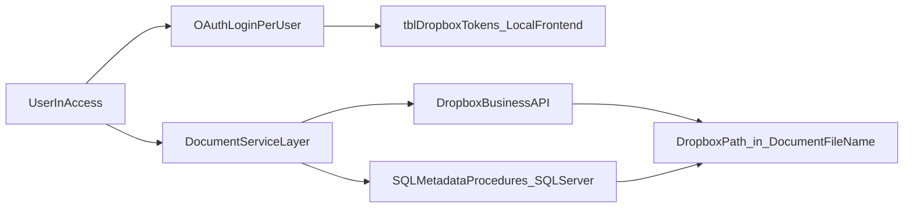

# TBCMS Dropbox Business Migration Plan

---

> **⚠ CURRENT STATE — ACTION REQUIRED**
> S:\ drive is decommissioned as of May 2026. All firm files have moved to Dropbox.
> TBCMS document open, save, scan, invoice, and case move operations are **currently broken** for all users — they still reference S:\ paths which no longer resolve.
> **Immediate priorities in order:**
> 1. Populate `tblDropboxConfig` (SQL Server) with `AppKey`, `AppSecret`, `RedirectUri`.
> 2. Run `STEP_1_UPDATE.sql` to rewrite all `DocumentFileName` / `ScanLocation` values from `S:\` to `/Company/` Dropbox paths.
> 3. Run `STEP_2_VERIFY.sql` to confirm zero S:\ rows remain.
> 4. Build and deploy the Phase 3–5 TBCMS code changes.
> 5. Run the Phase 7 `VerificationReport` (zero `NotFound` rows required) and deploy the new `.accde` to all users.
> Files are already in Dropbox — no file movement is needed. Only the SQL config rows, SQL path data, and TBCMS code need to change.

---

## System Context

**TBCMS** (Tate By Water Case Management System) is a law firm case management application with a split architecture:

- **Access frontend** — each user runs their own copy of `TBCMS.accdb` (a compiled/distributed `.accde`). All VBA code and local per-user tables live here. Local tables are accessed via DAO (`CurrentDb`).
- **SQL Server backend** — shared database containing all case data, documents metadata, and stored procedures. Accessed from VBA via ADO using the existing helper `PcaGetConnnectionString()` (defined in the shared utilities module). Stored procedures are called via `cn.Execute "exec spName @Param = value"`.

**Key distinction**: any table described as "local frontend" lives in the user's `TBCMS.accdb` and is accessed with `CurrentDb`. Any table described as "backend" lives in SQL Server and is accessed via `ADODB.Connection` using `PcaGetConnnectionString()`.

**Existing document data volumes** (verified against live `awsql2022dev` mirror):
- `tblCaseDocuments`: 18,561 rows — canonical case document references; 10,190 distinct `(CaseID, DocumentType)` pairs; one outlier `(26211, General)` has 243 rows.
- `tblScans`: 4,678 rows — additional scan path records; 66% of `TypeofScan` is NULL; paths are wrapped in legacy `#...#` Access-hyperlink markers.
- `tblCase`: 10,959 rows total; only **6,610 (60.3%)** have any row in `tblCaseDocuments`. 4,349 cases pre-date the ledger.
- 29 rows in `tblDocumentTypes` (28 visible + 1 hidden `Intake` type).
- Single configuration row in `tblDocumentRootDirectory` controls all path templates and root directories (see Path Template Syntax below).

See `document-management-analysis.md` for the full grounded review.

---

## POC Baseline

The existing POC is at `database_assessment/DropboxPOC/vba_code/DropboxAPI_POC.bas` (module name: `DropboxAPI_POC_Updated`).

**What the POC already provides (reuse as starting point):**
- OAuth 2.0 authorization code flow with `token_access_type=offline` (refresh tokens)
- `tblDropboxTokens` and `tblDropboxConfig` local Access table schemas and DDL (`CreateConfigTables`) — in production, `tblDropboxConfig` moves to SQL Server backend (shared across users); only `tblDropboxTokens` and `tblDropboxLog` remain local
- Token load/save/refresh lifecycle (`InitializeDropboxAPI`, `RefreshAccessToken`, `LoadTokens`, `SaveTokens`)
- `UploadFile`, `DownloadFile`, `CreateFolder`, `ListFolder` API wrappers
- Retry logic with exponential backoff (2s, 4s, 8s; max 3 retries) and `429` handling
- `tblDropboxLog` table and `LogError`/`LogActivity` helpers
- Hex-based token encryption (`EncryptValue`/`DecryptValue`) — **replace with DPAPI in production**

**What the POC lacks (must be built for production):**
- Multi-user token isolation — POC is single-identity/global-token
- DPAPI encryption replacing hex encoding
- `state` parameter in OAuth flow (CSRF protection)
- Local HTTP listener (`localhost:8765`) replacing manual URL-paste — **validated in `DropboxOAuthTest.bas` (May 2026)**
- `Dropbox-API-Path-Root` namespace header on every API call — **confirmed required, namespace ID `14334595683`**
- Direct Dropbox path storage — `DocumentFileName` / `ScanLocation` are rewritten to `/Company/` paths by `STEP_1_UPDATE.sql` before cutover; no runtime translation formula required, no new DB columns
- `files/move_v2`, `files/copy_v2`, `files/delete_v2` operations
- `files/download` to `%TEMP%\TBCMS\` for document-open native-app launch (`files/get_temporary_link` retained as a utility for future link-distribution use, not the primary open path)
- Chunked upload (`files/upload_session`) for files > 150 MB
- `DropboxAccountEmail` capture and identity validation at startup
- Admin revocation check against backend `tblDropboxRevocationList`
- Shared SQL Server `tblDropboxConfig` (POC scopes config to local frontend only)

---

## Objectives

- Replace local/shared-folder document operations with Dropbox API operations in TBCMS.
- Require each user to authenticate with their own Dropbox Business account.
- Keep current business workflows (open folder/file, scan save, invoice PDF save, close/reopen case moves) while improving auditability and reducing shared-drive dependency.

---

## Current-State Findings

- Core file-management logic is centralized in `database_assessment/TBCMS/extract/vba/modules/DocumentManagement.txt`.
- Main UI entry points are in `database_assessment/TBCMS/extract/vba/forms/frmClientLedger.txt` and related forms (invoice, intake, provider modules).
- Current implementation stores and opens local/UNC full file paths via SQL procedures (`spSaveCaseDocument`, `spGetCaseDocument`) and uses `FileCopy`, `Dir`, `FollowHyperlink`, and `Scripting.FileSystemObject`.
- `SaveCaseDocument(CaseID, DocumentType, DocumentFileName)` current signature — passes a full path as `DocumentFileName`. After `STEP_1_UPDATE.sql`, callers pass a `/Company/`-rooted Dropbox path. **The SP signature is unchanged** — no new Dropbox-specific parameters are added.
- All stored procedure calls in `DocumentManagement` use `ADODB.Connection` with `PcaGetConnnectionString()` — new SP calls must follow this same pattern.
- **All 11 file/folder SPs** build their result paths with **dynamic SQL** that tokenizes a naming template through `fnGetListOfWords`, substitutes columns from `vwfrmClientLedger`, and `EXEC`s the result. The naming templates and root directories live in a single row in `tblDocumentRootDirectory`. Any rewrite must preserve the template language or replace it wholesale.
- **`spMoveDocumentFolder` hard-codes position 3** of the existing path as the `_CLOSED` injection point. It cannot be retargeted to a different layout without a rewrite.
- **Three parallel "scanned?" tracking systems** exist that do not stay in sync: `tblCaseDocuments`, `tblCase.Scan`/`tblCase.[Scan Location]`/`tblCase.ScanNotAvail`, and `tblScans`. Intakes are a fourth tracker (`TB Intakes.Scan Location GI` + `Scanned GI`). Cutover requires an explicit reconciliation policy — see Phase 1.
- **Data-quality defects in production** discovered during DB review (Phase 1 remediation backlog):
  - 7 rows in `tblCaseDocuments` contain unresolved template literals (e.g., `S:\COMMON\RLF\CLIENTS\[Case_Letter]\…`).
  - Mixed casing in stored paths (`S:\CLOSED FILE SCANS\…` vs `S:\Closed File Scans\…`) — NTFS-tolerant, Dropbox/URL-intolerant.
  - Non-canonical roots (cases pointing at `S:\COMMON\<Atty>\Domestic\…` without `_CLIENTS\`) that pre-date the current `DocumentRootNaming` template.
  - 4,349 cases (39.7%) have **no row** in `tblCaseDocuments` at all.
- **Workflow inventory is complete** in `.docs/document-management-analysis.md`. Phase 1 validates and freezes that contract rather than re-inventorying.

---

## Target Architecture



---

## Design Decisions (confirmed)

- **Integration mode**: API-native Dropbox operations, not filesystem sync dependency.
- **Token scope**: per-user tokens stored in each user's local Access frontend in `tblDropboxTokens` (DAO/`CurrentDb`).
- **File reference strategy**: no new columns added to `tblCaseDocuments`, `tblScans`, or the Intakes table. `DocumentFileName` (and `tblScans.ScanLocation`) stores the Dropbox path directly after the one-time data migration in `migrate_paths_to_dropbox/STEP_1_UPDATE.sql`. All Dropbox API calls use `DocumentFileName` as-is. No runtime translation is required.
- **Path migration (one-time, pre-cutover)**: all `DocumentFileName` and `ScanLocation` values are updated in SQL Server before TBCMS goes live:
  - Strip a leading `#` if present (Access hyperlink format artifact)
  - Replace `S:\` with `/Company/`
  - Replace all remaining `\` with `/`
  - Scripts: `database_assessment/TBCMS/migrate_paths_to_dropbox/`
    - `STEP_0_ANALYZE.sql` — safe inspection, no changes
    - `STEP_1_UPDATE.sql` — transactional update with spot-check before COMMIT
    - `STEP_2_VERIFY.sql` — post-commit validation (expects zero S:\ rows remaining)
  - `spMoveDocumentFolder` writes updated paths in the same `/Company/` format going forward.
- **Migration style**: direct cutover. All files are already in Dropbox; S:\ is no longer in use. No hybrid period, no per-row provider flag, and **no `StorageProvider` flag at all** — TBCMS routes every document operation through the Dropbox API unconditionally. There is no provider abstraction layer and no `LocalProvider`: `DocumentManagement` delegates directly to `DropboxService`. See Rollback section for failure recovery.
- **OAuth flow**: authorization code grant with `token_access_type=offline`. VBA shells a PowerShell `HttpListener` on `http://localhost:8765` before opening the browser. When the user clicks Allow, Dropbox redirects to `localhost:8765` automatically — PowerShell captures the code, displays a green "Authorization complete — you can close this tab" page in the browser, and writes the redirect URL to a temp file VBA polls. No copy-paste required. The redirect URI `http://localhost:8765` must be registered in the Dropbox App Console (Settings → OAuth 2 → Redirect URIs) exactly as written. A manual paste fallback (redirect to `http://localhost`, no port) is retained in the codebase via `USE_LOCAL_LISTENER = False` for environments where port 8765 is blocked or PowerShell execution policy prevents the listener script from running. Both redirect URIs must be registered in the App Console.
- **OAuth frequency — once per user**: The full browser OAuth flow runs exactly once per user. Dropbox returns both an `access_token` (4-hour lifetime) and a `refresh_token` (long-lived, no expiry under normal conditions). Both are DPAPI-encrypted and stored in `tblDropboxTokens`. On every subsequent session, `InitializeDropboxAPI` loads the stored tokens silently — no browser, no user interaction. If the access token is within 5 minutes of expiry, it is refreshed silently using the refresh token before any API call is made. Users are only prompted to re-authorize in the following situations:

  | Situation | Reason |
  |---|---|
  | IT admin inserts row in `tblDropboxRevocationList` | Intentional deprovisioning — forced re-auth on next startup |
  | User revokes app in their own Dropbox account settings | Dropbox invalidates the refresh token |
  | User's Windows profile is rebuilt or reset | DPAPI blob is bound to the original Windows session; cannot be decrypted on a new profile |
  | `tblDropboxTokens` is deleted or corrupted | No stored token to load |

  The user runbook must document all four recovery paths (re-auth steps with screenshots). See G18 for DPAPI profile-reset handling.
- **Conflict policy**: **overwrite** for save/scan workflows; **fail explicitly** (no `autorename`) for move operations during case close/reopen — surfaces a user-facing error requiring manual resolution.
- **Temporary downloaded files**: stored in `%TEMP%\TBCMS\` as `<GUID>_<original_filename>`. Deleted on `Workbook_BeforeClose` equivalent (`Form_Unload` of the Access startup form) and at next session open. Directory is user-profile-scoped.
- **Document open**: `files/download` → write bytes to `%TEMP%\TBCMS\<GUID>_<filename>` → hand the local path to `Application.FollowHyperlink` / `ShellExecute` so the document opens in the native app (Word/Acrobat/Excel). Preserves today's attorney UX. Edits are not re-uploaded automatically — users save changes back through the Save flow (parity with the legacy UNC-share flow's implicit save semantics is **not** maintained; document this in the user runbook). `files/get_temporary_link` is retained in `DropboxService` for future link-distribution scenarios (e.g., emailed links to opposing counsel) but is not used by the routine open path. When it is used, links last 24 hours; never permanent shared links.
- **Token encryption (per-user, local)**: Windows DPAPI (`CryptProtectData` / `CryptUnprotectData`) declared via VBA `Declare` statements, applied to access/refresh tokens stored in the local frontend `tblDropboxTokens`. Encrypted blobs are bound to the current user's Windows session and cannot be decrypted on another machine or by another Windows user. Replaces the POC's trivial hex encoding.
- **AppKey and AppSecret location**: stored once in the SQL Server backend table `tblDropboxConfig` (single row, ConfigID = 1). All TBCMS frontends read the row on startup via ADO using `PcaGetConnnectionString()` and cache the values in module-level variables for the session. The values are stored **plaintext**; protection at rest is the SQL Server credential boundary (`TateBywaterSQLUser`), the same boundary that already protects every other SQL Server secret. Trade-off accepted: provisioning simplicity (one row, one update for rotation) over per-user DPAPI encryption. DPAPI is not used here because DPAPI blobs are user-session-bound and cannot be shared across users via a SQL row. Implication: AppSecret rotation is tightly coupled to `TateBywaterSQLUser` rotation — if the SQL credential is compromised, rotate the Dropbox AppSecret in lockstep (see Phase 6).
- **Write failure**: if a Dropbox write fails, the operation fails with an error and is logged to `tblDropboxAuditLog`. No silent fallback — avoids invisible data loss.
- **Rollback**: S:\ is permanently decommissioned. There is no flag-based runtime rollback — TBCMS routes every document operation through the Dropbox API. The only recovery from a failed cutover is reverting the TBCMS `.accde` deployment to the previous version and restoring S:\ from backup if necessary. The cutover decision is therefore close to irreversible; the pre-cutover `VerificationReport` must show zero `NotFound` rows before deployment.
- **Upload size limit**: Dropbox `files/upload` supports up to 150 MB. Files exceeding 150 MB must use `files/upload_session/start` + `files/upload_session/append_v2` + `files/upload_session/finish` (chunked upload). This applies to large TIF/PDF case scan files. `DropboxService` must detect file size before upload and route accordingly.
- **VBA unit testing framework**: Rubberduck (https://rubberduckvba.com).
- **Access startup hook**: initialization code (`InitializeDropboxAPI`, shared-config load from `tblDropboxConfig`, revocation check) runs in the `Form_Open` event of the application's startup form (whichever form is set as the Display Form in Access Options). Do not use an `AutoExec` macro — it cannot call VBA with error handling.
- **Team namespace header (required on every API call)**: The Tate Bywater Dropbox Business team uses a dedicated team root namespace (confirmed ID: `14334595683`). All `DropboxService` API calls — list, upload, download, move, copy, delete, metadata, temporary link — **must** include the header `Dropbox-API-Path-Root: {"namespace_id": "14334595683", ".tag": "namespace_id"}`. Without this header, calls resolve against the user's personal home namespace (which is empty) rather than the shared team folder tree. The namespace ID is read from `tblDropboxRootConfig.NamespaceId` at startup; `DropboxService` stores it in a module-level variable and injects it into every request.

---

## Path Template Syntax

### Two-template design

Dropbox case folder paths are built in two passes — matching the current
SQL Server design, where `tblDocumentRootDirectory.DocumentRootNaming`
produces the per-case folder and `tblDocumentTypes.DocumentFolder` adds
the per-type subfolder.

The Dropbox replacement preserves this two-template shape so the
familiar mental model is kept and so that `tblDocumentTypes.DocumentFolder`
can stay populated without modification.

`tblDropboxRootConfig` holds the **per-case-folder** templates.
`tblDocumentTypes.DocumentFolder` (unchanged) holds the per-type
**suffix** appended to the resolved case folder.

Templates use the same token language as today (so the same
`fnGetListOfWords` parser remains valid):

- `[Field]` — substituted from `vwfrmClientLedger` (the contract
  columns frozen in Phase 1: `Last_Name`, `First_Name`, `FileNo`,
  `Yr`, `Orig_Atty`, `Case_Letter`, `CaseOpenDate`).
- `~` — literal space placeholder (tokenizer artifact).
- `<currentdate>` — today, ISO formatted.
- `(customuserentry)` — placeholder for user-editable filename
  segment; resolved to literal `<type here>` in the Save As preview.

Dropbox templates (confirmed against live Dropbox team — namespace `14334595683`,
verified May 2026):

| Field | Confirmed value |
|-------|----------------|
| `TeamRootPath` | `/Company/COMMON` |
| `OpenCasesFolderTemplate` | `\ [Orig_Atty] \_CLIENTS\ [Case_Letter] \ [Last_Name] , ~ [First_Name] ~ [FileNo] \` |
| `ClosedCasesFolderTemplate` | `\ [Orig_Atty] \_CLIENTS\ [Case_Letter] \ _CLOSED \ [Last_Name] , ~ [First_Name] ~ [FileNo] \` |
| `AllInvoicesFolderTemplate` | *(empty — root only)* |
| `AllInvoicesDirectory` | `/Company/COMMON/_ALL INVOICES` |
| `ClosedFileScanFolderTemplate` | `\ TB \ [Yr] \` |
| `ClosedFileScanDirectory` | `/Company/Closed File Scans` |
| `ScannerDirectory` | `/Company/COMMON/_SCANNER` |
| `IntakeFolderTemplate` | `/Company/COMMON/Intakes` |

> `IntakeFolderTemplate` path does not yet exist in Dropbox. IT must create
> `/Company/COMMON/Intakes` before Phase 5 intake flows go live. All other paths
> above are confirmed to exist in the live team namespace.

> The shape exactly mirrors the existing `tblDocumentRootDirectory`
> row, only with Dropbox `/`-rooted paths replacing `S:\` UNC roots.
> This keeps the migration semantics-preserving: a closed-case folder
> resolves to the same logical structure on either provider.
>
> **Critical**: `Closed File Scans` uses title case in Dropbox (not `CLOSED FILE SCANS`
> as on the legacy S: drive). Use the Dropbox casing exactly to avoid creating a
> duplicate folder.

### Canonical DocumentType folder mapping

`tblCaseDocuments.DocumentType` has 29 distinct active values, all of
which must map cleanly to Dropbox folder segments. Most already map to
their `tblDocumentTypes.DocumentFolder` value verbatim and **need no
mapping table** — keep `tblDocumentTypes.DocumentFolder` as the source
of truth and reuse it for Dropbox paths.

A flat mapping override table is added only for the 5 special types
that have no `DocumentFolder` (they currently save to the case root):

| DocumentType | Current behavior | Dropbox folder segment (proposed) |
|---|---|---|
| `Init Intake, Notes, Documents` | case root | `_Intake\` |
| `Client ID` | case root | `_Client ID\` |
| `Retainer / Contract` | case root | `_Retainer\` |
| `Closed Final` | case root | `_Closed Final\` |
| `General` | case root | *(case root — unchanged)* |

The remaining 23 visible types (e.g., `Client Invoices` → `Invoices\`,
`Correspondence: Letters and Emails` → `Correspondence\`, `Client
Medical Records` → `Client Medical Records\`, all `Discovery\*`
variants) inherit their folder from `tblDocumentTypes.DocumentFolder`
unchanged. (Arithmetic: 28 visible − 5 in the mapping override above = 23.
The hidden `Intake` type — id 31 — routes to `IntakeDirectory` via a
separate code path; see G15.)

Legal-staff sign-off is required on this proposed mapping (Phase 1
deliverable). Categories like `Correspondence: Letters and Emails` and
`Closed Final` may have compliance implications for folder placement.

### Naming-template parity for filenames

`tblDocumentTypes.DocumentNamingRule` (per-type filename templates,
e.g., `[Last_Name] [FileNo] <CurrentDate> (customuserentry)`) **must
remain authoritative** for Dropbox saves. Wire the same tokenizer
through `DropboxService.BuildFileName(documentType, caseID)` → calls
the existing `spGetDocumentFileName` SP and uses its output verbatim.

Do not invent a new filename language. The 29 existing rules in
`tblDocumentTypes` already encode legal-staff conventions and have
been stable for years.

---

## Implementation Phases

### Phase 0: Dropbox Prerequisites Intake

Nothing in Phase 1 onward can start until the items below are collected.
Items flagged **(blocking)** must be resolved before Phase 2 schema work
begins. Items in section D may be collected in parallel with Phase 1
but can influence Phase 7 verification and cutover design.

#### A. From the Dropbox App Console (https://www.dropbox.com/developers/apps)

App created for TBCMS (May 2026). App key: `dqleswbnux8k3m5`.

| Item | Where it goes | Notes |
|---|---|---|
| **App key** ✅ captured | `tblDropboxConfig.AppKey` (SQL Server, plaintext, single shared row — sole source of truth). | Value: `dqleswbnux8k3m5` |
| **App secret** ✅ captured | `tblDropboxConfig.AppSecret` (SQL Server, plaintext, single shared row). Protected at rest by `TateBywaterSQLUser` credentials. | Rotate immediately if compromised; rotate in lockstep with `TateBywaterSQLUser` |
| Permission type ✅ | App configuration | "Scoped access" + "Full Dropbox" confirmed |
| Scopes ✅ | App configuration | `files.content.read`, `files.content.write`, `files.metadata.read`, `sharing.read`, `account_info.read` confirmed enabled |
| Redirect URIs ✅ confirmed | App configuration | `http://localhost:8765` (primary — local HTTP listener, no copy-paste) and `http://localhost` (fallback — manual paste) both registered. Both confirmed working in `DropboxOAuthTest.bas` (May 2026). |
| OAuth 2 settings | App configuration | Confirm "Allow implicit grant" is **off**. We use authorization code flow with `token_access_type=offline` |
| App status | Production submission | Development apps cap at 250 linked users. If headcount exceeds 250, **submit for production approval** — 1–2 week turnaround |

#### B. From the Dropbox Business Admin Console (and the team admin)

| Item | Why it matters |
|---|---|
| **Plan tier** (blocking) | Standard / Advanced / Business Plus / Enterprise. Determines whether **Team Spaces** is available (Advanced+) vs. classic shared folders, and affects API rate limits |
| Licensed seats vs. headcount | Are there enough Dropbox Business seats for all TBCMS users? Procurement lead time if not |
| Storage quota | Current consumption (case content already migrated to `/Company`) + headroom for ongoing growth. No bulk-upload event remaining — file content already lives in Dropbox. |
| **Team root** ✅ confirmed | Root namespace ID `14334595683` (team: "Tate Bywater"). TBCMS case data lives under `/Company/COMMON`. Attorney folders (`RLF`, `PM`, `TDT`, etc.), `_ALL INVOICES`, and `_SCANNER` confirmed present. `Closed File Scans` confirmed at `/Company/Closed File Scans`. No collision with existing content. |
| **Permission model** | Shared-folder-per-attorney? Per-role groups (attorneys, paralegals, admin assistants)? Ethical-wall constraints? Drives the Dropbox Business group/folder design |
| Data residency | US or EU storage region. Some legal contracts dictate this |
| Audit log access | Confirm team admin can pull Dropbox's native audit feed. Complements `tblDropboxAuditLog`, does not replace it |
| SSO / SCIM | Is the firm using Okta / Azure AD SSO for Dropbox? Affects the OAuth UX users see during initial auth |
| Network allowlist | Corporate firewall must allow outbound 443 to `api.dropboxapi.com`, `content.dropboxapi.com`, `www.dropbox.com` |

#### C. From the firm's internal records

| Item | Purpose |
|---|---|
| Roster of Dropbox-Business-licensed users | Email + display name + role. Feeds the identity-validation check at startup and the permission matrix |
| TBCMS user → Dropbox email mapping | The Windows account running Access is not necessarily the Dropbox account; both identities must align in `tblDropboxTokens.DropboxAccountEmail` |
| Office-letter ↔ team-folder mapping | `[Orig_Atty]` is the 2nd path segment in `DocumentRootNaming` (`PM`, `RLF`, `TDT`, etc.). Each office letter needs a corresponding Dropbox folder or group |
| Migration cutover window | When `STEP_1_UPDATE.sql` runs and is verified, the `VerificationReport` passes, and the new TBCMS `.accde` is ready to deploy. Files are already in Dropbox — no file transfer is needed. The window is gated by IT scheduling the SQL update and the code deployment, not by bandwidth. |

#### D. From Dropbox documentation or a sales engineer

| Item | Why we care |
|---|---|
| API rate limit for the firm's tier | Baseline is 1,200 calls/min/app. Expected peak is the pre-cutover `VerificationReport` pass: ~23,000 `files/get_metadata` calls across `tblCaseDocuments` (18,561) and `tblScans` (4,678). Steady-state usage is well below this. No bulk file-upload event in the plan. |
| `upload_session` quotas | Concurrent open sessions per user, session lifetime (default 48 h), chunk size limits (4–150 MB; plan uses 100 MB) |
| **`get_temporary_link` lifetime** ✅ resolved | Standardized on 24 hours across Design Decisions, Phase 3, and Testing Strategy. See G1. |
| Path length limit | Dropbox enforces ~260 chars in most contexts. Existing `[Last_Name], [First_Name] [FileNo]` folder names plus subfolders can push limits. The 7 broken `[Case_Letter]` rows in `tblCaseDocuments` (see Phase 1b) are an early warning |
| Atomicity guarantees on `files/move_v2` | The case close/reopen design assumes folder-level atomicity. If only file-level atomicity is guaranteed, redesign the close sequence with per-file moves and explicit rollback |
| Team Spaces vs. classic shared folders | If using Team Spaces (Advanced+), paths route through a namespace ID. Confirm `DropboxService.BuildCasePath` design handles this or capture the namespace logic needed |

#### Exit criteria for Phase 0

- All "(blocking)" items in sections A and B captured and recorded.
- Section C roster locked (open issues like missing seats raised to procurement).
- Section D answers documented in this plan or its addendum — specifically: confirmed rate limit, confirmed `get_temporary_link` lifetime (and the plan's two mentions corrected to match), confirmed atomicity model for `files/move_v2`, confirmed path length limit.
- IT-admin runbook draft started, anchored on the actual app key and team root values from A and B.

---

### Phase 1: Discovery, Mapping, Data-Quality Remediation, and Contract Freeze

#### 1a. Validation
- Validate the workflow inventory in `document-management-analysis.md` against the live SQL Server database — confirm all `DocumentType` values, stored procedures, and table fields are current.
- Freeze the **`vwfrmClientLedger` contract**: list the exact columns currently referenced by token substitution (`Last_Name`, `First_Name`, `FileNo`, `Yr`, `Orig_Atty`, `Case_Letter`, `CaseOpenDate`) and forbid breaking changes to those columns for the duration of the migration.
- Confirm the proposed DocumentType folder mapping (see Path Template Syntax above) with legal staff.

#### 1b. Data-quality remediation (must complete before Phase 7 verification)
- **Fix 7 unresolved-template rows** in `tblCaseDocuments` where `DocumentFileName LIKE '%[[]%'`. Either delete (if the underlying file does not exist on disk) or re-resolve by re-running `spGetDocumentFolderName` + `spGetDocumentFileName` with the now-complete `vwfrmClientLedger` row.
- **Canonicalize path casing**: rewrite all stored paths to canonical form (lowercase root + correct case for known folder segments). Required because Dropbox paths are case-preserving but case-insensitive for lookup, and any future migration to a case-sensitive store would break.
- **Survey non-canonical roots**: enumerate distinct path prefixes in `tblCaseDocuments` (the DB review found multiple legacy roots: `S:\COMMON\<Atty>\Domestic\…` without `_CLIENTS\`, `S:\COMMON\File Scans\…`, etc.). For each prefix, decide: realign to current template, or map to a known Dropbox path. **"Skip" is not an option** — since S:\ is gone, skipped rows will produce "file not found" errors at open time with no fallback. Every non-null, non-blank `DocumentFileName` row must have a verified Dropbox path in the `VerificationReport` before cutover.
- **Decide the 243-rows-per-pair policy** for `tblCaseDocuments`: keep all (multi-version history), keep latest only, or archive older with a `Status` column. Current `spGetCaseDocument` only ever reads the latest by `CreatedOn`, so older rows are operationally dead.
- **Reconcile the four scan-trackers**: produce a written decision on which becomes source-of-truth post-cutover:
  - `tblCaseDocuments` (modern; only 60.3% case coverage)
  - `tblCase.Scan` / `tblCase.[Scan Location]` / `tblCase.ScanNotAvail` (drives work-queue queries; drifts from `tblCaseDocuments`)
  - `tblScans` (legacy; `#…#`-wrapped paths; **partially active post-cutover** — see below)
  - `TB Intakes.Scan Location GI` + `Scanned GI` (pre-case)
  - Output: a reconciliation plan including the SQL backfill that brings `tblCase.Scan = 1` into agreement with `EXISTS(SELECT 1 FROM tblCaseDocuments WHERE CaseID = tblCase.CaseID)` for the post-cutover model.
  - **`tblScans` lifecycle decision (May 2026)**: `tblScans` remains legacy-read in the active workflows (no INSERTs from current procs), **but `ScanLocation` is rewritten on case close/reopen** by the new `spMoveDocumentFolder` (G2). Required because S:\ is decommissioned — leaving `ScanLocation` pointing at the open-case path after the Dropbox folder has been moved would produce a hard 404 at open time with no fallback. Read-only forms (`frmScansubform`, `frmScanLocation`) display whatever path is currently stored, so the rewrite keeps them functional.
- **Scope decision: SQL is authoritative; orphan Dropbox content is out of scope.** Files that exist in Dropbox without a `tblCaseDocuments` row remain invisible to TBCMS. The 4,349 cases with no ledger entry stay invisible to the app — users access those documents directly via the Dropbox web/desktop client. No pre-cutover walk of `/Company` to synthesize ledger rows. Document this in the user runbook so users know which cases require Dropbox-direct access.

#### 1c. Contract freeze
- Confirm no schema changes to `tblCaseDocuments`, `tblScans`, or the Intakes table — sign off on the zero-new-columns decision.
- Confirm `tblDropboxRootConfig` carries no `StorageProvider` flag — TBCMS routes every document operation through the Dropbox API unconditionally. There is no `Local` or `Hybrid` mode.
- Identify stored procedures whose **signatures remain unchanged** but whose callers now pass `/Company/`-rooted Dropbox paths instead of `S:\`-rooted UNC paths: `spSaveCaseDocument`, `spGetCaseDocument`, `spGetDocumentFileName`, `spGetDocumentFolderName`, `spGetClosedDocumentFolderName`, `spGetClosedFileScanFolderName`, `spGetAllInvoicesFolderName`, `spGetIntakeFolderName`, `spGetIntakeDocumentFileName`. All remain callable from VBA via `ADODB.Connection` with no signature changes. Exception: `spMoveDocumentFolder` requires a signature change (see G2) — it must accept `@OldFolderPath` / `@NewFolderPath` Dropbox paths instead of reconstructing paths from positional splits.
- Mark `tblDocumentRootDirectory` as deprecated-after-cutover in a schema comment.

---

### Phase 2: Data Model and Config Foundation

#### SQL Server backend schema additions

**No new columns on `tblCaseDocuments`, `tblScans`, or the Intakes table.**

All files are already in Dropbox. S:\ is no longer in use. There is no hybrid period and no per-row storage provider tracking required. `DocumentFileName` and `ScanLocation` are rewritten to `/Company/`-rooted Dropbox paths by `STEP_1_UPDATE.sql` before cutover (see Design Decisions — Path migration). After that one-time update, all Dropbox API calls use `DocumentFileName` as-is — no runtime translation is needed.

> **Confirmed from live database (May 2026):** all 18,561 rows in `tblCaseDocuments` used exactly two root prefixes — `S:\COMMON\` (14,229 rows) and `S:\Closed File Scans\` (4,332 rows) — with zero exceptions. `STEP_1_UPDATE.sql` maps these losslessly to `/Company/COMMON/` and `/Company/Closed File Scans/` respectively.

**Create `tblDropboxRootConfig`** (SQL Server backend, single admin-managed row — schema mirrors the existing `tblDocumentRootDirectory` so both providers share the same template semantics):

| Column | Type | Description |
|--------|------|-------------|
| `ConfigID` | INT PK | Single row, ConfigID = 1 |
| `NamespaceId` | NVARCHAR(50) | Dropbox team root namespace ID. **Confirmed value: `14334595683`**. Required in `Dropbox-API-Path-Root` header on every API call. Store here so it can be updated without a code change. |
| `TeamRootPath` | NVARCHAR(500) | Dropbox path to firm's case document root. **Confirmed value: `/Company/COMMON`** — equivalent of `S:\COMMON`. |
| `DocumentRootNaming` | NVARCHAR(500) | Open-case folder template using existing token language. Mirrors `tblDocumentRootDirectory.DocumentRootNaming`. |
| `DocumentClosedNaming` | NVARCHAR(500) | Closed-case folder template. Mirrors `tblDocumentRootDirectory.DocumentClosedNaming`. |
| `AllInvoicesDirectory` | NVARCHAR(500) | Firm-wide invoices root. **Confirmed value: `/Company/COMMON/_ALL INVOICES`**. Mirrors `tblDocumentRootDirectory.AllInvoicesDirectory`. |
| `AllInvoicesNaming` | NVARCHAR(500) | Suffix template under `AllInvoicesDirectory`. Empty in current production. |
| `ClosedFileScanDirectory` | NVARCHAR(500) | Closed-file-scans root. **Confirmed value: `/Company/Closed File Scans`** (title case — not all-caps). Mirrors `tblDocumentRootDirectory.ClosedFileScanDirectory`. |
| `ClosedFileScanNaming` | NVARCHAR(500) | Suffix template under `ClosedFileScanDirectory` (confirmed value: `\ TB \ [Yr] \`). |
| `ScannerDirectory` | NVARCHAR(500) | Scanner hardware drop folder. **Confirmed value: `/Company/COMMON/_SCANNER`**. Read-only source for scan ingest; never a write target for TBCMS uploads. |
| `IntakeDirectory` | NVARCHAR(500) | Intake scans root (case-independent). Proposed value: `/Company/COMMON/Intakes`. **This folder does not yet exist — IT must create it before Phase 5.** |

> Schema parity with `tblDocumentRootDirectory` is intentional: the new Dropbox path procs (Phase 4) take this row as input the same way the current procs take `tblDocumentRootDirectory`, so the dynamic-SQL tokenizer logic is reused verbatim. Only the root paths and the `\` → `/` separator differ.

**Create `tblDropboxConfig`** (SQL Server backend, single shared row, accessible by all TBCMS users):

| Column | Type | Description |
|--------|------|-------------|
| `ConfigID` | INT PK | Single row, ConfigID = 1 |
| `AppKey` | NVARCHAR(200) NOT NULL | Dropbox app key (plaintext — public per OAuth spec) |
| `AppSecret` | NVARCHAR(200) NOT NULL | Dropbox app secret (plaintext; protected at rest by `TateBywaterSQLUser` SQL credentials). Rotate immediately on compromise. |
| `RedirectUri` | NVARCHAR(500) NOT NULL | Default `http://localhost:8765` (primary local-listener flow). Fallback `http://localhost` (manual paste) used only when `USE_LOCAL_LISTENER = False` in `DropboxService.bas`. Both URIs must be registered in the Dropbox App Console. |

> Note: DPAPI cannot encrypt rows shared across users (DPAPI blobs are bound to a single Windows session). The trade-off accepted is plaintext-in-SQL with SQL credential auth as the protection boundary — see Design Decisions ("AppKey and AppSecret location"). This means a `TateBywaterSQLUser` compromise must trigger a paired AppSecret rotation.

**Create `tblDropboxRevocationList`** (SQL Server backend, IT-admin-managed):

| Column | Type | Description |
|--------|------|-------------|
| `RevocationID` | INT PK IDENTITY |  |
| `DropboxAccountEmail` | NVARCHAR(320) NOT NULL | Dropbox account email of the user being revoked. Matched against `tblDropboxTokens.DropboxAccountEmail` in the local frontend. |
| `RevokedAt` | DATETIME NOT NULL | When the revocation was issued |
| `RevokedBy` | NVARCHAR(200) | IT admin who issued the revocation |
| `Reason` | NVARCHAR(500) | Reason for revocation (audit) |

#### Local Access frontend schema (per-user, accessed via DAO/`CurrentDb`)

> `tblDropboxConfig` is no longer a local-frontend table — it has been moved to the SQL Server backend (see above) so AppKey, AppSecret, and RedirectUri can be provisioned once and shared across all users. The POC's local `tblDropboxConfig` is dropped in the upgrade script.

**`tblDropboxTokens`** (replace POC schema with production schema):

| Column | Type | Description |
|--------|------|-------------|
| `TokenID` | AUTOINCREMENT PK |  |
| `DropboxAccountEmail` | TEXT(320) | Dropbox account email — populated from `/users/get_current_account` at auth time. Used for identity validation and revocation matching. |
| `AccessToken` | MEMO | DPAPI-encrypted |
| `RefreshToken` | MEMO | DPAPI-encrypted |
| `TokenType` | TEXT(50) | Always `"Bearer"` |
| `ExpiresAt` | DATETIME | Expiry of the access token |
| `CreatedDate` | DATETIME |  |
| `TokenStatus` | TEXT(20) | `Active`, `Expired`, or `Revoked`. Replaces POC's `IsActive YESNO` — more states needed for revocation. |

> The POC's `IsActive YESNO` column must be migrated to `TokenStatus TEXT(20)` via the `UpgradeTokenTable` pattern already in the POC.

**`tblDropboxLog`** (local frontend — session-level debug log):
- Retain POC schema: `LogID`, `LogDate`, `LogLevel`, `FunctionName`, `ErrorNumber`, `ErrorDescription`, `Details`
- Never write token values or file content to this table
- **Audit-critical events** (upload, move, copy, delete, link generation) are additionally written to a SQL Server audit table `tblDropboxAuditLog` via a new SP `spLogDropboxAuditEvent(CaseID, DocumentType, DropboxPath, ActionType, Outcome, ErrorDetail)`. Called via `ADODB.Connection` using `PcaGetConnnectionString()`.

**Create `tblDropboxVerificationReport`** (SQL Server backend, pre-cutover artifact):

| Column | Type | Description |
|--------|------|-------------|
| `VerificationID` | INT PK IDENTITY |  |
| `SourceTable` | NVARCHAR(50) NOT NULL | `tblCaseDocuments` or `tblScans` |
| `SourceRowID` | INT NOT NULL | FK to `tblCaseDocuments.CaseDocumentID` or `tblScans` PK |
| `DropboxPath` | NVARCHAR(MAX) NOT NULL | The `DocumentFileName` / `ScanLocation` value used for the `files/get_metadata` check |
| `Status` | NVARCHAR(20) NOT NULL | `Found`, `NotFound`, or `Error` |
| `ErrorDetail` | NVARCHAR(MAX) NULL | Dropbox error code/message when `Status = Error` |
| `CheckedAt` | DATETIME NOT NULL |  |

> Lives on SQL Server (not in a local Access file) so IT can run the verification pass from any workstation, query results from SSMS, and retain the report after cutover for audit. UPDATE permission locked to the IT admin SQL login.

**Create `tblDropboxAuditLog`** (SQL Server backend):

| Column | Type | Description |
|--------|------|-------------|
| `AuditID` | INT PK IDENTITY |  |
| `EventDate` | DATETIME NOT NULL |  |
| `DropboxAccountEmail` | NVARCHAR(320) | Who performed the action |
| `CaseID` | INT NULL |  |
| `DocumentType` | NVARCHAR(100) NULL |  |
| `DropboxPath` | NVARCHAR(MAX) NULL |  |
| `ActionType` | NVARCHAR(50) | `Upload`, `Move`, `Copy`, `Delete`, `LinkGenerate` |
| `Outcome` | NVARCHAR(20) | `Success` or `Failure` |
| `ErrorDetail` | NVARCHAR(MAX) NULL | Dropbox error code/message on failure |

---

### Phase 3: Dropbox Service Module Hardening

Create production `DropboxService.bas` module based on the POC. All items below are changes from or additions to the POC:

**Authentication:**
- `state` parameter: at auth initiation, generate a random GUID (`CreateObject("Scriptlet.TypeLib").GUID`), store in a module-level `m_OAuthState` variable. The local HTTP listener captures the redirect URL automatically; VBA extracts `state` from it and compares to `m_OAuthState`. If they do not match, abort and log an error — do not exchange the code for tokens. (In the paste fallback, the user-provided URL is validated the same way.)
- After successful token exchange, call `/users/get_current_account` and store the returned `email` in `tblDropboxTokens.DropboxAccountEmail`.

**Encryption:**
- Replace POC `EncryptValue`/`DecryptValue` (hex) with `EncryptDPAPI(plaintext As String) As String` and `DecryptDPAPI(ciphertext As String) As String` using Windows DPAPI via `Declare` statements for `CryptProtectData` and `CryptUnprotectData` from `crypt32.dll`.
- DPAPI is applied **only to per-user OAuth tokens** in the local frontend `tblDropboxTokens` (access token + refresh token). AppKey and AppSecret are **not** DPAPI-encrypted — they live in the shared SQL Server `tblDropboxConfig` and are protected at rest by the SQL credential boundary.

**Startup sequence** (called from startup form `Form_Open`):
1. Load Dropbox config from SQL Server `tblDropboxConfig` and `tblDropboxRootConfig` via ADO (AppKey, AppSecret, RedirectUri, NamespaceId, root paths). Cache in module-level variables for the session.
2. Call `InitializeDropboxAPI` (loads tokens from local `tblDropboxTokens` via DAO). If no token exists, run the OAuth flow now.
3. Check `tblDropboxRevocationList` (SQL Server) for any row matching `tblDropboxTokens.DropboxAccountEmail`. If found: set `TokenStatus = "Revoked"`, clear module-level token variables, prompt user to re-authenticate.
4. Validate identity: call `/users/get_current_account`, compare returned email to `tblDropboxTokens.DropboxAccountEmail`. If mismatch: clear tokens, prompt re-auth.
5. If token expiring within 5 minutes: auto-refresh silently.

**Required API operations:**

All calls except `users/get_current_account` **must** include the header:
```
Dropbox-API-Path-Root: {"namespace_id": "14334595683", ".tag": "namespace_id"}
```
Read namespace ID from `tblDropboxRootConfig.NamespaceId` at startup; store in module-level `m_NamespaceId`. Without this header, paths resolve against the user's personal home namespace (empty), not the team folder tree.

| Operation | Endpoint | Key parameters |
|-----------|----------|---------------|
| Upload ≤ 150 MB | `POST content.dropboxapi.com/2/files/upload` | `mode: overwrite`, `mute: false` |
| Upload > 150 MB | `files/upload_session/start` → `append_v2` → `finish` | Chunk size: 100 MB |
| Download to temp | `POST content.dropboxapi.com/2/files/download` | Writes to `%TEMP%\TBCMS\<GUID>_<filename>` |
| Create folder | `POST api.dropboxapi.com/2/files/create_folder_v2` | `autorename: false`; treat `path/conflict/folder` as success |
| Move | `POST api.dropboxapi.com/2/files/move_v2` | `autorename: false`; on conflict, surface error — do not silent-rename |
| Copy | `POST api.dropboxapi.com/2/files/copy_v2` | `autorename: false` |
| Delete | `POST api.dropboxapi.com/2/files/delete_v2` | Only called after confirmed successful copy in move sequence |
| Get metadata | `POST api.dropboxapi.com/2/files/get_metadata` | Used by the pre-cutover `VerificationReport` to confirm a file exists at a given Dropbox path; pass `{"path": "/Company/..."}` |
| Temporary link | `POST api.dropboxapi.com/2/files/get_temporary_link` | Returns link valid for 24 hours; open via `Application.FollowHyperlink` |
| List folder | `POST api.dropboxapi.com/2/files/list_folder` | Used for folder-browse actions |
| Current account | `POST api.dropboxapi.com/2/users/get_current_account` | Used at startup for identity validation — namespace header not required for this call |

**Retry policy**: `429` → wait `Retry-After` seconds; `500`/`503` → exponential backoff (2s, 4s, 8s); `401` → attempt one token refresh then re-raise; other errors → fail immediately with translated user message. Max 3 retries total.

**Logging**: every API call logs to `tblDropboxLog` (local). Write/move/copy/delete/link events additionally call `spLogDropboxAuditEvent` (SQL Server). Never log token values or file content bytes.

---

### Phase 4: Document Management Compatibility Layer

- Refactor `DocumentManagement` module to delegate every document operation to `DropboxService`. There is no provider abstraction layer and no `LocalProvider` — TBCMS is Dropbox-only post-cutover.
- **All 8 forms that touch `DocumentManagement` keep their current call signatures.** The Dropbox delegation is fully internal to `DocumentManagement`; forms call the same public functions they call today.

  | Form | Role in document workflows | Phase 4 treatment |
  |---|---|---|
  | `frmClientLedger` | Primary case ledger — open/save/scan/close/reopen entry points | Signatures unchanged; internal dispatch to `DropboxService` |
  | `frmInvoiceSent` | Invoice PDF export + dual save (case folder + `_ALL INVOICES`) | Signatures unchanged; render-to-temp + upload (Phase 5 step 3) |
  | `frm_invoices_summary` | Invoice list / open existing invoice | Signatures unchanged; open uses download-to-temp (Phase 5 step 1) |
  | `Time_Keeping` | Active-case invoice generation | Signatures unchanged; same invoice flow as `frmInvoiceSent` |
  | `frmTimeKeepingClosed` | Closed-case invoice generation | Signatures unchanged; same invoice flow but writes to `ClosedCasesFolderTemplate` |
  | `Intakes` | Intake scan ingest (case-independent) | Signatures unchanged; intake flow (Phase 5 step 5) |
  | `frmPersInjProvider` | Medical-provider folder/document open | Signatures unchanged; open uses download-to-temp; folder open uses Dropbox web URL |
  | `frmScansubform` / `frmScanLocation` | Read-only views over `tblScans` | Signatures unchanged. Display the `ScanLocation` column verbatim (now a `/Company/`-rooted Dropbox path post-`STEP_1_UPDATE.sql`). On click, route through `DropboxService.OpenDocument(ScanLocation)` (same download-to-temp pattern as Phase 5 step 1). No new write paths — these forms remain read-only on `tblScans`. |

- Updated stored procedures (`spSaveCaseDocument`, `spMoveDocumentFolder`, etc.) must remain callable via `cn.Execute "exec spName @Param = value"` using `ADODB.Connection` — consistent with all existing SP calls in `DocumentManagement`.

---

### Phase 5: Workflow-by-Workflow Migration

> **File-origin distinction.** TBCMS workflows fall into two patterns based on who creates the file:
>
> - **Access-generated** — Access itself produces the file via `DoCmd.OutputTo acFormatPDF` (invoices only; 2,933 of 18,561 ledger rows). The implementation pattern is **render-to-temp → upload → cleanup**: write to `%TEMP%\TBCMS\<GUID>.pdf`, call `files/upload`, then delete the temp file.
> - **External-source ingest** — the file already exists on disk (scanner drop folder, user's local machine, Outlook attachment save, Word "Save As" target). VBA only relocates it. The implementation pattern is **upload-from-source-path → register**: `files/upload` reads directly from the source path; no temp staging is needed.
>
> Do not build a "save to temp first" shim for ingest flows — it's wasted I/O and creates a second cleanup obligation. Each workflow below explicitly states which pattern applies.

Migrate and validate in this order:

**1. Open document file/folder actions** *(no file creation — read-only for the open flow)*
- **Document open — download-to-temp + native open**: replace `FollowHyperlink(localPath)` with `DropboxService.OpenDocument(DocumentFileName)`, which:
  1. Calls `files/download` against the Dropbox path stored in `DocumentFileName` (e.g. `/Company/COMMON/RLF/...`).
  2. Writes the bytes to `%TEMP%\TBCMS\<GUID>_<original_filename>`.
  3. Hands the local file path to `Application.FollowHyperlink` (or `ShellExecute` if hyperlink behavior is unreliable) so it opens in the native app (Word/Acrobat/Excel) — preserves today's attorney UX.
- **Edits are not re-uploaded automatically.** Opening a document yields a working copy in `%TEMP%`; if the user makes edits, they must explicitly save back through the Save flow to persist them. Document this as a known limitation in the user runbook (today's UNC-share flow has the same constraint — edits go straight back to the share — so the change is meaningful and must be communicated).
- **Temp file cleanup**: `%TEMP%\TBCMS\` is purged on the startup form's `Form_Unload` and at next session open (already specified for the invoice flow — this extends the same hook to cover open-document downloads).
- **No local fallback.** S:\ is gone. If Dropbox returns a 404, surface an error: "Document not found in Dropbox — please contact IT."
- **Folder open**: download is not meaningful for a folder. Open the Dropbox web URL (`https://www.dropbox.com/home` + folder path from `DocumentFileName`) in the user's browser. Confirm UX approach with users before implementing.
- No conflict possible on the open path — read-only operation. `files/get_temporary_link` is not used here; it remains available in `DropboxService` for any future link-distribution use case (e.g., emailed links).

**2. Scan save flow** (`SaveScannedFileAs`) *(external-source ingest — file already exists in scanner drop folder)*
- Source file selected by user via `SelectFileDialog` from the Dropbox-synced scanner folder at `/Company/COMMON/_SCANNER` (confirmed in Dropbox — see `tblDropboxRootConfig.ScannerDirectory`)
- Compute Dropbox destination path: `DropboxService.BuildCasePath(DocumentRootNaming, CaseID)` + `tblDocumentTypes.DocumentFolder` for the type + generated filename from `spGetDocumentFileName`
- **Save-As filename — override-with-confirmation**: show the Save-As dialog pre-filled with the SP-generated filename. If the user submits the dialog with the filename unchanged, upload silently. If the user has edited the filename, show a confirmation prompt — *"You have changed the suggested filename from `<sp-name>` to `<user-name>`. Save with the new name?"* — and only proceed on Yes. This catches accidental edits and surface-area-typos that caused the 7 unresolved-template rows surfaced in Phase 1b, while preserving legal-staff freedom to add intentional context. The confirmed filename (SP-generated or user-edited) is what ends up in both Dropbox and `tblCaseDocuments.DocumentFileName`.
- `files/upload` reads **directly from the source path** — no copy to `%TEMP%` first
- If file > 150 MB: use chunked upload session against the same source path
- On `path/conflict/file`: overwrite (user is intentionally saving a new version)
- On success: call `spSaveCaseDocument` with `@DocumentName` (signature unchanged — no new Dropbox columns). `spSaveCaseDocument` validates that `@DocumentName` contains no unresolved template tokens (see G13) and raises if so.
- Source file in `_SCANNER`: leave alone (scanner workflow rotates its own folder)

**3. Invoice PDF save + metadata persistence** *(Access-generated — render-to-temp pattern)*
- `DoCmd.OutputTo acOutputReport, strReportName, acFormatPDF, "%TEMP%\TBCMS\<GUID>_invoice.pdf"`
- Upload the temp file to the case invoice folder (`DocumentRootNaming` + `Invoices\`) and the firm-wide all-invoices folder (`AllInvoicesDirectory` + `AllInvoicesNaming`) — two separate `files/upload` calls reading the same temp source
- Register both document references via `spSaveCaseDocument` calls (same `DocumentType = 'Client Invoices'`, two rows — signature unchanged)
- Delete the temp PDF after **both** uploads succeed; on partial failure, retain the temp file and surface a user-facing retry option
- This is the only workflow that requires `%TEMP%\TBCMS\` write access; the directory cleanup logic in `Form_Unload` removes any orphans from failed runs

**4. Case close/reopen move/copy operations**

All routing is through the existing wrapper `MoveDocumentByCaseStatus(CaseID, CaseStatus)` in `DocumentManagement.bas`. The two button handlers in `frmClientLedger` (`cmdCloseCase_Click`, `cmdReopenCase_Click`) keep their current signatures; only the wrapper body is rewritten. Today's wrapper does `FileSystemObject.CopyFolder` + `DeleteFolder` then calls the SP; the new wrapper does `files/move_v2` then calls the rewritten SP.

- **Close sequence** (`MoveDocumentByCaseStatus(CaseID, "Closed")`):
  1. Derive `@OldFolderPath` from `OpenCasesFolderTemplate` resolved for the case; derive `@NewFolderPath` from `ClosedCasesFolderTemplate` resolved for the case.
  2. **Optional first step (only if user confirms the `CLOSED FILE SCANS` prompt)**: `files/copy_v2` of the case folder to `ClosedFileScanFolderTemplate`. This is a copy, not a move — does not affect the SP call. (`CopyDocumentToClosedFileScan` is a separate function and remains the caller for this step.)
  3. `files/move_v2` from `@OldFolderPath` → `@NewFolderPath` with `autorename = false`.
  4. On move success: `EXEC dbo.spMoveDocumentFolder @CaseID, @OldFolderPath, @NewFolderPath` (new G2 signature). Read returned `CaseDocumentsUpdated` and `ScansUpdated`; if either is zero, write a warning to `tblDropboxAuditLog` (Dropbox succeeded, SQL didn't match) — do not fail the close.
  5. On move conflict (`path/conflict/folder`): surface error with full path details, abort — do not call the SP, do not delete any source content.
- **Reopen sequence** (`MoveDocumentByCaseStatus(CaseID, "Open")`):
  - Same shape as close, with `@OldFolderPath` = closed path, `@NewFolderPath` = open path.
- **Both tables are rewritten in one SP transaction**: `tblCaseDocuments.DocumentFileName` and `tblScans.ScanLocation` for the case. Required because S:\ is gone — any stale path becomes a hard error at open time. See G2 for the SP body.
- **Partial state protection**: `files/delete_v2` is never called in these workflows. Dropbox `move_v2` is atomic server-side per folder.

**5. Intake and provider-specialized document flows**
- **Intake scan** (`Intakes.txt` form, `cmdScan_Click`): *(external-source ingest — file already exists in `/Company/COMMON/_SCANNER`)*. `files/upload` direct from the Dropbox source path to `IntakeDirectory`; update `Scan_Location_GI` with the derived Dropbox path on success. No new columns, no temp staging. Set `Scanned GI = True` on successful upload.
- **Medical provider documents** (`frmPersInjProvider`): read-only — document open uses the download-to-temp + native-app pattern from step 1; folder open uses the Dropbox web folder URL.
- **Mail-merge outputs** (`frmClientLedger.cmdMailMerge_Click` and similar): currently `objWord.MailMerge.Execute` produces a Word document; whether and where it lands in the case folder depends on the Word template. **Phase 1 deliverable**: enumerate every mail-merge template in use and classify each as either (a) Access-generated (template writes directly to case folder → needs render-to-temp + upload), (b) external-source ingest (user saves manually after merge → no migration handling needed), or (c) ephemeral (preview-only, never saved). Migration handling for category (a) only.

---

### Phase 6: Security, Access Control, and Governance

- **Dropbox app scopes** (matches Phase 0 captured set): `files.content.read`, `files.content.write`, `files.metadata.read` (required for `files/get_metadata` used by the `VerificationReport`), `sharing.read`, `account_info.read` (required for `/users/get_current_account` identity validation at startup). No `team_data`, no admin scopes, no `files.metadata.write` beyond what upload/move/copy/delete already require.
- **Dropbox app registration**: register at `https://www.dropbox.com/developers/apps`. Choose "Scoped access", "Full Dropbox" (required for team folder access). Register **both** redirect URIs: `http://localhost:8765` (primary — local listener) and `http://localhost` (fallback — manual paste). Note the `App key` and `App secret` — populate the SQL Server `tblDropboxConfig` row once (see Phase 2 — `tblDropboxConfig` on SQL Server).
- **Authorization boundary**: each user authenticates with their own Dropbox identity. TBCMS does not manage Dropbox permissions. Folder access is controlled by Dropbox Business shared-folder membership configured by the Dropbox Business admin.
- **Token-at-rest protection**: per-user OAuth tokens (`tblDropboxTokens`, local frontend) are DPAPI-encrypted and cannot be decrypted outside the authenticating user's Windows session. Frontend `.accdb`/`.accde` distribution must be via a read-only controlled network share — not emailed.
- **AppKey / AppSecret at-rest protection**: stored plaintext in the shared SQL Server table `tblDropboxConfig`. The protection boundary is the `TateBywaterSQLUser` SQL credential (the same credential that already governs every other SQL secret). On `TateBywaterSQLUser` compromise, rotate AppSecret in lockstep. DPAPI is not used here because DPAPI blobs cannot be shared across Windows sessions / users.
- **Admin token revocation**: insert a row into SQL Server `tblDropboxRevocationList` with the user's `DropboxAccountEmail`. On next TBCMS startup, the revocation check (Phase 3) detects it and forces re-auth. Revocation does not require physical access to the user's machine.
- **Audit trail**: `tblDropboxAuditLog` (SQL Server) records all write operations. Retained indefinitely; accessible to IT admin via SQL Server directly.
- **Pre-cutover permission matrix validation**: enumerate Dropbox Business team folder members by role (attorney, paralegal, admin assistant). Verify each role has correct Dropbox folder membership (editor vs. viewer vs. no access) before deploying the new `.accde`.
- **Pre-cutover SQL Server credential rotation**: the file `database_assessment/TBCMS/extract/z_PCADataSources.csv` ships in the repository with the cleartext production password for `TateBywaterSQLUser`. Rotate this credential before cutover and reissue connection strings to all frontends. Because `tblDropboxConfig.AppSecret` is now protected only by SQL credential auth, rotate the Dropbox AppSecret in the same operation. Future credential-bearing CSVs must not be committed.

---

### Phase 7: Cutover and Rollback

#### Pre-cutover steps

**Step 1 — Populate shared SQL Server config**
Create `tblDropboxConfig`, `tblDropboxRootConfig`, `tblDropboxRevocationList`, `tblDropboxAuditLog`, and `tblDropboxVerificationReport` per Phase 2 schema. Insert the single shared `tblDropboxConfig` row with `AppKey`, `AppSecret`, `RedirectUri = http://localhost:8765`. Insert the single `tblDropboxRootConfig` row with confirmed namespace ID, team root path, and folder templates. Lock UPDATE permission on all five tables to the IT admin SQL login.

**Step 2 — Path migration (STEP_1_UPDATE.sql)**
Run `database_assessment/TBCMS/migrate_paths_to_dropbox/STEP_1_UPDATE.sql` on `awsql2022dev/TateByWater`.
This rewrites all `DocumentFileName` values in `tblCaseDocuments` and all `ScanLocation` values in `tblScans` from `S:\` format to `/Company/` Dropbox paths in a single transaction.
Review the spot-check output before committing. Run `STEP_2_VERIFY.sql` after committing to confirm zero S:\ rows remain.

**Step 3 — Dropbox file existence verification**
For each row in `tblCaseDocuments` (and `tblScans` after the path migration), read the stored Dropbox path and call `files/get_metadata` to confirm the file exists. Record one row per check in `tblDropboxVerificationReport` (SQL Server, defined in Phase 2) with `Status = Found | NotFound | Error`.

Cutover proceeds only when `NotFound` and `Error` counts are both zero across both source tables.

**`NotFound` rows** indicate a file that exists in SQL Server but cannot be located at the Dropbox path stored in `DocumentFileName` / `ScanLocation`. Resolution: locate the file in Dropbox and update the SQL path directly, or mark the row as archived if the file no longer exists. Re-run Step 3 after each fix until `NotFound = 0` and `Error = 0`.

**Step 4 — Deploy new `.accde` to all users**
Replace the legacy `.accde` on every user's workstation with the Phase 3–5 build. Users complete first-time OAuth on next launch. No flag to flip — TBCMS is unconditionally Dropbox-routed once the new build is in place.

#### Cutover checklist

- [ ] `tblDropboxConfig`, `tblDropboxRevocationList`, `tblDropboxRootConfig`, `tblDropboxAuditLog`, `tblDropboxVerificationReport` created and populated; UPDATE permission locked to IT admin SQL login
- [ ] `STEP_1_UPDATE.sql` committed; `STEP_2_VERIFY.sql` returns zero `S:\` rows in `tblCaseDocuments` and `tblScans`
- [ ] `VerificationReport`: zero `NotFound` and `Error` rows across `tblCaseDocuments`, `tblScans`, and intake records
- [ ] Smoke tests pass by role (attorney, paralegal, admin) on a pre-deployment build: open document, scan save, invoice export, case close, case reopen
- [ ] Helpdesk runbook available: OAuth re-auth steps, common error messages, rollback instructions
- [ ] Dropbox Business admin has validated permission matrix for all team folders
- [ ] New `.accde` deployed to all user workstations; legacy `.accde` retained at a known location for emergency revert
- [ ] All users have completed OAuth onboarding post-deployment (`TokenStatus = Active` in their local frontend)

#### Rollback

**S:\ is decommissioned — there is no filesystem rollback and no provider flag.** TBCMS routes every document operation through the Dropbox API.

The only recovery options post-cutover are:
1. **Dropbox API outage**: users wait for Dropbox to recover. Consider displaying a clear "Dropbox unavailable — please retry later" message rather than crashing.
2. **Bug in new TBCMS code**: revert the `.accde` deployment to the previous version. Users will be unable to open/save documents until the bug is fixed and a new `.accde` is deployed — there is no working fallback path.
3. **Data not found in Dropbox**: the `VerificationReport` must confirm zero `NotFound` rows before cutover precisely to prevent this scenario.

Given the irreversibility, the pre-cutover gate is strict: zero `NotFound`, zero `Error` in the `VerificationReport`, and smoke tests passing by role before the new `.accde` is deployed.

---

## Testing Strategy

- **Pre-development API smoke test** (`DropboxOAuthTest.bas`): a standalone VBA module at `database_assessment/DropboxPOC/vba_code/DropboxOAuthTest.bas` that runs the full OAuth authorization code flow, exchanges the code for a token, and lists `/Company/COMMON`. Run this once per developer workstation to confirm app credentials, scopes, namespace header, and team folder access before writing production `DropboxService.bas` code. Uses App key/secret from module-level constants — **not** from `tblDropboxConfig`. Generated access tokens from the App Console are for ad-hoc curl/API-Explorer verification only; all VBA code uses the OAuth flow.
- **Unit tests** (Rubberduck VBA test framework): path template interpolation (`BuildCasePath`), `DocumentType`-to-folder mapping, token lifecycle state machine (`Active` → `Expired` → `Revoked`), DPAPI encrypt/decrypt round-trip, API error code translation, `state` parameter GUID validation, chunked upload routing (file size threshold).
- **Integration tests** against a dedicated Dropbox sandbox team (separate from production team — never test against production):
  - OAuth end-to-end: auth, token storage, refresh, identity validation, revocation check
  - Upload/download round-trip: verify `content_hash` matches after download
  - Move conflict: attempt move to occupied path, verify error surfaced and source untouched
  - Chunked upload: upload a file > 150 MB, verify `content_hash`
  - Temporary link: generate and open within 24 hours, verify expiry after 24 hours
- **UAT scripts** for legal operation scenarios:
  - Case lifecycle: create documents → close case (move) → reopen case (move back) → open documents via link
  - Invoice: export PDF → verify in Dropbox at correct path → open via link → verify audit log row
  - Scan save: scan document → verify in Dropbox → verify `tblCaseDocuments` row has `DocumentFileName` set to the correct Dropbox path
- **Non-functional checks**:
  - 5 concurrent users uploading simultaneously — verify no token cross-contamination
  - Network drop during upload — verify retry, no partial SQL record written
  - Token expiry mid-session — verify silent auto-refresh, no user interruption
  - Temp file cleanup — verify `%TEMP%\TBCMS\` is empty after session close

---

## Risks and Mitigations

| Risk | Mitigation |
|------|-----------|
| Token cross-contamination between users | DPAPI blobs are user-session-bound; `DropboxAccountEmail` checked at startup against current `/users/get_current_account` result |
| Broken legacy links after migration | `STEP_1_UPDATE.sql` rewrites all stored paths to Dropbox format before cutover; `VerificationReport` confirms every path resolves in Dropbox before the new `.accde` is deployed; zero `NotFound` rows required |
| API throttling / network instability | Retry/backoff with `Retry-After` respect; persistent failure surfaces user-facing "retry later" message; no silent data loss |
| Dropbox permission mismatch | Pre-cutover permission matrix validation; access-denied errors surface immediately in `tblDropboxAuditLog` |
| Partial state on case close move failure | `files/move_v2` is atomic on Dropbox side; conflict detected before any delete; failure logged with path details |
| AppSecret exposure | Stored plaintext in shared SQL Server `tblDropboxConfig`; protection boundary is `TateBywaterSQLUser` credential. Rotate AppSecret in lockstep with SQL credential on any compromise. Trade-off accepted: shared provisioning over per-user DPAPI (DPAPI blobs can't be shared). |
| Sensitive documents lingering in temp folder | GUID-named temp files deleted on session close and at next startup; `%TEMP%\TBCMS\` is user-profile-scoped |
| Files > 150 MB silently failing | Size check before every upload; chunked upload session used automatically above threshold |
| Path-casing divergence in legacy data | Phase 1b canonicalization step rewrites mixed-case paths in `tblCaseDocuments` to canonical form before the SQL path update; Phase 7 `VerificationReport` confirms each row's stored Dropbox path resolves to a single metadata entry |
| Cases without ledger entries (4,349 rows) | Out of scope for TBCMS. SQL is the authoritative ledger; documents in Dropbox folders for these cases remain accessible only via the Dropbox web/desktop client. User runbook calls this out so users know to bypass TBCMS for those cases. No bulk-index pre-cutover. |
| Drift between `tblCaseDocuments` and `tblCase.Scan` | Phase 1b reconciliation SQL aligns the legacy flag with ledger reality before Phase 7 cutover; post-cutover work queues query `tblCaseDocuments` directly |
| `vwfrmClientLedger` schema change breaks all path procs | Phase 1a freezes the contract columns; CI guard added to flag any schema change touching `Last_Name`, `First_Name`, `FileNo`, `Yr`, `Orig_Atty`, `Case_Letter`, `CaseOpenDate` |
| Cleartext SQL Server credentials in repo | Rotate `TateBywaterSQLUser` password during Phase 6; remove `z_PCADataSources.csv` from version control; replace with a templated `.example` file and pull real credentials from a secrets store |

---

## Known Gaps / Open Decisions

Items below were surfaced reviewing this plan against
`document-management-analysis.md`. Each must be resolved (or
explicitly deferred with sign-off) before the dependent phase
starts. Severity is implementation-blocking risk, not business
risk.

### Critical — resolve before Phase 2 schema work

**G1. `get_temporary_link` lifetime — resolved.**
Standardized on **24 hours**. All three references (Design Decisions, Phase 3 API operations table, Testing Strategy) now read 24 hours. If a future Dropbox documentation update changes the published lifetime, revisit this gap.

**G2. `spMoveDocumentFolder` redesign — resolved.**

New signature and body (replaces the legacy cursor + token-walk + position-3 `_CLOSED` injection):

```sql
CREATE PROCEDURE dbo.spMoveDocumentFolder
    @CaseID         INT,
    @OldFolderPath  NVARCHAR(500),   -- e.g. /Company/COMMON/RLF/_CLIENTS/A/Smith, John 12345/
    @NewFolderPath  NVARCHAR(500)    -- e.g. /Company/COMMON/RLF/_CLIENTS/A/_CLOSED/Smith, John 12345/
AS
BEGIN
    SET NOCOUNT ON;

    -- Normalize: enforce trailing slash so prefix match is unambiguous
    IF RIGHT(@OldFolderPath, 1) <> '/' SET @OldFolderPath = @OldFolderPath + '/';
    IF RIGHT(@NewFolderPath, 1) <> '/' SET @NewFolderPath = @NewFolderPath + '/';

    DECLARE @CaseDocsUpdated INT, @ScansUpdated INT;

    BEGIN TRAN;

    UPDATE dbo.tblCaseDocuments
    SET DocumentFileName =
        @NewFolderPath + SUBSTRING(DocumentFileName, LEN(@OldFolderPath) + 1, LEN(DocumentFileName))
    WHERE CaseID = @CaseID
      AND LEFT(DocumentFileName, LEN(@OldFolderPath)) = @OldFolderPath;
    SET @CaseDocsUpdated = @@ROWCOUNT;

    UPDATE dbo.tblScans
    SET ScanLocation =
        @NewFolderPath + SUBSTRING(ScanLocation, LEN(@OldFolderPath) + 1, LEN(ScanLocation))
    WHERE CaseID = @CaseID
      AND LEFT(ScanLocation, LEN(@OldFolderPath)) = @OldFolderPath;
    SET @ScansUpdated = @@ROWCOUNT;

    COMMIT TRAN;

    -- Caller (MoveDocumentByCaseStatus) reads this recordset to confirm the SQL ledger matched
    -- the Dropbox move. Zero rowcount on either side is logged to tblDropboxAuditLog as a warning;
    -- the case is still considered closed/reopened because Dropbox is the source of truth.
    SELECT @CaseDocsUpdated AS CaseDocumentsUpdated,
           @ScansUpdated    AS ScansUpdated;
END;
```

Design notes:
- **Prefix-anchored**: only rows whose stored path begins with `@OldFolderPath` are touched. Non-canonical legacy paths are left alone (no silent corruption) and surface via the rowcount return.
- **No cursor, no dynamic SQL, no token walk, no position-3 `_CLOSED` invariant**. Caller (`MoveDocumentByCaseStatus` in `DocumentManagement.bas`) supplies both paths directly from the Dropbox `files/move_v2` source and destination it just submitted.
- **Both tables updated in one transaction.** `tblScans.CaseID` is the join key (confirmed `INT NULL` in `awsql2022dev/TateByWater`). Because S:\ is decommissioned, `tblScans` paths must stay consistent with Dropbox reality on close/reopen — the legacy "tblScans is frozen archive" stance is overridden specifically for this lifecycle event. Rows with `CaseID IS NULL` are not touched.
- **Caller call sequence** (Phase 5 step 4): Dropbox `files/move_v2` first; on success, exec the SP with the same source/destination paths; read the returned rowcounts; if either is zero, write a warning row to `tblDropboxAuditLog` (Dropbox succeeded, SQL didn't match — case still closes).
- **Single existing caller**: `MoveDocumentByCaseStatus(CaseID, CaseStatus)` in `database_assessment/TBCMS/extract/vba/modules/DocumentManagement.txt:613-702`. Two call sites, both in `frmClientLedger`: `cmdCloseCase_Click` (line 16691) passes `"Closed"`, `cmdReopenCase_Click` (line 16944) passes `"Open"`. Both button handlers stay unchanged; only `MoveDocumentByCaseStatus` is rewritten to do `files/move_v2` then call the new SP with explicit paths.

**G3. `spSaveCaseDocument` dedupe semantics — resolved.**
No new Dropbox columns are added to `tblCaseDocuments`. The existing dedupe key `(CaseID, DocumentFileName)` is retained unchanged. `spSaveCaseDocument` signature requires no Dropbox-specific parameter additions.

**G4. Result-set return contract for path-resolving SPs is not pinned.**
- Analysis §9: every consumer of `spGetDocumentFolderName`, `spGetDocumentFileName`, `spGetClosedDocumentFolderName`, `spGetClosedFileScanFolderName`, `spGetAllInvoicesFolderName`, `spGetIntakeFolderName`, `spGetIntakeDocumentFileName` reads a single-row, single-column ADO recordset because the procs `EXEC()` dynamically built SQL. Rewriting any of them to scalar-returning form (e.g., `sp_executesql` with OUTPUT param) is a wire-format break for all VBA callers.
- **Decision / rule to add to Phase 1c**: "All updated path-resolving SPs must continue to return their resolved path as a single-row, single-column result-set, readable via `ADODB.Recordset`. Any SP migrated to scalar OUTPUT params must do so behind a new SP name; the existing names retain the recordset contract."

**G5. AppSecret provisioning mechanism — resolved.**
`tblDropboxConfig` moved to SQL Server backend, single shared row. IT populates `AppKey`, `AppSecret`, and `RedirectUri` once in SQL Server. Every TBCMS frontend reads the row on startup via ADO and caches it for the session. AppSecret is plaintext at rest, protected by `TateBywaterSQLUser` SQL credentials. DPAPI is no longer used for AppSecret because DPAPI blobs cannot be shared across users. See Design Decisions ("AppKey and AppSecret location") and Phase 2 (`tblDropboxConfig` schema). Trade-off: AppSecret rotation must be tightly coupled to SQL credential rotation.

**G6. `tblScans` legacy-format handling — resolved.**
- `#…#` Access-hyperlink marker stripping: handled by `STEP_1_UPDATE.sql` (the CASE strip on leading `#` applies to `tblScans.ScanLocation` rows as well as `tblCaseDocuments.DocumentFileName`). After the script runs, `ScanLocation` stores bare Dropbox paths.
- 66% of `TypeofScan` is NULL — this column is not affected by the path migration and is left as-is.
- **Inclusion in verification — confirmed**: `tblScans` rows are in scope for `tblDropboxVerificationReport` (Phase 7 Step 3). The same zero-`NotFound` / zero-`Error` gate applies to both `tblCaseDocuments.DocumentFileName` and `tblScans.ScanLocation` before cutover.

**G7. `tblDocumentRootDirectory` — resolved.**
There is no hybrid mode. `tblDropboxRootConfig` is the sole active config table. `tblDocumentRootDirectory` should be marked deprecated-after-cutover in a schema comment; no synchronisation rule is needed.

### Moderate — resolve before the affected phase

**G8. Form-caller inventory — resolved.**
Phase 4 now names all 8 forms with explicit per-form Phase 4 treatment (see table). All keep their current call signatures; Dropbox delegation is internal to `DocumentManagement`. The two read-only `tblScans` views (`frmScansubform`, `frmScanLocation`) display `ScanLocation` verbatim (already rewritten to Dropbox paths by `STEP_1_UPDATE.sql`) and route click-to-open through `DropboxService.OpenDocument`, matching Phase 5 step 1.

**G9. Save-As filename-override behavior — resolved.**
Override-with-confirmation: Save-As dialog stays; SP-generated name is the pre-filled default; if the user edits it, a confirmation prompt fires before upload. Phase 5 step 2 updated. Paired with G13's SP-side validation (`spSaveCaseDocument` rejects unresolved template tokens) to prevent silent path corruption.

**G10. Document-open UX — resolved.**
Picked option (a): `files/download` → `%TEMP%\TBCMS\<GUID>_<filename>` → native-app open via `FollowHyperlink` / `ShellExecute`. Phase 5 step 1 and Design Decisions ("Document open") updated. Known trade-off: edits made in the native app are not re-uploaded automatically — users must save changes back through the Save flow. This is a behavioral change from today's UNC-share flow (where edits land on the share implicitly) and must be called out in the user runbook. Browser-open via `files/get_temporary_link` remains available for non-routine link-distribution scenarios.

**G11. `ScannerDirectory` residency — superseded by G23.**
The historical concern was that `tblDocumentRootDirectory.ScannerDirectory = S:\COMMON\_SCANNER` would force the firm to retain an on-prem file server post-cutover. Live inspection (May 2026, G23) confirmed the scanner drop folder is in Dropbox at `/Company/COMMON/_SCANNER`, and `tblDropboxRootConfig.ScannerDirectory` carries that value. No on-prem dependency remains. Closed by G23.

**G12. AppKey duplication — resolved.**
`tblDropboxRootConfig.AppKey` dropped. `tblDropboxConfig.AppKey` is the sole source of truth. No lockstep update rule required.

**G13. No SP-layer invariant check to prevent the "7 broken rows" defect recurring.**
- Phase 1b cleans up 7 rows in `tblCaseDocuments` that contain unresolved template literals (e.g., `[Case_Letter]`). Analysis attributes the cause: the `vwfrmClientLedger` row was incomplete at save time.
- **Action**: add to Phase 1c — updated `spSaveCaseDocument` validates that `@DocumentName` contains no unresolved template tokens (`[…]`, `<…>`, `(…)`) and raises on violation rather than inserting.

**G14. Path-length pre-flight.**
- Dropbox enforces ~260 chars effective path length.
- **Action**: add to Phase 1b a pre-flight that applies the path derivation formula to each `DocumentFileName` row and flags any whose derived Dropbox path exceeds 260 characters. Flagged rows must be resolved (shorten the filename or folder name) before Phase 7 verification passes.

### Minor — track but don't block

**G15. `Intake` (id 31, hidden) vs. `Init Intake, Notes, Documents` (id 1) collide conceptually.** Plan's mapping table proposes `_Intake\` for id 1, but id 31 already routes to `IntakeDirectory` via a different code path. Add one clarifying sentence in Path Template Syntax so a future reader doesn't merge them.

**G16. Intakes column naming.** No new Dropbox columns are added to the Intakes table. Confirm the actual SQL Server column names (`Scan Location GI`, `Scanned GI` with spaces) before any Phase 5 code touches them.

**G17. `Scanned GI` flag post-cutover.** No hybrid mode. Decide whether `Scanned GI` is set to true when the Dropbox upload for an intake scan succeeds (recommended), or left as a manual flag. Document the chosen behavior before Phase 5 step 5 implementation.

**G18. DPAPI re-encryption on Windows-profile changes.** Workstation rebuilds, AD migrations, and profile resets invalidate DPAPI blobs. "User re-authenticates" is the correct recovery, but say so in the user runbook.

**G19. `tblDropboxAuditLog` growth and retention policy.** Indefinite retention is stated. Add an index plan (at minimum on `EventDate` and `DropboxAccountEmail`) and a retention/archive note — at firm scale this table will grow steadily.

**G20. `[GI#Last#Name]` `#`-as-space token in the Intake type.** Analysis §3 calls this out as an unusual workaround in `spGetIntakeDocumentFileName`. Preserved implicitly by reusing the SP, but add a comment in the SP source so a future rewrite doesn't strip the `#REPLACE` thinking it's dead code.

**G21. Duplicate lowercase `company` folder inside `/Company`.** Live Dropbox inspection (May 2026) found `/Company/company` (lowercase) alongside the canonical `/Company` folders. This is likely an accidental creation by the desktop sync client. **Action**: Dropbox admin should delete `/Company/company` before Phase 7 verification runs. If it contains content, review and relocate before deleting. Add to Phase 1b pre-flight checklist.

**G22. Loose files at `/Company` root that do not belong there.** Live inspection found case-related PDFs (e.g., client payment receipts, notices of satisfaction), `.lnk` Windows shortcuts, and `.log`/`.txt` files sitting directly in `/Company` rather than in a case subfolder. These are housekeeping issues outside TBCMS scope but could cause confusion when reconciling stored paths against Dropbox metadata. **Action**: Dropbox admin should review and relocate or delete these files before Phase 7 `VerificationReport` runs. Add to Phase 1b pre-flight checklist.

**G23. `ScannerDirectory` on-prem residency confirmed.** The scanner hardware drop folder is confirmed in Dropbox at `/Company/COMMON/_SCANNER` (equivalent of `S:\COMMON\_SCANNER`). This folder is an **ingest source only** — TBCMS reads files from it to upload to case folders; it is never a write target for TBCMS-generated files. Add to Design Decisions: the scanner drop folder remains as-is in Dropbox (mirrored from on-prem via desktop sync client) and is not managed by the Dropbox API integration. The `ScannerDirectory` value in `tblDropboxRootConfig` is used read-only to validate the source path before upload.

---

## Deliverables

0. **Phase 1b data-quality remediation report** — record of fixes/decisions for: 7 unresolved-template rows, multi-version policy for `(CaseID, DocumentType)` outliers, four-tracker reconciliation policy and SQL, path-length pre-flight results, G21/G22 Dropbox housekeeping (duplicate folder, loose files).
1. This plan document (updated through cutover).
2. `DropboxService.bas` — production VBA module with DPAPI encryption, `state` validation, local HTTP listener OAuth flow, identity check, revocation check, retry/backoff, chunked upload, all required API operations. No path derivation formula — `DocumentFileName` stores Dropbox paths directly after `STEP_1_UPDATE.sql`.
3. Updated `DocumentManagement.bas` — Dropbox-only delegation (no `LocalProvider`, no provider flag); stable signatures for all form callers.
4. SQL Server schema migration scripts (config and audit tables only — no changes to existing document tables):
   - `STEP_0_ANALYZE.sql`, `STEP_1_UPDATE.sql`, `STEP_2_VERIFY.sql` — one-time path migration for `DocumentFileName` / `ScanLocation`
   - `tblDropboxRootConfig` table creation + initial row
   - `tblDropboxConfig` table creation + initial row (single shared row holding `AppKey`, `AppSecret`, `RedirectUri`)
   - `tblDropboxRevocationList` table creation
   - `tblDropboxAuditLog` table creation
   - `tblDropboxVerificationReport` table creation (pre-cutover gate)
   - `spMoveDocumentFolder` updated to accept `@OldFolderPath` / `@NewFolderPath` Dropbox paths (see G2)
   - `tblDocumentRootDirectory` deprecated comment
5. Updated stored procedures: callers pass `/Company/`-rooted Dropbox paths; signatures unchanged (except `spMoveDocumentFolder` — see G2). New `spLogDropboxAuditEvent`. No backfill SP required.
6. Pre-cutover `tblDropboxVerificationReport` population script: iterates `tblCaseDocuments` and `tblScans`, calls `files/get_metadata` for each stored Dropbox path, inserts a `Found`/`NotFound`/`Error` row per check into the SQL Server table. Run after `STEP_1_UPDATE.sql` is committed; re-run after fixes until counts are zero. Report queryable via SSMS for the IT admin.
7. Local frontend upgrade script: drop legacy local `tblDropboxConfig` (replaced by SQL Server table); upgrade `tblDropboxTokens` (migrate `IsActive YESNO` → `TokenStatus TEXT(20)`, add `DropboxAccountEmail`).
8. IT admin runbook: Dropbox Business app registration steps, team folder structure, permission matrix by role, one-time population of `tblDropboxRootConfig` and `tblDropboxConfig` (single shared row with AppKey/AppSecret/RedirectUri), AppSecret + `TateBywaterSQLUser` lockstep rotation procedure, token revocation procedure.
9. User runbook: OAuth onboarding (first-time auth steps with screenshots), re-authentication on token expiry, common error messages and resolutions.
10. Cutover sign-off report with completed cutover checklist.
