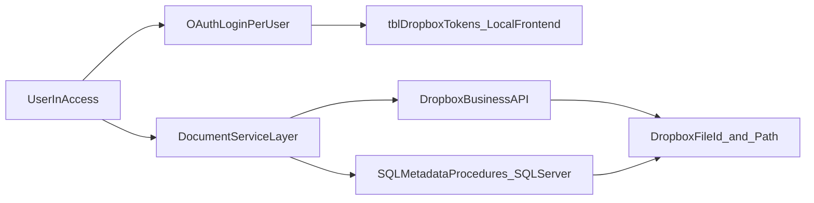

# TBCMS Dropbox Business Migration Plan

---

> **⚠ CURRENT STATE — ACTION REQUIRED**
> S:\ drive is decommissioned as of May 2026. All firm files have moved to Dropbox.
> TBCMS document open, save, scan, invoice, and case move operations are **currently broken** for all users — they still reference S:\ paths which no longer resolve.
> The Phase 3–5 code changes and Phase 7 verification + cutover are the immediate priority.
> No data migration is required — files are already in Dropbox. Only the TBCMS code and `StorageProvider` flag need to change.

---

## System Context

**TBCMS** (Tate By Water Case Management System) is a law firm case management application with a split architecture:

- **Access frontend** — each user runs their own copy of `TBCMS.accdb` (a compiled/distributed `.accde`). All VBA code and local per-user tables live here. Local tables are accessed via DAO (`CurrentDb`).
- **SQL Server backend** — shared database containing all case data, documents metadata, and stored procedures. Accessed from VBA via ADO using the existing helper `PcaGetConnnectionString()` (defined in the shared utilities module). Stored procedures are called via `cn.Execute "exec spName @Param = value"`.

**Key distinction**: any table described as "local frontend" lives in the user's `TBCMS.accdb` and is accessed with `CurrentDb`. Any table described as "backend" lives in SQL Server and is accessed via `ADODB.Connection` using `PcaGetConnnectionString()`.

**Existing document data volumes** (verified against live `awsql2022dev` mirror):
- `tblCaseDocuments`: 18,561 rows — canonical case document references; 10,190 distinct `(CaseID, DocumentType)` pairs; one outlier `(26211, General)` has 243 rows.
- `tblScans`: 4,678 rows — additional scan path records; 66% of `TypeofScan` is NULL; paths are wrapped in legacy `#...#` Access-hyperlink markers.
- `tblCase`: 10,959 rows total; only **6,610 (60.3%)** have any row in `tblCaseDocuments`. 4,349 cases pre-date the ledger.
- 29 rows in `tblDocumentTypes` (28 visible + 1 hidden `Intake` type).
- Single configuration row in `tblDocumentRootDirectory` controls all path templates and root directories (see Path Template Syntax below).

See `document-management-analysis.md` for the full grounded review.

---

## POC Baseline

The existing POC is at `database_assessment/DropboxPOC/vba_code/DropboxAPI_POC.bas` (module name: `DropboxAPI_POC_Updated`).

**What the POC already provides (reuse as starting point):**
- OAuth 2.0 authorization code flow with `token_access_type=offline` (refresh tokens)
- `tblDropboxTokens` and `tblDropboxConfig` local Access table schemas and DDL (`CreateConfigTables`)
- Token load/save/refresh lifecycle (`InitializeDropboxAPI`, `RefreshAccessToken`, `LoadTokens`, `SaveTokens`)
- `UploadFile`, `DownloadFile`, `CreateFolder`, `ListFolder` API wrappers
- Retry logic with exponential backoff (2s, 4s, 8s; max 3 retries) and `429` handling
- `tblDropboxLog` table and `LogError`/`LogActivity` helpers
- Hex-based token encryption (`EncryptValue`/`DecryptValue`) — **replace with DPAPI in production**

**What the POC lacks (must be built for production):**
- Multi-user token isolation — POC is single-identity/global-token
- DPAPI encryption replacing hex encoding
- `state` parameter in OAuth flow (CSRF protection)
- Local HTTP listener (`localhost:8765`) replacing manual URL-paste — **validated in `DropboxOAuthTest.bas` (May 2026)**
- `Dropbox-API-Path-Root` namespace header on every API call — **confirmed required, namespace ID `14334595683`**
- Path derivation formula (`ToDropboxPath`) translating `DocumentFileName` to Dropbox path — **no new DB columns required**
- `files/move_v2`, `files/copy_v2`, `files/delete_v2` operations
- `files/get_temporary_link` for document open
- Chunked upload (`files/upload_session`) for files > 150 MB
- `DropboxAccountEmail` capture and identity validation at startup
- Admin revocation check against backend `tblDropboxRevocationList`
- Provider abstraction (`LocalProvider` / `DropboxProvider`)

---

## Objectives

- Replace local/shared-folder document operations with Dropbox API operations in TBCMS.
- Require each user to authenticate with their own Dropbox Business account.
- Keep current business workflows (open folder/file, scan save, invoice PDF save, close/reopen case moves) while improving auditability and reducing shared-drive dependency.

---

## Current-State Findings

- Core file-management logic is centralized in `msaccess/TBCMS/extract/vba/modules/DocumentManagement.txt`.
- Main UI entry points are in `msaccess/TBCMS/extract/vba/forms/frmClientLedger.txt` and related forms (invoice, intake, provider modules).
- Current implementation stores and opens local/UNC full file paths via SQL procedures (`spSaveCaseDocument`, `spGetCaseDocument`) and uses `FileCopy`, `Dir`, `FollowHyperlink`, and `Scripting.FileSystemObject`.
- `SaveCaseDocument(CaseID, DocumentType, DocumentFileName)` current signature — passes a full filesystem path as `DocumentFileName`. The updated SP must accept Dropbox fields alongside the legacy path.
- All stored procedure calls in `DocumentManagement` use `ADODB.Connection` with `PcaGetConnnectionString()` — new SP calls must follow this same pattern.
- **All 11 file/folder SPs** build their result paths with **dynamic SQL** that tokenizes a naming template through `fnGetListOfWords`, substitutes columns from `vwfrmClientLedger`, and `EXEC`s the result. The naming templates and root directories live in a single row in `tblDocumentRootDirectory`. Any rewrite must preserve the template language or replace it wholesale.
- **`spMoveDocumentFolder` hard-codes position 3** of the existing path as the `_CLOSED` injection point. It cannot be retargeted to a different layout without a rewrite.
- **Three parallel "scanned?" tracking systems** exist that do not stay in sync: `tblCaseDocuments`, `tblCase.Scan`/`tblCase.[Scan Location]`/`tblCase.ScanNotAvail`, and `tblScans`. Intakes are a fourth tracker (`TB Intakes.Scan Location GI` + `Scanned GI`). Cutover requires an explicit reconciliation policy — see Phase 1.
- **Data-quality defects in production** discovered during DB review (Phase 1 remediation backlog):
  - 7 rows in `tblCaseDocuments` contain unresolved template literals (e.g., `S:\COMMON\RLF\CLIENTS\[Case_Letter]\…`).
  - Mixed casing in stored paths (`S:\CLOSED FILE SCANS\…` vs `S:\Closed File Scans\…`) — NTFS-tolerant, Dropbox/URL-intolerant.
  - Non-canonical roots (cases pointing at `S:\COMMON\<Atty>\Domestic\…` without `_CLIENTS\`) that pre-date the current `DocumentRootNaming` template.
  - 4,349 cases (39.7%) have **no row** in `tblCaseDocuments` at all.
- **Workflow inventory is complete** in `.docs/document-management-analysis.md`. Phase 1 validates and freezes that contract rather than re-inventorying.

---

## Target Architecture



---

## Design Decisions (confirmed)

- **Integration mode**: API-native Dropbox operations, not filesystem sync dependency.
- **Token scope**: per-user tokens stored in each user's local Access frontend in `tblDropboxTokens` (DAO/`CurrentDb`).
- **File reference strategy**: no new columns added to `tblCaseDocuments`, `tblScans`, or the Intakes table. The Dropbox path for any document is derived at runtime from the existing `DocumentFileName` field using the path translation formula. `DocumentFileName` is never overwritten — it remains the canonical record. All Dropbox API calls use the derived path directly.
- **Path derivation formula** (applied by `DropboxService.ToDropboxPath(localPath)`):
  1. Replace `S:\COMMON\` with `/Company/COMMON/`
  2. Replace `S:\Closed File Scans\` with `/Company/Closed File Scans/`
  3. Replace all remaining `\` with `/`
  Confirmed lossless against all 18,561 rows in `tblCaseDocuments` (May 2026) — zero non-conforming paths exist.
- **Migration style**: direct cutover. All files are already in Dropbox; S:\ is no longer in use. No hybrid period, no per-row `StorageProvider` flag. The global `StorageProvider` flag in `tblDropboxRootConfig` controls whether TBCMS routes through the Dropbox API (`Dropbox`) or the legacy filesystem (`Local`), and is the single rollback switch.
- **OAuth flow**: authorization code grant with `token_access_type=offline`. VBA shells a PowerShell `HttpListener` on `http://localhost:8765` before opening the browser. When the user clicks Allow, Dropbox redirects to `localhost:8765` automatically — PowerShell captures the code, displays a green "Authorization complete — you can close this tab" page in the browser, and writes the redirect URL to a temp file VBA polls. No copy-paste required. The redirect URI `http://localhost:8765` must be registered in the Dropbox App Console (Settings → OAuth 2 → Redirect URIs) exactly as written. A manual paste fallback (redirect to `http://localhost`, no port) is retained in the codebase via `USE_LOCAL_LISTENER = False` for environments where port 8765 is blocked or PowerShell execution policy prevents the listener script from running. Both redirect URIs must be registered in the App Console.
- **OAuth frequency — once per user**: The full browser OAuth flow runs exactly once per user. Dropbox returns both an `access_token` (4-hour lifetime) and a `refresh_token` (long-lived, no expiry under normal conditions). Both are DPAPI-encrypted and stored in `tblDropboxTokens`. On every subsequent session, `InitializeDropboxAPI` loads the stored tokens silently — no browser, no user interaction. If the access token is within 5 minutes of expiry, it is refreshed silently using the refresh token before any API call is made. Users are only prompted to re-authorize in the following situations:

  | Situation | Reason |
  |---|---|
  | IT admin inserts row in `tblDropboxRevocationList` | Intentional deprovisioning — forced re-auth on next startup |
  | User revokes app in their own Dropbox account settings | Dropbox invalidates the refresh token |
  | User's Windows profile is rebuilt or reset | DPAPI blob is bound to the original Windows session; cannot be decrypted on a new profile |
  | `tblDropboxTokens` is deleted or corrupted | No stored token to load |

  The user runbook must document all four recovery paths (re-auth steps with screenshots). See G18 for DPAPI profile-reset handling.
- **Conflict policy**: **overwrite** for save/scan workflows; **fail explicitly** (no `autorename`) for move operations during case close/reopen — surfaces a user-facing error requiring manual resolution.
- **Temporary downloaded files**: stored in `%TEMP%\TBCMS\` as `<GUID>_<original_filename>`. Deleted on `Workbook_BeforeClose` equivalent (`Form_Unload` of the Access startup form) and at next session open. Directory is user-profile-scoped.
- **Document open links**: `files/get_temporary_link` (24-hour expiry) for all document-open actions. Never permanent shared links — limits exposure of sensitive case documents.
- **Token and AppSecret encryption**: Windows DPAPI (`CryptProtectData` / `CryptUnprotectData`) declared via VBA `Declare` statements. Encrypted blobs are bound to the current user's Windows session and cannot be decrypted on another machine or by another Windows user. Replaces the POC's trivial hex encoding.
- **AppKey and AppSecret location**: stored in the local Access frontend table `tblDropboxConfig` (DAO), DPAPI-encrypted. Provisioned once per user by IT during frontend setup (not distributed via SQL Server — DPAPI blobs are user-session-bound and cannot be shared). `AppKey` is additionally stored unencrypted in `tblDropboxRootConfig` (SQL Server) for display/reference only.
- **Write failure**: if a Dropbox write fails, the operation fails with an error and is logged to `tblDropboxAuditLog`. No silent fallback — avoids invisible data loss.
- **Rollback**: S:\ is permanently decommissioned. `StorageProvider = Local` in `tblDropboxRootConfig` reverts TBCMS code to the legacy filesystem path, but since S:\ no longer exists that path is also broken — `StorageProvider = Local` is **not a viable runtime rollback**. The only recovery from a failed cutover is reverting the TBCMS `.accde` deployment to the previous version and restoring S:\ from backup if necessary. This means the cutover decision is close to irreversible. The pre-cutover `VerificationReport` must show zero `NotFound` rows before the flag is flipped.
- **Upload size limit**: Dropbox `files/upload` supports up to 150 MB. Files exceeding 150 MB must use `files/upload_session/start` + `files/upload_session/append_v2` + `files/upload_session/finish` (chunked upload). This applies to large TIF/PDF case scan files. `DropboxService` must detect file size before upload and route accordingly.
- **VBA unit testing framework**: Rubberduck (https://rubberduckvba.com).
- **Access startup hook**: initialization code (`InitializeDropboxAPI`, `StorageProvider` flag load, revocation check) runs in the `Form_Open` event of the application's startup form (whichever form is set as the Display Form in Access Options). Do not use an `AutoExec` macro — it cannot call VBA with error handling.
- **Team namespace header (required on every API call)**: The Tate Bywater Dropbox Business team uses a dedicated team root namespace (confirmed ID: `14334595683`). All `DropboxService` API calls — list, upload, download, move, copy, delete, metadata, temporary link — **must** include the header `Dropbox-API-Path-Root: {"namespace_id": "14334595683", ".tag": "namespace_id"}`. Without this header, calls resolve against the user's personal home namespace (which is empty) rather than the shared team folder tree. The namespace ID is read from `tblDropboxRootConfig.NamespaceId` at startup; `DropboxService` stores it in a module-level variable and injects it into every request.

---

## Path Template Syntax

### Two-template design

Dropbox case folder paths are built in two passes — matching the current
SQL Server design, where `tblDocumentRootDirectory.DocumentRootNaming`
produces the per-case folder and `tblDocumentTypes.DocumentFolder` adds
the per-type subfolder.

The Dropbox replacement preserves this two-template shape so the
familiar mental model is kept and so that `tblDocumentTypes.DocumentFolder`
can stay populated without modification.

`tblDropboxRootConfig` holds the **per-case-folder** templates.
`tblDocumentTypes.DocumentFolder` (unchanged) holds the per-type
**suffix** appended to the resolved case folder.

Templates use the same token language as today (so the same
`fnGetListOfWords` parser remains valid):

- `[Field]` — substituted from `vwfrmClientLedger` (the contract
  columns frozen in Phase 1: `Last_Name`, `First_Name`, `FileNo`,
  `Yr`, `Orig_Atty`, `Case_Letter`, `CaseOpenDate`).
- `~` — literal space placeholder (tokenizer artifact).
- `<currentdate>` — today, ISO formatted.
- `(customuserentry)` — placeholder for user-editable filename
  segment; resolved to literal `<type here>` in the Save As preview.

Dropbox templates (confirmed against live Dropbox team — namespace `14334595683`,
verified May 2026):

| Field | Confirmed value |
|-------|----------------|
| `TeamRootPath` | `/Company/COMMON` |
| `OpenCasesFolderTemplate` | `\ [Orig_Atty] \_CLIENTS\ [Case_Letter] \ [Last_Name] , ~ [First_Name] ~ [FileNo] \` |
| `ClosedCasesFolderTemplate` | `\ [Orig_Atty] \_CLIENTS\ [Case_Letter] \ _CLOSED \ [Last_Name] , ~ [First_Name] ~ [FileNo] \` |
| `AllInvoicesFolderTemplate` | *(empty — root only)* |
| `AllInvoicesDirectory` | `/Company/COMMON/_ALL INVOICES` |
| `ClosedFileScanFolderTemplate` | `\ TB \ [Yr] \` |
| `ClosedFileScanDirectory` | `/Company/Closed File Scans` |
| `ScannerDirectory` | `/Company/COMMON/_SCANNER` |
| `IntakeFolderTemplate` | `/Company/COMMON/Intakes` |

> `IntakeFolderTemplate` path does not yet exist in Dropbox. IT must create
> `/Company/COMMON/Intakes` before Phase 5 intake flows go live. All other paths
> above are confirmed to exist in the live team namespace.

> The shape exactly mirrors the existing `tblDocumentRootDirectory`
> row, only with Dropbox `/`-rooted paths replacing `S:\` UNC roots.
> This keeps the migration semantics-preserving: a closed-case folder
> resolves to the same logical structure on either provider.
>
> **Critical**: `Closed File Scans` uses title case in Dropbox (not `CLOSED FILE SCANS`
> as on the legacy S: drive). Use the Dropbox casing exactly to avoid creating a
> duplicate folder.

### Canonical DocumentType folder mapping

`tblCaseDocuments.DocumentType` has 29 distinct active values, all of
which must map cleanly to Dropbox folder segments. Most already map to
their `tblDocumentTypes.DocumentFolder` value verbatim and **need no
mapping table** — keep `tblDocumentTypes.DocumentFolder` as the source
of truth and reuse it for Dropbox paths.

A flat mapping override table is added only for the 5 special types
that have no `DocumentFolder` (they currently save to the case root):

| DocumentType | Current behavior | Dropbox folder segment (proposed) |
|---|---|---|
| `Init Intake, Notes, Documents` | case root | `_Intake\` |
| `Client ID` | case root | `_Client ID\` |
| `Retainer / Contract` | case root | `_Retainer\` |
| `Closed Final` | case root | `_Closed Final\` |
| `General` | case root | *(case root — unchanged)* |

The remaining 24 visible types (e.g., `Client Invoices` → `Invoices\`,
`Correspondence: Letters and Emails` → `Correspondence\`, `Client
Medical Records` → `Client Medical Records\`, all `Discovery\*`
variants) inherit their folder from `tblDocumentTypes.DocumentFolder`
unchanged.

Legal-staff sign-off is required on this proposed mapping (Phase 1
deliverable). Categories like `Correspondence: Letters and Emails` and
`Closed Final` may have compliance implications for folder placement.

### Naming-template parity for filenames

`tblDocumentTypes.DocumentNamingRule` (per-type filename templates,
e.g., `[Last_Name] [FileNo] <CurrentDate> (customuserentry)`) **must
remain authoritative** for Dropbox saves. Wire the same tokenizer
through `DropboxService.BuildFileName(documentType, caseID)` → calls
the existing `spGetDocumentFileName` SP and uses its output verbatim.

Do not invent a new filename language. The 29 existing rules in
`tblDocumentTypes` already encode legal-staff conventions and have
been stable for years.

---

## Implementation Phases

### Phase 0: Dropbox Prerequisites Intake

Nothing in Phase 1 onward can start until the items below are collected.
Items flagged **(blocking)** must be resolved before Phase 2 schema work
begins. Items in section D may be collected in parallel with Phase 1
but can influence Phase 7 backfill design.

#### A. From the Dropbox App Console (https://www.dropbox.com/developers/apps)

App created for TBCMS (May 2026). App key: `dqleswbnux8k3m5`.

| Item | Where it goes | Notes |
|---|---|---|
| **App key** ✅ captured | `tblDropboxRootConfig.AppKey` (SQL Server, plain) and `tblDropboxConfig.AppKey` (local frontend, plain) | Value: `dqleswbnux8k3m5` |
| **App secret** ✅ captured | `tblDropboxConfig.AppSecret` (local frontend only, DPAPI-encrypted per user) | Rotate immediately if compromised; never store in SQL Server |
| Permission type ✅ | App configuration | "Scoped access" + "Full Dropbox" confirmed |
| Scopes ✅ | App configuration | `files.content.read`, `files.content.write`, `files.metadata.read`, `sharing.read`, `account_info.read` confirmed enabled |
| Redirect URIs ✅ confirmed | App configuration | `http://localhost:8765` (primary — local HTTP listener, no copy-paste) and `http://localhost` (fallback — manual paste) both registered. Both confirmed working in `DropboxOAuthTest.bas` (May 2026). |
| OAuth 2 settings | App configuration | Confirm "Allow implicit grant" is **off**. We use authorization code flow with `token_access_type=offline` |
| App status | Production submission | Development apps cap at 250 linked users. If headcount exceeds 250, **submit for production approval** — 1–2 week turnaround |

#### B. From the Dropbox Business Admin Console (and the team admin)

| Item | Why it matters |
|---|---|
| **Plan tier** (blocking) | Standard / Advanced / Business Plus / Enterprise. Determines whether **Team Spaces** is available (Advanced+) vs. classic shared folders, and affects API rate limits |
| Licensed seats vs. headcount | Are there enough Dropbox Business seats for all TBCMS users? Procurement lead time if not |
| Storage quota | Current consumption + headroom for existing `S:\COMMON` data plus migration growth |
| **Team root** ✅ confirmed | Root namespace ID `14334595683` (team: "Tate Bywater"). TBCMS case data lives under `/Company/COMMON`. Attorney folders (`RLF`, `PM`, `TDT`, etc.), `_ALL INVOICES`, and `_SCANNER` confirmed present. `Closed File Scans` confirmed at `/Company/Closed File Scans`. No collision with existing content. |
| **Permission model** | Shared-folder-per-attorney? Per-role groups (attorneys, paralegals, admin assistants)? Ethical-wall constraints? Drives the Dropbox Business group/folder design |
| Data residency | US or EU storage region. Some legal contracts dictate this |
| Audit log access | Confirm team admin can pull Dropbox's native audit feed. Complements `tblDropboxAuditLog`, does not replace it |
| SSO / SCIM | Is the firm using Okta / Azure AD SSO for Dropbox? Affects the OAuth UX users see during initial auth |
| Network allowlist | Corporate firewall must allow outbound 443 to `api.dropboxapi.com`, `content.dropboxapi.com`, `www.dropbox.com` |

#### C. From the firm's internal records

| Item | Purpose |
|---|---|
| Roster of Dropbox-Business-licensed users | Email + display name + role. Feeds the identity-validation check at startup and the permission matrix |
| TBCMS user → Dropbox email mapping | The Windows account running Access is not necessarily the Dropbox account; both identities must align in `tblDropboxTokens.DropboxAccountEmail` |
| Office-letter ↔ team-folder mapping | `[Orig_Atty]` is the 2nd path segment in `DocumentRootNaming` (`PM`, `RLF`, `TDT`, etc.). Each office letter needs a corresponding Dropbox folder or group |
| Migration cutover window | When ~18,500 `tblCaseDocuments` files + 4,678 `tblScans` references + any non-indexed cases can be backfilled. Mostly a one-time bandwidth question |

#### D. From Dropbox documentation or a sales engineer

| Item | Why we care |
|---|---|
| API rate limit for the firm's tier | Baseline is 1,200 calls/min/app. Compare against expected peak (bulk backfill of 18,500 files) |
| `upload_session` quotas | Concurrent open sessions per user, session lifetime (default 48 h), chunk size limits (4–150 MB; plan uses 100 MB) |
| **`get_temporary_link` lifetime** | Confirm current published lifetime so Phase 3 and Design Decisions in this plan use the same value (the plan currently mentions both "4 hours" and "24 hours"; pick one based on current docs) |
| Path length limit | Dropbox enforces ~260 chars in most contexts. Existing `[Last_Name], [First_Name] [FileNo]` folder names plus subfolders can push limits. The 7 broken `[Case_Letter]` rows in `tblCaseDocuments` (see Phase 1b) are an early warning |
| Atomicity guarantees on `files/move_v2` | The case close/reopen design assumes folder-level atomicity. If only file-level atomicity is guaranteed, redesign the close sequence with per-file moves and explicit rollback |
| Team Spaces vs. classic shared folders | If using Team Spaces (Advanced+), paths route through a namespace ID. Confirm `DropboxService.BuildCasePath` design handles this or capture the namespace logic needed |

#### Exit criteria for Phase 0

- All "(blocking)" items in sections A and B captured and recorded.
- Section C roster locked (open issues like missing seats raised to procurement).
- Section D answers documented in this plan or its addendum — specifically: confirmed rate limit, confirmed `get_temporary_link` lifetime (and the plan's two mentions corrected to match), confirmed atomicity model for `files/move_v2`, confirmed path length limit.
- IT-admin runbook draft started, anchored on the actual app key and team root values from A and B.

---

### Phase 1: Discovery, Mapping, Data-Quality Remediation, and Contract Freeze

#### 1a. Validation
- Validate the workflow inventory in `document-management-analysis.md` against the live SQL Server database — confirm all `DocumentType` values, stored procedures, and table fields are current.
- Freeze the **`vwfrmClientLedger` contract**: list the exact columns currently referenced by token substitution (`Last_Name`, `First_Name`, `FileNo`, `Yr`, `Orig_Atty`, `Case_Letter`, `CaseOpenDate`) and forbid breaking changes to those columns for the duration of the migration.
- Confirm the proposed DocumentType folder mapping (see Path Template Syntax above) with legal staff.

#### 1b. Data-quality remediation (must complete before Phase 7 backfill)
- **Fix 7 unresolved-template rows** in `tblCaseDocuments` where `DocumentFileName LIKE '%[[]%'`. Either delete (if the underlying file does not exist on disk) or re-resolve by re-running `spGetDocumentFolderName` + `spGetDocumentFileName` with the now-complete `vwfrmClientLedger` row.
- **Canonicalize path casing**: rewrite all stored paths to canonical form (lowercase root + correct case for known folder segments). Required because Dropbox paths are case-preserving but case-insensitive for lookup, and any future migration to a case-sensitive store would break.
- **Survey non-canonical roots**: enumerate distinct path prefixes in `tblCaseDocuments` (the DB review found multiple legacy roots: `S:\COMMON\<Atty>\Domestic\…` without `_CLIENTS\`, `S:\COMMON\File Scans\…`, etc.). For each prefix, decide: realign to current template, or map to a known Dropbox path. **"Skip" is not an option** — since S:\ is gone, skipped rows will produce "file not found" errors at open time with no fallback. Every non-null, non-blank `DocumentFileName` row must have a verified Dropbox path in the `VerificationReport` before cutover.
- **Decide the 243-rows-per-pair policy** for `tblCaseDocuments`: keep all (multi-version history), keep latest only, or archive older with a `Status` column. Current `spGetCaseDocument` only ever reads the latest by `CreatedOn`, so older rows are operationally dead.
- **Reconcile the four scan-trackers**: produce a written decision on which becomes source-of-truth post-cutover:
  - `tblCaseDocuments` (modern; only 60.3% case coverage)
  - `tblCase.Scan` / `tblCase.[Scan Location]` / `tblCase.ScanNotAvail` (drives work-queue queries; drifts from `tblCaseDocuments`)
  - `tblScans` (legacy; `#…#`-wrapped paths; not written by current procs)
  - `TB Intakes.Scan Location GI` + `Scanned GI` (pre-case)
  - Output: a reconciliation plan including the SQL backfill that brings `tblCase.Scan = 1` into agreement with `EXISTS(SELECT 1 FROM tblCaseDocuments WHERE CaseID = tblCase.CaseID)` for the post-cutover model.

#### 1c. Contract freeze
- Confirm no schema changes to `tblCaseDocuments`, `tblScans`, or the Intakes table — sign off on the zero-new-columns decision.
- Confirm `StorageProvider` flag value in `tblDropboxRootConfig`: `Dropbox` is the only live value. `Local` is non-functional (S:\ decommissioned). `Hybrid` is not used.
- Identify stored procedures whose **internal implementation** changes (path construction switches from `S:\` to derived Dropbox path) but whose **signatures remain unchanged**: `spSaveCaseDocument`, `spGetCaseDocument`, `spGetDocumentFileName`, `spGetDocumentFolderName`, `spGetClosedDocumentFolderName`, `spGetClosedFileScanFolderName`, `spGetAllInvoicesFolderName`, `spGetIntakeFolderName`, `spGetIntakeDocumentFileName`, `spMoveDocumentFolder`. All remain callable from VBA via `ADODB.Connection` with no signature changes.
- Mark `tblDocumentRootDirectory` as deprecated-after-cutover in a schema comment.

---

### Phase 2: Data Model and Config Foundation

#### SQL Server backend schema additions

**No new columns on `tblCaseDocuments`, `tblScans`, or the Intakes table.**

All files are already in Dropbox. S:\ is no longer in use. There is no hybrid period and no per-row storage provider tracking required. The Dropbox path for any document is derived on demand from the existing `DocumentFileName` value using the path translation formula (see Design Decisions — Path derivation). `DocumentFileName` is kept as-is and continues to store the canonical S:\ path as the authoritative record; the translation is applied at runtime by `DropboxService`.

> **Confirmed from live database (May 2026):** all 18,561 rows in `tblCaseDocuments` use exactly two root prefixes — `S:\COMMON\` (14,229 rows) and `S:\Closed File Scans\` (4,332 rows) — with zero exceptions. The translation is a lossless, reversible string replacement with no ambiguity.

**Create `tblDropboxRootConfig`** (SQL Server backend, single admin-managed row — schema mirrors the existing `tblDocumentRootDirectory` so both providers share the same template semantics):

| Column | Type | Description |
|--------|------|-------------|
| `ConfigID` | INT PK | Single row, ConfigID = 1 |
| `NamespaceId` | NVARCHAR(50) | Dropbox team root namespace ID. **Confirmed value: `14334595683`**. Required in `Dropbox-API-Path-Root` header on every API call. Store here so it can be updated without a code change. |
| `TeamRootPath` | NVARCHAR(500) | Dropbox path to firm's case document root. **Confirmed value: `/Company/COMMON`** — equivalent of `S:\COMMON`. |
| `DocumentRootNaming` | NVARCHAR(500) | Open-case folder template using existing token language. Mirrors `tblDocumentRootDirectory.DocumentRootNaming`. |
| `DocumentClosedNaming` | NVARCHAR(500) | Closed-case folder template. Mirrors `tblDocumentRootDirectory.DocumentClosedNaming`. |
| `AllInvoicesDirectory` | NVARCHAR(500) | Firm-wide invoices root. **Confirmed value: `/Company/COMMON/_ALL INVOICES`**. Mirrors `tblDocumentRootDirectory.AllInvoicesDirectory`. |
| `AllInvoicesNaming` | NVARCHAR(500) | Suffix template under `AllInvoicesDirectory`. Empty in current production. |
| `ClosedFileScanDirectory` | NVARCHAR(500) | Closed-file-scans root. **Confirmed value: `/Company/Closed File Scans`** (title case — not all-caps). Mirrors `tblDocumentRootDirectory.ClosedFileScanDirectory`. |
| `ClosedFileScanNaming` | NVARCHAR(500) | Suffix template under `ClosedFileScanDirectory` (confirmed value: `\ TB \ [Yr] \`). |
| `ScannerDirectory` | NVARCHAR(500) | Scanner hardware drop folder. **Confirmed value: `/Company/COMMON/_SCANNER`**. Read-only source for scan ingest; never a write target for TBCMS uploads. |
| `IntakeDirectory` | NVARCHAR(500) | Intake scans root (case-independent). Proposed value: `/Company/COMMON/Intakes`. **This folder does not yet exist — IT must create it before Phase 5.** |
| `AppKey` | NVARCHAR(200) | Dropbox app key (public — for display/reference only) |
| `StorageProvider` | NVARCHAR(20) | **Admin-controlled global feature flag**: `Dropbox` (live — the only operational value). `Local` retained in schema but non-functional since S:\ is decommissioned. `Hybrid` not used. |

> Schema parity with `tblDocumentRootDirectory` is intentional: the new Dropbox path procs (Phase 4) take this row as input the same way the current procs take `tblDocumentRootDirectory`, so the dynamic-SQL tokenizer logic is reused verbatim. Only the root paths and the `\` → `/` separator differ.

> Note: `AppSecret` is NOT stored in SQL Server. It is stored DPAPI-encrypted in the local frontend `tblDropboxConfig` (see below) and provisioned by IT per user.

**Create `tblDropboxRevocationList`** (SQL Server backend, IT-admin-managed):

| Column | Type | Description |
|--------|------|-------------|
| `RevocationID` | INT PK IDENTITY |  |
| `DropboxAccountEmail` | NVARCHAR(320) NOT NULL | Dropbox account email of the user being revoked. Matched against `tblDropboxTokens.DropboxAccountEmail` in the local frontend. |
| `RevokedAt` | DATETIME NOT NULL | When the revocation was issued |
| `RevokedBy` | NVARCHAR(200) | IT admin who issued the revocation |
| `Reason` | NVARCHAR(500) | Reason for revocation (audit) |

#### Local Access frontend schema (per-user, accessed via DAO/`CurrentDb`)

**`tblDropboxConfig`** (carry forward from POC, extend):

| Key | Description |
|-----|-------------|
| `AppKey` | Dropbox app key (plain text — app key is public) |
| `AppSecret` | Dropbox app secret (DPAPI-encrypted) |
| `RedirectUri` | Default: `http://localhost` |

**`tblDropboxTokens`** (replace POC schema with production schema):

| Column | Type | Description |
|--------|------|-------------|
| `TokenID` | AUTOINCREMENT PK |  |
| `DropboxAccountEmail` | TEXT(320) | Dropbox account email — populated from `/users/get_current_account` at auth time. Used for identity validation and revocation matching. |
| `AccessToken` | MEMO | DPAPI-encrypted |
| `RefreshToken` | MEMO | DPAPI-encrypted |
| `TokenType` | TEXT(50) | Always `"Bearer"` |
| `ExpiresAt` | DATETIME | Expiry of the access token |
| `CreatedDate` | DATETIME |  |
| `TokenStatus` | TEXT(20) | `Active`, `Expired`, or `Revoked`. Replaces POC's `IsActive YESNO` — more states needed for revocation. |

> The POC's `IsActive YESNO` column must be migrated to `TokenStatus TEXT(20)` via the `UpgradeTokenTable` pattern already in the POC.

**`tblDropboxLog`** (local frontend — session-level debug log):
- Retain POC schema: `LogID`, `LogDate`, `LogLevel`, `FunctionName`, `ErrorNumber`, `ErrorDescription`, `Details`
- Never write token values or file content to this table
- **Audit-critical events** (upload, move, copy, delete, link generation) are additionally written to a SQL Server audit table `tblDropboxAuditLog` via a new SP `spLogDropboxAuditEvent(CaseID, DocumentType, DropboxPath, ActionType, Outcome, ErrorDetail)`. Called via `ADODB.Connection` using `PcaGetConnnectionString()`.

**Create `tblDropboxAuditLog`** (SQL Server backend):

| Column | Type | Description |
|--------|------|-------------|
| `AuditID` | INT PK IDENTITY |  |
| `EventDate` | DATETIME NOT NULL |  |
| `DropboxAccountEmail` | NVARCHAR(320) | Who performed the action |
| `CaseID` | INT NULL |  |
| `DocumentType` | NVARCHAR(100) NULL |  |
| `DropboxPath` | NVARCHAR(MAX) NULL |  |
| `ActionType` | NVARCHAR(50) | `Upload`, `Move`, `Copy`, `Delete`, `LinkGenerate` |
| `Outcome` | NVARCHAR(20) | `Success` or `Failure` |
| `ErrorDetail` | NVARCHAR(MAX) NULL | Dropbox error code/message on failure |

---

### Phase 3: Dropbox Service Module Hardening

Create production `DropboxService.bas` module based on the POC. All items below are changes from or additions to the POC:

**Authentication:**
- `state` parameter: at auth initiation, generate a random GUID (`CreateObject("Scriptlet.TypeLib").GUID`), store in a module-level `m_OAuthState` variable. The local HTTP listener captures the redirect URL automatically; VBA extracts `state` from it and compares to `m_OAuthState`. If they do not match, abort and log an error — do not exchange the code for tokens. (In the paste fallback, the user-provided URL is validated the same way.)
- After successful token exchange, call `/users/get_current_account` and store the returned `email` in `tblDropboxTokens.DropboxAccountEmail`.

**Encryption:**
- Replace `EncryptValue`/`DecryptValue` (hex) with `EncryptDPAPI(plaintext As String) As String` and `DecryptDPAPI(ciphertext As String) As String` using Windows DPAPI via `Declare` statements for `CryptProtectData` and `CryptUnprotectData` from `crypt32.dll`.

**Startup sequence** (called from startup form `Form_Open`):
1. Load `StorageProvider` from SQL Server `tblDropboxRootConfig` via ADO. If `StorageProvider = "Local"`, display a warning: "Document access is unavailable — S:\ drive is decommissioned. Contact IT." and disable all document-related UI. This state should never occur in normal operation.
2. Call `InitializeDropboxAPI` (loads tokens from local `tblDropboxTokens` via DAO). If no token exists, run the OAuth flow now.
3. Check `tblDropboxRevocationList` (SQL Server) for any row matching `tblDropboxTokens.DropboxAccountEmail`. If found: set `TokenStatus = "Revoked"`, clear module-level token variables, prompt user to re-authenticate.
4. Validate identity: call `/users/get_current_account`, compare returned email to `tblDropboxTokens.DropboxAccountEmail`. If mismatch: clear tokens, prompt re-auth.
5. If token expiring within 5 minutes: auto-refresh silently.

**Required API operations:**

All calls except `users/get_current_account` **must** include the header:
```
Dropbox-API-Path-Root: {"namespace_id": "14334595683", ".tag": "namespace_id"}
```
Read namespace ID from `tblDropboxRootConfig.NamespaceId` at startup; store in module-level `m_NamespaceId`. Without this header, paths resolve against the user's personal home namespace (empty), not the team folder tree.

| Operation | Endpoint | Key parameters |
|-----------|----------|---------------|
| Upload ≤ 150 MB | `POST content.dropboxapi.com/2/files/upload` | `mode: overwrite`, `mute: false` |
| Upload > 150 MB | `files/upload_session/start` → `append_v2` → `finish` | Chunk size: 100 MB |
| Download to temp | `POST content.dropboxapi.com/2/files/download` | Writes to `%TEMP%\TBCMS\<GUID>_<filename>` |
| Create folder | `POST api.dropboxapi.com/2/files/create_folder_v2` | `autorename: false`; treat `path/conflict/folder` as success |
| Move | `POST api.dropboxapi.com/2/files/move_v2` | `autorename: false`; on conflict, surface error — do not silent-rename |
| Copy | `POST api.dropboxapi.com/2/files/copy_v2` | `autorename: false` |
| Delete | `POST api.dropboxapi.com/2/files/delete_v2` | Only called after confirmed successful copy in move sequence |
| Get metadata | `POST api.dropboxapi.com/2/files/get_metadata` | Used to resolve `DropboxFileId` to current path; pass `{".tag": "id", "id": "id:AbCd..."}` |
| Temporary link | `POST api.dropboxapi.com/2/files/get_temporary_link` | Returns link valid for 4 hours; open via `Application.FollowHyperlink` |
| List folder | `POST api.dropboxapi.com/2/files/list_folder` | Used for folder-browse actions |
| Current account | `POST api.dropboxapi.com/2/users/get_current_account` | Used at startup for identity validation — namespace header not required for this call |

**Retry policy**: `429` → wait `Retry-After` seconds; `500`/`503` → exponential backoff (2s, 4s, 8s); `401` → attempt one token refresh then re-raise; other errors → fail immediately with translated user message. Max 3 retries total.

**Logging**: every API call logs to `tblDropboxLog` (local). Write/move/copy/delete/link events additionally call `spLogDropboxAuditEvent` (SQL Server). Never log token values or file content bytes.

---

### Phase 4: Document Management Compatibility Layer

- Refactor `DocumentManagement` module into a provider-based layer:
  - `LocalProvider`: legacy filesystem behavior — retained in code for emergency revert only, not operational (S:\ decommissioned)
  - `DropboxProvider`: delegates to `DropboxService`
- `StorageProvider` flag loaded once at startup (see Phase 3 startup sequence) into a module-level variable `m_StorageProvider`. Forms do not read the flag — they call `DocumentManagement` functions, which dispatch internally.
- Valid flag values:
  - `Dropbox` — all operations use Dropbox API. This is the only live value.
  - `Local` — retained in code for emergency scenarios only. Since S:\ is decommissioned, setting this will cause document operations to fail. Do not use as a runtime rollback.
- Existing VBA callers in forms (`frmClientLedger`, `frmInvoiceSent`, `Intakes`, `frmPersInjProvider`) keep their current call signatures. Provider dispatch is fully internal to `DocumentManagement`.
- Updated stored procedures (`spSaveCaseDocument`, `spMoveDocumentFolder`, etc.) must remain callable via `cn.Execute "exec spName @Param = value"` using `ADODB.Connection` — consistent with all existing SP calls in `DocumentManagement`.

---

### Phase 5: Workflow-by-Workflow Migration

> **File-origin distinction.** TBCMS workflows fall into two patterns based on who creates the file:
>
> - **Access-generated** — Access itself produces the file via `DoCmd.OutputTo acFormatPDF` (invoices only; 2,933 of 18,561 ledger rows). The implementation pattern is **render-to-temp → upload → cleanup**: write to `%TEMP%\TBCMS\<GUID>.pdf`, call `files/upload`, then delete the temp file.
> - **External-source ingest** — the file already exists on disk (scanner drop folder, user's local machine, Outlook attachment save, Word "Save As" target). VBA only relocates it. The implementation pattern is **upload-from-source-path → register**: `files/upload` reads directly from the source path; no temp staging is needed.
>
> Do not build a "save to temp first" shim for ingest flows — it's wasted I/O and creates a second cleanup obligation. Each workflow below explicitly states which pattern applies.

Migrate and validate in this order:

**1. Open document file/folder actions** *(no file creation — read only)*
- Replace `FollowHyperlink(localPath)` with `FollowHyperlink(DropboxService.GetTemporaryLink(derivedDropboxPath))`
  where `derivedDropboxPath = DropboxService.ToDropboxPath(DocumentFileName)`
- No local fallback. S:\ is gone. If the derived path returns a 404 from Dropbox, surface an error: "Document not found in Dropbox — please contact IT."
- Folder open: open the Dropbox web URL for the folder (`https://www.dropbox.com/home` + derived folder path). Confirm UX approach with users before implementing.
- No conflict possible — read-only operation.

**2. Scan save flow** (`SaveScannedFileAs`) *(external-source ingest — file already exists in scanner drop folder)*
- Source file selected by user via `SelectFileDialog` from the Dropbox-synced scanner folder at `/Company/COMMON/_SCANNER` (confirmed in Dropbox — see `tblDropboxRootConfig.ScannerDirectory`)
- Compute Dropbox destination path: `DropboxService.BuildCasePath(DocumentRootNaming, CaseID)` + `tblDocumentTypes.DocumentFolder` for the type + generated filename from `spGetDocumentFileName`
- `files/upload` reads **directly from the source path** — no copy to `%TEMP%` first
- If file > 150 MB: use chunked upload session against the same source path
- On `path/conflict/file`: overwrite (user is intentionally saving a new version)
- On success: call `spSaveCaseDocument` with `@DocumentName` (signature unchanged — no new Dropbox columns)
- Source file in `_SCANNER`: leave alone (scanner workflow rotates its own folder)

**3. Invoice PDF save + metadata persistence** *(Access-generated — render-to-temp pattern)*
- `DoCmd.OutputTo acOutputReport, strReportName, acFormatPDF, "%TEMP%\TBCMS\<GUID>_invoice.pdf"`
- Upload the temp file to the case invoice folder (`DocumentRootNaming` + `Invoices\`) and the firm-wide all-invoices folder (`AllInvoicesDirectory` + `AllInvoicesNaming`) — two separate `files/upload` calls reading the same temp source
- Register both document references via `spSaveCaseDocument` calls (same `DocumentType = 'Client Invoices'`, two rows — signature unchanged)
- Delete the temp PDF after **both** uploads succeed; on partial failure, retain the temp file and surface a user-facing retry option
- This is the only workflow that requires `%TEMP%\TBCMS\` write access; the directory cleanup logic in `Form_Unload` removes any orphans from failed runs

**4. Case close/reopen move/copy operations**
- **Close sequence**:
  1. `files/copy_v2`: copy document folder to `ClosedFileScanFolderTemplate` (if user confirms)
  2. `files/move_v2`: move document folder from `OpenCasesFolderTemplate` to `ClosedCasesFolderTemplate` with `autorename = false`
  3. On move success: call `spMoveDocumentFolder` — it updates `DocumentFileName` for all case rows to the new closed path (same S:\ path rewrite logic as today, applied to the stored `DocumentFileName` values). The path derivation formula then resolves correctly from the updated `DocumentFileName`.
  4. On move conflict: surface error with full path details, abort — do not proceed to delete any source content
- **Reopen sequence**: `files/move_v2` from `ClosedCasesFolderTemplate` back to `OpenCasesFolderTemplate`; update `spMoveDocumentFolder`
- Partial state protection: `files/delete_v2` is never called in these workflows — Dropbox `move_v2` is atomic server-side

**5. Intake and provider-specialized document flows**
- **Intake scan** (`Intakes.txt` form, `cmdScan_Click`): *(external-source ingest — file already exists in `/Company/COMMON/_SCANNER`)*. `files/upload` direct from the Dropbox source path to `IntakeDirectory`; update `Scan_Location_GI` with the derived Dropbox path on success. No new columns, no temp staging. Set `Scanned GI = True` on successful upload.
- **Medical provider documents** (`frmPersInjProvider`): read-only — folder-open action updated to use `files/get_temporary_link` or Dropbox web folder URL.
- **Mail-merge outputs** (`frmClientLedger.cmdMailMerge_Click` and similar): currently `objWord.MailMerge.Execute` produces a Word document; whether and where it lands in the case folder depends on the Word template. **Phase 1 deliverable**: enumerate every mail-merge template in use and classify each as either (a) Access-generated (template writes directly to case folder → needs render-to-temp + upload), (b) external-source ingest (user saves manually after merge → no migration handling needed), or (c) ephemeral (preview-only, never saved). Migration handling for category (a) only.

---

### Phase 6: Security, Access Control, and Governance

- **Dropbox app scopes**: `files.content.read`, `files.content.write`, `sharing.read`. No `team_data`, no admin scopes, no `files.metadata.write` beyond what upload/move require.
- **Dropbox app registration**: register at `https://www.dropbox.com/developers/apps`. Choose "Scoped access", "Full Dropbox" (required for team folder access). Set redirect URI to `http://localhost`. Note the `App key` and `App secret` — provision to each user's local `tblDropboxConfig` via the IT setup script.
- **Authorization boundary**: each user authenticates with their own Dropbox identity. TBCMS does not manage Dropbox permissions. Folder access is controlled by Dropbox Business shared-folder membership configured by the Dropbox Business admin.
- **Token-at-rest protection**: DPAPI (user-session-bound). Tokens in `tblDropboxTokens` cannot be decrypted outside the authenticating user's Windows session. Frontend `.accdb`/`.accde` distribution must be via a read-only controlled network share — not emailed.
- **Admin token revocation**: insert a row into SQL Server `tblDropboxRevocationList` with the user's `DropboxAccountEmail`. On next TBCMS startup, the revocation check (Phase 3) detects it and forces re-auth. Revocation does not require physical access to the user's machine.
- **Audit trail**: `tblDropboxAuditLog` (SQL Server) records all write operations. Retained indefinitely; accessible to IT admin via SQL Server directly.
- **Pre-cutover permission matrix validation**: enumerate Dropbox Business team folder members by role (attorney, paralegal, admin assistant). Verify each role has correct Dropbox folder membership (editor vs. viewer vs. no access) before setting `StorageProvider = Dropbox`.
- **Pre-cutover SQL Server credential rotation**: the file `msaccess/TBCMS/extract/z_PCADataSources.csv` ships in the repository with the cleartext production password for `TateBywaterSQLUser`. Rotate this credential before cutover and reissue connection strings to all frontends. Future credential-bearing CSVs must not be committed.

---

### Phase 7: Pilot, Cutover, and Rollback

#### Pre-cutover verification (replaces backfill)

All files are already in Dropbox. No data migration or ID population is required. The pre-cutover step is verification only: confirm that every `DocumentFileName` row in `tblCaseDocuments` resolves to an existing file in Dropbox before flipping the global flag.

**Verification script** (run once before cutover):
For each row in `tblCaseDocuments`, apply the path derivation formula to `DocumentFileName` and call `files/get_metadata` on the derived path. Record the result in a `VerificationReport` table:

| Column | Description |
|---|---|
| `CaseDocumentID` | FK to `tblCaseDocuments` |
| `DerivedDropboxPath` | Computed path from `DocumentFileName` |
| `Status` | `Found`, `NotFound`, or `Error` |
| `CheckedAt` | Timestamp |

Output a summary: counts of `Found`, `NotFound`, and `Error` rows. Cutover proceeds only when `NotFound` and `Error` counts are zero.

**`NotFound` rows** indicate a file that exists in SQL Server but cannot be located at the derived Dropbox path. Resolution options: locate the file manually in Dropbox and update `DocumentFileName` to match the actual path, or mark the row as archived if the underlying file no longer exists.

**`tblScans` and intake records**: same verification applied to `tblScans.DocumentFileName` and `Scan_Location_GI` rows where the `#…#` markers have been stripped (see Phase 1b).

#### Cutover checklist

- [ ] All users have completed OAuth onboarding (`TokenStatus = Active` in their local frontend)
- [ ] `VerificationReport`: zero `NotFound` and `Error` rows across `tblCaseDocuments`, `tblScans`, and intake records
- [ ] Smoke tests pass by role (attorney, paralegal, admin): open document, scan save, invoice export, case close, case reopen
- [ ] Helpdesk runbook available: OAuth re-auth steps, common error messages, rollback instructions
- [ ] `tblDropboxRevocationList` and `tblDropboxRootConfig` rows populated and update permission locked to IT admin SQL login
- [ ] Dropbox Business admin has validated permission matrix for all team folders

#### Rollback

**S:\ is decommissioned — there is no filesystem rollback.** `StorageProvider = Local` cannot be used as a runtime rollback because the S:\ paths no longer resolve.

The only recovery options post-cutover are:
1. **Dropbox API outage**: users wait for Dropbox to recover. Consider displaying a clear "Dropbox unavailable — please retry later" message rather than crashing.
2. **Bug in new TBCMS code**: revert the `.accde` deployment to the previous version. Users will be unable to open/save documents until the bug is fixed and a new `.accde` is deployed — there is no working fallback path.
3. **Data not found in Dropbox**: the `VerificationReport` must confirm zero `NotFound` rows before cutover precisely to prevent this scenario.

Given the irreversibility, the pre-cutover gate is strict: zero `NotFound`, zero `Error` in the `VerificationReport`, and smoke tests passing by role before the `StorageProvider` flag is set to `Dropbox`.

---

## Testing Strategy

- **Pre-development API smoke test** (`DropboxOAuthTest.bas`): a standalone VBA module at `database_assessment/DropboxPOC/vba_code/DropboxOAuthTest.bas` that runs the full OAuth authorization code flow, exchanges the code for a token, and lists `/Company/COMMON`. Run this once per developer workstation to confirm app credentials, scopes, namespace header, and team folder access before writing production `DropboxService.bas` code. Uses App key/secret from module-level constants — **not** from `tblDropboxConfig`. Generated access tokens from the App Console are for ad-hoc curl/API-Explorer verification only; all VBA code uses the OAuth flow.
- **Unit tests** (Rubberduck VBA test framework): path template interpolation (`BuildCasePath`), `DocumentType`-to-folder mapping, token lifecycle state machine (`Active` → `Expired` → `Revoked`), DPAPI encrypt/decrypt round-trip, API error code translation, `state` parameter GUID validation, chunked upload routing (file size threshold).
- **Integration tests** against a dedicated Dropbox sandbox team (separate from production team — never test against production):
  - OAuth end-to-end: auth, token storage, refresh, identity validation, revocation check
  - Upload/download round-trip: verify `content_hash` matches after download
  - Move conflict: attempt move to occupied path, verify error surfaced and source untouched
  - Chunked upload: upload a file > 150 MB, verify `content_hash`
  - Temporary link: generate and open within 4 hours, verify expiry after 4 hours
- **UAT scripts** for legal operation scenarios:
  - Case lifecycle: create documents → close case (move) → reopen case (move back) → open documents via link
  - Invoice: export PDF → verify in Dropbox at correct path → open via link → verify audit log row
  - Scan save: scan document → verify in Dropbox → verify `tblCaseDocuments` row has all four Dropbox fields populated
- **Non-functional checks**:
  - 5 concurrent users uploading simultaneously — verify no token cross-contamination
  - Network drop during upload — verify retry, no partial SQL record written
  - Token expiry mid-session — verify silent auto-refresh, no user interruption
  - Temp file cleanup — verify `%TEMP%\TBCMS\` is empty after session close

---

## Risks and Mitigations

| Risk | Mitigation |
|------|-----------|
| Token cross-contamination between users | DPAPI blobs are user-session-bound; `DropboxAccountEmail` checked at startup against current `/users/get_current_account` result |
| Broken legacy links after migration | Hybrid mode + backfill verification before cutover; `StorageProvider = Hybrid` allows legacy fallback reads |
| API throttling / network instability | Retry/backoff with `Retry-After` respect; persistent failure surfaces user-facing "retry later" message; no silent data loss |
| Dropbox permission mismatch | Pre-cutover permission matrix validation; access-denied errors surface immediately in `tblDropboxAuditLog` |
| Partial state on case close move failure | `files/move_v2` is atomic on Dropbox side; conflict detected before any delete; failure logged with path details |
| AppSecret exposure | DPAPI-encrypted in local frontend; `.accde` distributed via read-only network share; AppSecret never stored in SQL Server |
| Sensitive documents lingering in temp folder | GUID-named temp files deleted on session close and at next startup; `%TEMP%\TBCMS\` is user-profile-scoped |
| Files > 150 MB silently failing | Size check before every upload; chunked upload session used automatically above threshold |
| Path-casing divergence in legacy data | Phase 1b canonicalization step rewrites mixed-case paths in `tblCaseDocuments` to canonical form before backfill; Phase 7 backfill verifies each row matches a single Dropbox metadata entry |
| Cases without ledger entries (4,349 rows) | Phase 1b reconciliation policy decides how these are handled in the `VerificationReport`. Since S:\ is gone, there is no "ship as Local" option — every case with documents in Dropbox must have a verified path before cutover, or it will be inaccessible. Options: bulk-index pre-cutover, mark as `NoDocuments`, or explicitly exclude from Dropbox scope with a documented triage decision. |
| Drift between `tblCaseDocuments` and `tblCase.Scan` | Phase 1b reconciliation SQL aligns the legacy flag with ledger reality before Phase 7 cutover; post-cutover work queues query `tblCaseDocuments` directly |
| `vwfrmClientLedger` schema change breaks all path procs | Phase 1a freezes the contract columns; CI guard added to flag any schema change touching `Last_Name`, `First_Name`, `FileNo`, `Yr`, `Orig_Atty`, `Case_Letter`, `CaseOpenDate` |
| Cleartext SQL Server credentials in repo | Rotate `TateBywaterSQLUser` password during Phase 6; remove `z_PCADataSources.csv` from version control; replace with a templated `.example` file and pull real credentials from a secrets store |

---

## Known Gaps / Open Decisions

Items below were surfaced reviewing this plan against
`document-management-analysis.md`. Each must be resolved (or
explicitly deferred with sign-off) before the dependent phase
starts. Severity is implementation-blocking risk, not business
risk.

### Critical — resolve before Phase 2 schema work

**G1. `get_temporary_link` lifetime is contradicted within this plan.**
- Design Decisions (Target Architecture section) says 24-hour expiry.
- Phase 3 API operations table says "valid for 4 hours".
- Testing Strategy says "open within 4 hours, verify expiry after 4 hours".
- Phase 0 Section D already flags this and asks for resolution from Dropbox docs.
- **Decision required**: confirm Dropbox's current published lifetime and rewrite all three references to the single confirmed value. Update Risks if the actual lifetime materially affects link-distribution UX (e.g., emailed links).

**G2. `spMoveDocumentFolder` redesign is undefined.**
- Today's proc iterates `tblCaseDocuments` rows for a case and rewrites each path by splitting on `\`, hard-coded position 3 as the `_CLOSED` injection point (Analysis §5, §9). It operates on `S:\`-rooted backslashed UNC strings.
- Phase 5 step 4 calls "updated `spMoveDocumentFolder` with new `@DropboxPath`" but never defines: (a) input parameter set, (b) how it rewrites each row's `DropboxPath` for `/`-rooted Dropbox layout, (c) whether it operates per-row or accepts a folder old→new translation pair, (d) what it does with rows that still have legacy `S:\` paths during Hybrid mode.
- **Decision required**: design the new proc signature and body before Phase 4 (compatibility layer) begins. Document the exact path-rewrite rule for closed/open transitions on Dropbox paths.

**G3. `spSaveCaseDocument` dedupe semantics — resolved.**
No new Dropbox columns are added to `tblCaseDocuments`. The existing dedupe key `(CaseID, DocumentFileName)` is retained unchanged. `spSaveCaseDocument` signature requires no Dropbox-specific parameter additions.

**G4. Result-set return contract for path-resolving SPs is not pinned.**
- Analysis §9: every consumer of `spGetDocumentFolderName`, `spGetDocumentFileName`, `spGetClosedDocumentFolderName`, `spGetClosedFileScanFolderName`, `spGetAllInvoicesFolderName`, `spGetIntakeFolderName`, `spGetIntakeDocumentFileName` reads a single-row, single-column ADO recordset because the procs `EXEC()` dynamically built SQL. Rewriting any of them to scalar-returning form (e.g., `sp_executesql` with OUTPUT param) is a wire-format break for all VBA callers.
- **Decision / rule to add to Phase 1c**: "All updated path-resolving SPs must continue to return their resolved path as a single-row, single-column result-set, readable via `ADODB.Recordset`. Any SP migrated to scalar OUTPUT params must do so behind a new SP name; the existing names retain the recordset contract."

**G5. AppSecret provisioning mechanism is undefined.**
- Plan correctly notes DPAPI blobs are user-session-bound and cannot be pre-encrypted by IT.
- Plan does not describe **how** IT actually delivers `AppSecret` into each user's `tblDropboxConfig` so that the user's session encrypts it.
- **Decision required**: pick one mechanism and write it into Phase 6 / IT runbook. Candidates:
  - (a) IT-distributed setup macro on the user's workstation that prompts for the value and calls `EncryptDPAPI` in the user's Windows session.
  - (b) First-run wizard inside Access that pulls `AppSecret` from a one-time-use IT credential store (e.g., a SQL Server table with row-level access for the user, written by IT, deleted on first read), then DPAPI-encrypts.
  - (c) IT delivers a plaintext `.reg` / config file the user double-clicks; macro reads it once and encrypts.

**G6. `tblScans` legacy-format handling for Phase 7 verification.**
- `tblScans` paths are wrapped in `#…#` Access-hyperlink markers; 66% of `TypeofScan` is NULL. The path derivation formula cannot be applied until `#…#` markers are stripped.
- **Decisions required, before Phase 7 verification begins**:
  1. Strip `#…#` markers as a pre-pass on `tblScans.DocumentFileName` before running the verification script.
  2. Decide whether `tblScans` rows are included in the `VerificationReport` or frozen as legacy-read-only and excluded from the zero-`NotFound` gate.

**G7. `tblDocumentRootDirectory` — resolved.**
There is no hybrid mode. `tblDropboxRootConfig` is the sole active config table. `tblDocumentRootDirectory` should be marked deprecated-after-cutover in a schema comment; no synchronisation rule is needed.

### Moderate — resolve before the affected phase

**G8. Form-caller inventory is incomplete.**
- Analysis §6 lists 8 forms touching DocumentManagement. Phase 4 names only `frmClientLedger`, `frmInvoiceSent`, `Intakes`, `frmPersInjProvider`.
- Missing: `frm_invoices_summary`, `Time_Keeping`, `frmTimeKeepingClosed` (invoice/PDF flow), and `frmScansubform` / `frmScanLocation` (read-only `tblScans` views).
- **Action**: extend Phase 4's "stable signatures" guarantee to all 8 forms. For the scan read-only forms, decide explicitly whether they continue to render legacy `tblScans` paths verbatim during and after cutover.

**G9. Save-As dialog filename-override behavior not addressed.**
- Analysis §9: `SaveScannedFileAs` shows a Save-As dialog pre-filled with the SP-generated filename; the **user-typed** name is what ends up in `tblCaseDocuments.DocumentFileName`, often diverging from `spGetDocumentFileName`'s suggestion.
- Phase 5 step 2 (scan save) does not state whether the dialog remains, whether the Dropbox upload uses the SP-generated name or the user-overridden name, or whether legal staff want this tightened.
- **Decision required, before Phase 5 step 2 implementation**: keep override / drop override / require override-with-confirmation. Document the chosen behavior.

**G10. `FollowHyperlink(temporary_link)` is a UX regression for document open.**
- Today: `FollowHyperlink(\\server\share\file.docx)` opens directly in Word/Acrobat/Excel.
- Plan Phase 5 step 1: `FollowHyperlink(GetTemporaryLink(...))` opens the **browser**, forcing the user to download from the browser to edit. For the dozens-of-files-per-day attorney workflow, this is friction.
- Phase 5 hand-waves "Confirm UX approach with users" only for folder-open, not document-open.
- **Decision required, before Phase 5 step 1**: pick one of:
  - (a) Download via `files/download` to `%TEMP%\TBCMS\<GUID>_<filename>` and `ShellExecute` the local copy (re-uploads on save not handled; read-only-ish).
  - (b) Use the Dropbox desktop client's `dbxcli`-style local path if the user has the client installed (resurrect a managed sync dependency just for opens).
  - (c) Accept the browser-open regression and document it.

**G11. `ScannerDirectory` and on-prem residency aren't named in the target architecture.**
- `tblDocumentRootDirectory.ScannerDirectory = S:\COMMON\_SCANNER` is the scanner-hardware drop folder. It is **not** in `tblDropboxRootConfig`.
- Phase 5 step 2 implies the scanner drop stays local but never says it explicitly, and Risks does not list "on-prem file server is permanent infrastructure post-migration" as a constraint.
- **Action**: add a one-line statement to Design Decisions that the scanner drop folder remains on-prem indefinitely (or document the alternative scanner ingestion path). Update Risks if the on-prem dependency affects DR / decommissioning plans.

**G12. AppKey is duplicated in two tables with no owner.**
- Stored in `tblDropboxRootConfig.AppKey` (SQL Server, plaintext, "for display/reference only") **and** `tblDropboxConfig.AppKey` (local frontend, plaintext, used by OAuth).
- Plan does not say which is canonical, who updates it, or what happens if they diverge.
- **Action**: declare `tblDropboxConfig` (local) the value used at runtime; `tblDropboxRootConfig` (SQL) is display-only and is updated by IT in lockstep when the key rotates. Or remove the SQL copy.

**G13. No SP-layer invariant check to prevent the "7 broken rows" defect recurring.**
- Phase 1b cleans up 7 rows in `tblCaseDocuments` that contain unresolved template literals (e.g., `[Case_Letter]`). Analysis attributes the cause: the `vwfrmClientLedger` row was incomplete at save time.
- **Action**: add to Phase 1c — updated `spSaveCaseDocument` validates that `@DocumentName` contains no unresolved template tokens (`[…]`, `<…>`, `(…)`) and raises on violation rather than inserting.

**G14. Path-length pre-flight.**
- Dropbox enforces ~260 chars effective path length.
- **Action**: add to Phase 1b a pre-flight that applies the path derivation formula to each `DocumentFileName` row and flags any whose derived Dropbox path exceeds 260 characters. Flagged rows must be resolved (shorten the filename or folder name) before Phase 7 verification passes.

### Minor — track but don't block

**G15. `Intake` (id 31, hidden) vs. `Init Intake, Notes, Documents` (id 1) collide conceptually.** Plan's mapping table proposes `_Intake\` for id 1, but id 31 already routes to `IntakeDirectory` via a different code path. Add one clarifying sentence in Path Template Syntax so a future reader doesn't merge them.

**G16. Intakes column naming.** No new Dropbox columns are added to the Intakes table. Confirm the actual SQL Server column names (`Scan Location GI`, `Scanned GI` with spaces) before any Phase 5 code touches them.

**G17. `Scanned GI` flag post-cutover.** No hybrid mode. Decide whether `Scanned GI` is set to true when the Dropbox upload for an intake scan succeeds (recommended), or left as a manual flag. Document the chosen behavior before Phase 5 step 5 implementation.

**G18. DPAPI re-encryption on Windows-profile changes.** Workstation rebuilds, AD migrations, and profile resets invalidate DPAPI blobs. "User re-authenticates" is the correct recovery, but say so in the user runbook.

**G19. `tblDropboxAuditLog` growth and retention policy.** Indefinite retention is stated. Add an index plan (at minimum on `EventDate` and `DropboxAccountEmail`) and a retention/archive note — at firm scale this table will grow steadily.

**G20. `[GI#Last#Name]` `#`-as-space token in the Intake type.** Analysis §3 calls this out as an unusual workaround in `spGetIntakeDocumentFileName`. Preserved implicitly by reusing the SP, but add a comment in the SP source so a future rewrite doesn't strip the `#REPLACE` thinking it's dead code.

**G21. Duplicate lowercase `company` folder inside `/Company`.** Live Dropbox inspection (May 2026) found `/Company/company` (lowercase) alongside the canonical `/Company` folders. This is likely an accidental creation by the desktop sync client. **Action**: Dropbox admin should delete `/Company/company` before backfill begins. If it contains content, review and relocate before deleting. Add to Phase 1b pre-flight checklist.

**G22. Loose files at `/Company` root that do not belong there.** Live inspection found case-related PDFs (e.g., client payment receipts, notices of satisfaction), `.lnk` Windows shortcuts, and `.log`/`.txt` files sitting directly in `/Company` rather than in a case subfolder. These are housekeeping issues outside TBCMS scope but could cause confusion during backfill path matching. **Action**: Dropbox admin should review and relocate or delete these files before Phase 7 backfill. Add to Phase 1b pre-flight checklist.

**G23. `ScannerDirectory` on-prem residency confirmed.** The scanner hardware drop folder is confirmed in Dropbox at `/Company/COMMON/_SCANNER` (equivalent of `S:\COMMON\_SCANNER`). This folder is an **ingest source only** — TBCMS reads files from it to upload to case folders; it is never a write target for TBCMS-generated files. Add to Design Decisions: the scanner drop folder remains as-is in Dropbox (mirrored from on-prem via desktop sync client) and is not managed by the Dropbox API integration. The `ScannerDirectory` value in `tblDropboxRootConfig` is used read-only to validate the source path before upload.

---

## Deliverables

0. **Phase 1b data-quality remediation report** — record of fixes/decisions for: 7 unresolved-template rows, multi-version policy for `(CaseID, DocumentType)` outliers, four-tracker reconciliation policy and SQL, path-length pre-flight results, G21/G22 Dropbox housekeeping (duplicate folder, loose files).
1. This plan document (updated through cutover).
2. `DropboxService.bas` — production VBA module with DPAPI encryption, `state` validation, local HTTP listener OAuth flow, identity check, revocation check, retry/backoff, chunked upload, path derivation formula (`ToDropboxPath`), all required API operations.
3. Updated `DocumentManagement.bas` — provider abstraction with `Local` / `Dropbox` dispatch; stable signatures for all form callers.
4. SQL Server schema migration scripts (config and audit tables only — no changes to existing document tables):
   - `tblDropboxRootConfig` table creation + initial row
   - `tblDropboxRevocationList` table creation
   - `tblDropboxAuditLog` table creation
   - `tblDocumentRootDirectory` deprecated comment
5. Updated stored procedures: internal path construction updated to use Dropbox paths via `ToDropboxPath` equivalent; signatures unchanged. New `spLogDropboxAuditEvent`. `spBackfillCaseDocumentDropbox` not required (no Dropbox columns to populate).
6. Pre-cutover verification script: for all `tblCaseDocuments` rows, derive Dropbox path and call `files/get_metadata`; output `VerificationReport` with `Found`/`NotFound`/`Error` counts.
7. `tblDropboxTokens` upgrade script for local frontend (migrate `IsActive YESNO` → `TokenStatus TEXT(20)`, add `DropboxAccountEmail`).
8. IT admin runbook: Dropbox Business app registration steps, team folder structure, permission matrix by role, `tblDropboxRootConfig` population, `tblDropboxConfig` provisioning per user, token revocation procedure.
9. User runbook: OAuth onboarding (first-time auth steps with screenshots), re-authentication on token expiry, common error messages and resolutions.
10. Pilot sign-off report with completed cutover checklist and 30-day stabilization gate sign-off.
