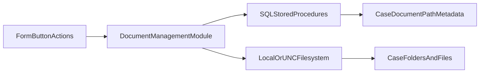

# Document Management Analysis (TBCMS Extract)

## Scope

This analysis is based on the extracted artifacts under:

- `msaccess/TBCMS/extract/vba/modules`
- `msaccess/TBCMS/extract/vba/forms`
- `msaccess/TBCMS/extract/queries`
- `msaccess/TBCMS/extract/forms`

The goal is to document how TBCMS currently manages documents/files before Dropbox migration.

## Key Findings

- Document handling is filesystem-based (UNC/local paths), not API-based.
- Core logic is centralized in `DocumentManagement`.
- Paths and filenames are mostly generated through SQL Server stored procedures.
- UI entry points are concentrated in `frmClientLedger`, with additional intake and invoice workflows in other forms.
- Case closure/reopen relies on folder copy/delete operations via `Scripting.FileSystemObject`.

## Primary Code Assets

### Core module

- `msaccess/TBCMS/extract/vba/modules/DocumentManagement.txt`

Important procedures:

- Path/name lookup:
  - `GetDocumentFileName`
  - `GetDocumentFolderName`
  - `GetClosedDocumentFolderName`
  - `GetClosedFileScanFolderName`
  - `GetAllInvoicesFolderName`
  - `GetIntakeFolderName`
  - `GetIntakeDocumentFileName`
  - `GetDocumentRootFolder`
  - `GetScannerFolder`
- File/folder operations:
  - `FolderExistsCreate`
  - `OpenFileDialog`
  - `SelectFileDialog`
  - `SaveScannedFileAs`
  - `OpenDocumentFolder`
  - `OpenDocumentFile`
  - `MoveDocumentByCaseStatus`
  - `CopyDocumentToClosedFileScan`
- Metadata persistence:
  - `SaveCaseDocument`
  - `GetCaseDocument`
  - `GetCaseClosedStatus`

### Main form entry points

- `msaccess/TBCMS/extract/vba/forms/frmClientLedger.txt`
  - Scanning/saving (`cmdScan_Click`)
  - Open folder/file actions (`cmdOpenDocumentFolder*`, `cmdOpen*`)
  - Case close/reopen migration (`cmdCloseCase_Click`, `cmdReopenCase_Click`)

### Additional workflow forms

- `msaccess/TBCMS/extract/vba/forms/Intakes.txt`
  - Intake scanning and direct path storage (`Scan_Location_GI`)
- `msaccess/TBCMS/extract/vba/forms/frmInvoiceSent.txt`
  - Invoice PDF output and registration via `SaveCaseDocument`
- `msaccess/TBCMS/extract/vba/forms/frmPersInjProvider.txt`
  - Medical documents folder opening
- `msaccess/TBCMS/extract/vba/forms/frmScansubform.txt`
- `msaccess/TBCMS/extract/vba/forms/frmScanLocation.txt`
  - Per-case scan location rows (`tblScans`)

## Current Architecture

## Stored Procedures and Tables in Use

### Stored procedures (from `DocumentManagement`)

- `spGetDocumentFileName`
- `spGetDocumentFolderName`
- `spGetClosedDocumentFolderName`
- `spGetClosedFileScanFolderName`
- `spGetAllInvoicesFolderName`
- `spGetIntakeFolderName`
- `spGetIntakeDocumentFileName`
- `spSaveCaseDocument`
- `spGetCaseDocument`
- `spMoveDocumentFolder`
- `spGetCaseClosedStatus`

### Tables referenced in workflows

- `tblDocumentRootDirectory` (`DocumentRootDirectory`, `ScannerDirectory`)
- `tblScans` (`ScanLocation`, `TypeofScan`)
- `tblCase` (`[Scan Location]`, `Scan`, `ScanNotAvail`, `Scanned`)
- Intake record field: `Scan_Location_GI` (in intake workflow)

## Main Workflows

### 1) Scan and save case document

Typical path:

1. User chooses a scanner/source file (`SelectFileDialog`).
2. Destination folder path is fetched by case + document type.
3. Destination filename is generated (`GetDocumentFileName`).
4. File is copied (`FileCopy`).
5. Metadata is saved using `spSaveCaseDocument`.

Functions:

- `frmClientLedger.cmdScan_Click`
- `DocumentManagement.SaveScannedFileAs`
- `DocumentManagement.SaveCaseDocument`

### 2) Open folder or open single document

- Folder open: `OpenDocumentFolder` -> `OpenFileDialog` / hyperlink flow
- File open: `OpenDocumentFile` -> `GetCaseDocument` -> `FollowHyperlink`

Functions:

- `cmdOpenDocumentFolderFull_Click`
- `cmdOpenDocumentFolderFinance_Click` (Discovery folder)
- `cmdOpenDocumentFolderInvoices_Click`
- `cmdOpenDocumentFolderCorrespondence_Click`
- `cmdOpenRetainer_Click`, `cmdOpenClosedFinal_Click`, etc.

### 3) Case close / reopen folder movement

- Close:
  - Optionally copy to closed file scans (`CopyDocumentToClosedFileScan`)
  - Move general folder to `_CLOSED` hierarchy (`MoveDocumentByCaseStatus(...,"Closed")`)
- Reopen:
  - Move back (`MoveDocumentByCaseStatus(...,"Open")`)

Internally uses:

- `Scripting.FileSystemObject.CopyFolder`
- `Scripting.FileSystemObject.DeleteFolder`
- `spMoveDocumentFolder`

### 4) Invoice export and registration

- PDF generated with `DoCmd.OutputTo`
- Saved to case invoice folder and all-invoices folder
- Registered with `SaveCaseDocument` as `Client Invoices`

Source:

- `frmInvoiceSent.txt`

### 5) Intake-specific scan path

- Intake scan copies to intake folder and stores direct path in `Scan_Location_GI`.
- This is separate from case document registration flow.

Source:

- `Intakes.txt`

## Data/Path Model (Current State)

- Canonical open-file reference for many case docs is a full filesystem path saved via `spSaveCaseDocument`.
- Folder targets are SP-driven by case/document type.
- Mixed model exists:
  - Case document registration via SPs
  - Additional scan path tracking in `tblScans` / `[Scan Location]` / `Scan_Location_GI`

## Current Risks and Limitations

1. **Filesystem coupling**
   - Heavy dependence on UNC/local paths and OS file permissions.

2. **Move operation fragility**
   - Close/reopen logic uses copy + delete, which can leave partial states if delete fails.

3. **Path consistency risk**
   - Multiple path-tracking locations can drift over time.

4. **Limited auditability/versioning**
   - File operations are not inherently versioned or centrally audited as cloud-object operations.

5. **User experience inconsistencies**
   - Open/browse behaviors rely on `FollowHyperlink` and dialog semantics that vary by context.

## Extract Baseline Snapshot

- Extracted VBA host files under `msaccess/TBCMS/extract/vba`: 212 (`modules`, `forms`, `reports` combined).
- Core module analyzed: `DocumentManagement.txt` (~840 lines in extract artifact).
- Main form analyzed: `frmClientLedger.txt` (large form export with VBA event code in trailing section).

## Migration Implications

For Dropbox migration, these current-state behaviors should be preserved functionally:

- Open file/folder actions by document type
- Scan save and document registration
- Case close/reopen movement semantics
- Invoice PDF save/register behavior
- Intake-specific scan handling

The recommended migration path and target architecture are documented in:

- `docs/dropbox-migration-plan.md`
