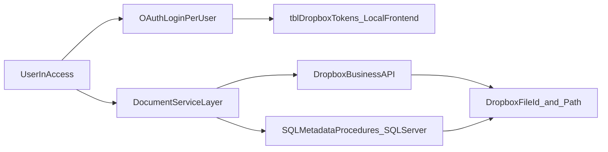

# TBCMS Dropbox Business Migration Plan

---

## System Context

**TBCMS** (Tate By Water Case Management System) is a law firm case management application with a split architecture:

- **Access frontend** — each user runs their own copy of `TBCMS.accdb` (a compiled/distributed `.accde`). All VBA code and local per-user tables live here. Local tables are accessed via DAO (`CurrentDb`).
- **SQL Server backend** — shared database containing all case data, documents metadata, and stored procedures. Accessed from VBA via ADO using the existing helper `PcaGetConnnectionString()` (defined in the shared utilities module). Stored procedures are called via `cn.Execute "exec spName @Param = value"`.

**Key distinction**: any table described as "local frontend" lives in the user's `TBCMS.accdb` and is accessed with `CurrentDb`. Any table described as "backend" lives in SQL Server and is accessed via `ADODB.Connection` using `PcaGetConnnectionString()`.

**Existing document data volumes** (as of analysis date):
- `tblCaseDocuments`: 18,561 rows — canonical case document references
- `tblScans`: 4,678 rows — additional scan path records

---

## POC Baseline

The existing POC is at `database_assessment/DropboxPOC/vba_code/DropboxAPI_POC.bas` (module name: `DropboxAPI_POC_Updated`).

**What the POC already provides (reuse as starting point):**
- OAuth 2.0 authorization code flow with `token_access_type=offline` (refresh tokens)
- `tblDropboxTokens` and `tblDropboxConfig` local Access table schemas and DDL (`CreateConfigTables`)
- Token load/save/refresh lifecycle (`InitializeDropboxAPI`, `RefreshAccessToken`, `LoadTokens`, `SaveTokens`)
- `UploadFile`, `DownloadFile`, `CreateFolder`, `ListFolder` API wrappers
- Retry logic with exponential backoff (2s, 4s, 8s; max 3 retries) and `429` handling
- `tblDropboxLog` table and `LogError`/`LogActivity` helpers
- Hex-based token encryption (`EncryptValue`/`DecryptValue`) — **replace with DPAPI in production**

**What the POC lacks (must be built for production):**
- Multi-user token isolation — POC is single-identity/global-token
- DPAPI encryption replacing hex encoding
- `state` parameter in OAuth flow (CSRF protection)
- `files/move_v2`, `files/copy_v2`, `files/delete_v2` operations
- `files/get_temporary_link` for document open
- `files/get_metadata` for file ID resolution
- Chunked upload (`files/upload_session`) for files > 150 MB
- `DropboxAccountEmail` capture and identity validation at startup
- Admin revocation check against backend `tblDropboxRevocationList`
- Provider abstraction (`LocalProvider` / `DropboxProvider`)

---

## Objectives

- Replace local/shared-folder document operations with Dropbox API operations in TBCMS.
- Require each user to authenticate with their own Dropbox Business account.
- Keep current business workflows (open folder/file, scan save, invoice PDF save, close/reopen case moves) while improving auditability and reducing shared-drive dependency.

---

## Current-State Findings

- Core file-management logic is centralized in `msaccess/TBCMS/extract/vba/modules/DocumentManagement.txt`.
- Main UI entry points are in `msaccess/TBCMS/extract/vba/forms/frmClientLedger.txt` and related forms (invoice, intake, provider modules).
- Current implementation stores and opens local/UNC full file paths via SQL procedures (`spSaveCaseDocument`, `spGetCaseDocument`) and uses `FileCopy`, `Dir`, `FollowHyperlink`, and `Scripting.FileSystemObject`.
- `SaveCaseDocument(CaseID, DocumentType, DocumentFileName)` current signature — passes a full filesystem path as `DocumentFileName`. The updated SP must accept Dropbox fields alongside the legacy path.
- All stored procedure calls in `DocumentManagement` use `ADODB.Connection` with `PcaGetConnnectionString()` — new SP calls must follow this same pattern.
- **Workflow inventory is complete** in `docs/document-management-analysis.md`. Phase 1 validates and freezes that contract rather than re-inventorying.

---

## Target Architecture

---

## Design Decisions (confirmed)

- **Integration mode**: API-native Dropbox operations, not filesystem sync dependency.
- **Token scope**: per-user tokens stored in each user's local Access frontend in `tblDropboxTokens` (DAO/`CurrentDb`).
- **File reference strategy**: store both `DropboxFileId` (Dropbox internal ID, format `id:AbCd...`, stable across renames/moves) and `DropboxPath` (human-readable logical path) for every document. `DocumentFileName` retained as legacy fallback during hybrid period.
- **Migration style**: phased rollout with `StorageProvider` feature flag; fallback to legacy provider is instant (single row update).
- **OAuth flow**: authorization code grant with `token_access_type=offline`. Redirect URI is `http://localhost`. User authorizes in browser; VBA displays an `InputBox` prompting the user to paste the full redirect URL (containing the `code` parameter). VBA extracts `code` and `state` from that URL, validates `state`, then exchanges `code` for tokens. This is the standard pattern for desktop Access apps that cannot handle HTTP callbacks.
- **Conflict policy**: **overwrite** for save/scan workflows; **fail explicitly** (no `autorename`) for move operations during case close/reopen — surfaces a user-facing error requiring manual resolution.
- **Temporary downloaded files**: stored in `%TEMP%\TBCMS\` as `<GUID>_<original_filename>`. Deleted on `Workbook_BeforeClose` equivalent (`Form_Unload` of the Access startup form) and at next session open. Directory is user-profile-scoped.
- **Document open links**: `files/get_temporary_link` (24-hour expiry) for all document-open actions. Never permanent shared links — limits exposure of sensitive case documents.
- **Token and AppSecret encryption**: Windows DPAPI (`CryptProtectData` / `CryptUnprotectData`) declared via VBA `Declare` statements. Encrypted blobs are bound to the current user's Windows session and cannot be decrypted on another machine or by another Windows user. Replaces the POC's trivial hex encoding.
- **AppKey and AppSecret location**: stored in the local Access frontend table `tblDropboxConfig` (DAO), DPAPI-encrypted. Provisioned once per user by IT during frontend setup (not distributed via SQL Server — DPAPI blobs are user-session-bound and cannot be shared). `AppKey` is additionally stored unencrypted in `tblDropboxRootConfig` (SQL Server) for display/reference only.
- **Hybrid write failure**: if `StorageProvider = Hybrid` and the Dropbox write fails, the operation fails with an error. No silent fallback to local write — avoids invisible divergence between providers.
- **Upload size limit**: Dropbox `files/upload` supports up to 150 MB. Files exceeding 150 MB must use `files/upload_session/start` + `files/upload_session/append_v2` + `files/upload_session/finish` (chunked upload). This applies to large TIF/PDF case scan files. `DropboxService` must detect file size before upload and route accordingly.
- **VBA unit testing framework**: Rubberduck (https://rubberduckvba.com).
- **Access startup hook**: initialization code (`InitializeDropboxAPI`, `StorageProvider` flag load, revocation check) runs in the `Form_Open` event of the application's startup form (whichever form is set as the Display Form in Access Options). Do not use an `AutoExec` macro — it cannot call VBA with error handling.

---

## Path Template Syntax

Dropbox folder paths for case documents are derived from templates stored in `tblDropboxRootConfig`. Templates use `{CaseID}` and `{DocumentType}` as named placeholders, replaced at runtime by `DropboxService.BuildCasePath(template, caseID, documentType)`.

Example templates (populated by IT admin during setup):

| Field | Example value |
|-------|--------------|
| `TeamRootPath` | `/TBW` |
| `OpenCasesFolderTemplate` | `/TBW/Cases/{CaseID}/{DocumentType}` |
| `ClosedCasesFolderTemplate` | `/TBW/Cases/_CLOSED/{CaseID}/{DocumentType}` |
| `AllInvoicesFolderTemplate` | `/TBW/AllInvoices/{CaseID}` |
| `ClosedFileScanFolderTemplate` | `/TBW/ClosedFileScans/{CaseID}` |
| `IntakeFolderTemplate` | `/TBW/Intakes/{CaseID}` |

`{DocumentType}` values in use (from `tblCaseDocuments`): `General`, `Invoices`, `Closed Final`, `Discovery`, `Correspondence`, `Medical`, `Client Invoices`. These must be mapped 1:1 to folder names in Dropbox — produce this mapping as a Phase 1 deliverable.

---

## Implementation Phases

### Phase 1: Discovery, Mapping, and Contract Freeze

- Validate the workflow inventory in `document-management-analysis.md` against the live SQL Server database — confirm all `DocumentType` values, stored procedures, and table fields are current.
- Produce the complete `DocumentType`-to-Dropbox-folder-name mapping table. Each value in `tblCaseDocuments.DocumentType` must map to a folder name segment used in Dropbox path templates above.
- Freeze the metadata contract: get sign-off on all schema additions in Phase 2 before any code changes.
- Confirm `StorageProvider` flag values: `Local` (default), `Dropbox`, `Hybrid`.
- Identify stored procedures requiring signature changes: `spSaveCaseDocument`, `spGetCaseDocument`, `spGetDocumentFileName`, `spGetDocumentFolderName`, `spGetClosedDocumentFolderName`, `spMoveDocumentFolder`, and all naming SPs. These must accept or return Dropbox path/ID values post-migration while remaining callable from VBA via `ADODB.Connection`.
- Confirm `tblDocumentRootDirectory` (SQL Server) is kept unchanged during hybrid period; mark as deprecated-after-cutover in schema comments after full Dropbox rollout.

---

### Phase 2: Data Model and Config Foundation

#### SQL Server backend schema additions

**Add to `tblCaseDocuments`:**
- `DropboxFileId` NVARCHAR(200) NULL — Dropbox internal file identifier (`id:AbCd...` format). Stable across renames and moves. Returned as `id` in Dropbox metadata responses. NULL until document is migrated to Dropbox.
- `DropboxPath` NVARCHAR(MAX) NULL — Dropbox logical path at time of last write (e.g., `/TBW/Cases/123/General/doc.pdf`). May drift if file is moved outside TBCMS — always re-resolve via `files/get_metadata` using `DropboxFileId` when displaying to user.
- `StorageProvider` NVARCHAR(20) NOT NULL DEFAULT `'Local'` — `Local` or `Dropbox`. Tracks which system owns this specific record.
- `DropboxContentHash` NVARCHAR(64) NULL — Dropbox-returned `content_hash` (SHA-256 block hash). Required for integrity verification on download. NOT the same as `DropboxFileId`.
- `DropboxModifiedAt` DATETIME NULL — `server_modified` timestamp from Dropbox metadata. Required for audit.

**Add to `tblScans`:**
- `DropboxFileId` NVARCHAR(200) NULL
- `DropboxPath` NVARCHAR(MAX) NULL
- `StorageProvider` NVARCHAR(20) NOT NULL DEFAULT `'Local'`

**Add to Intakes table (the table backing `Intakes.txt` form, containing `Scan_Location_GI`):**
- `Scan_DropboxFileId` NVARCHAR(200) NULL — replaces the "or new dedicated field" option from Phase 5. Do not overload `Scan_Location_GI` with Dropbox paths. `Scan_Location_GI` retains its UNC path during hybrid period.
- `Scan_DropboxPath` NVARCHAR(MAX) NULL

**Create `tblDropboxRootConfig`** (SQL Server backend, single admin-managed row):

| Column | Type | Description |
|--------|------|-------------|
| `ConfigID` | INT PK | Single row, ConfigID = 1 |
| `TeamRootPath` | NVARCHAR(500) | Dropbox Business team folder root (e.g., `/TBW`) |
| `OpenCasesFolderTemplate` | NVARCHAR(500) | Path template for open case documents |
| `ClosedCasesFolderTemplate` | NVARCHAR(500) | Path template for closed case documents |
| `AllInvoicesFolderTemplate` | NVARCHAR(500) | Path template for all-invoices folder |
| `ClosedFileScanFolderTemplate` | NVARCHAR(500) | Path template for closed file scans |
| `IntakeFolderTemplate` | NVARCHAR(500) | Path template for intake scans |
| `AppKey` | NVARCHAR(200) | Dropbox app key (public — for display/reference only) |
| `StorageProvider` | NVARCHAR(20) | **Admin-controlled global feature flag**: `Local`, `Dropbox`, or `Hybrid` |

> Note: `AppSecret` is NOT stored in SQL Server. It is stored DPAPI-encrypted in the local frontend `tblDropboxConfig` (see below) and provisioned by IT per user.

**Create `tblDropboxRevocationList`** (SQL Server backend, IT-admin-managed):

| Column | Type | Description |
|--------|------|-------------|
| `RevocationID` | INT PK IDENTITY |  |
| `DropboxAccountEmail` | NVARCHAR(320) NOT NULL | Dropbox account email of the user being revoked. Matched against `tblDropboxTokens.DropboxAccountEmail` in the local frontend. |
| `RevokedAt` | DATETIME NOT NULL | When the revocation was issued |
| `RevokedBy` | NVARCHAR(200) | IT admin who issued the revocation |
| `Reason` | NVARCHAR(500) | Reason for revocation (audit) |

#### Local Access frontend schema (per-user, accessed via DAO/`CurrentDb`)

**`tblDropboxConfig`** (carry forward from POC, extend):

| Key | Description |
|-----|-------------|
| `AppKey` | Dropbox app key (plain text — app key is public) |
| `AppSecret` | Dropbox app secret (DPAPI-encrypted) |
| `RedirectUri` | Default: `http://localhost` |

**`tblDropboxTokens`** (replace POC schema with production schema):

| Column | Type | Description |
|--------|------|-------------|
| `TokenID` | AUTOINCREMENT PK |  |
| `DropboxAccountEmail` | TEXT(320) | Dropbox account email — populated from `/users/get_current_account` at auth time. Used for identity validation and revocation matching. |
| `AccessToken` | MEMO | DPAPI-encrypted |
| `RefreshToken` | MEMO | DPAPI-encrypted |
| `TokenType` | TEXT(50) | Always `"Bearer"` |
| `ExpiresAt` | DATETIME | Expiry of the access token |
| `CreatedDate` | DATETIME |  |
| `TokenStatus` | TEXT(20) | `Active`, `Expired`, or `Revoked`. Replaces POC's `IsActive YESNO` — more states needed for revocation. |

> The POC's `IsActive YESNO` column must be migrated to `TokenStatus TEXT(20)` via the `UpgradeTokenTable` pattern already in the POC.

**`tblDropboxLog`** (local frontend — session-level debug log):
- Retain POC schema: `LogID`, `LogDate`, `LogLevel`, `FunctionName`, `ErrorNumber`, `ErrorDescription`, `Details`
- Never write token values or file content to this table
- **Audit-critical events** (upload, move, copy, delete, link generation) are additionally written to a SQL Server audit table `tblDropboxAuditLog` via a new SP `spLogDropboxAuditEvent(CaseID, DocumentType, DropboxPath, ActionType, Outcome, ErrorDetail)`. Called via `ADODB.Connection` using `PcaGetConnnectionString()`.

**Create `tblDropboxAuditLog`** (SQL Server backend):

| Column | Type | Description |
|--------|------|-------------|
| `AuditID` | INT PK IDENTITY |  |
| `EventDate` | DATETIME NOT NULL |  |
| `DropboxAccountEmail` | NVARCHAR(320) | Who performed the action |
| `CaseID` | INT NULL |  |
| `DocumentType` | NVARCHAR(100) NULL |  |
| `DropboxPath` | NVARCHAR(MAX) NULL |  |
| `ActionType` | NVARCHAR(50) | `Upload`, `Move`, `Copy`, `Delete`, `LinkGenerate` |
| `Outcome` | NVARCHAR(20) | `Success` or `Failure` |
| `ErrorDetail` | NVARCHAR(MAX) NULL | Dropbox error code/message on failure |

---

### Phase 3: Dropbox Service Module Hardening

Create production `DropboxService.bas` module based on the POC. All items below are changes from or additions to the POC:

**Authentication:**
- `state` parameter: at auth initiation, generate a random GUID (`CreateObject("Scriptlet.TypeLib").GUID`), store in a module-level `m_OAuthState` variable. Extract `state` from the redirect URL the user pastes back. If it does not match `m_OAuthState`, abort and log an error — do not exchange the code for tokens.
- After successful token exchange, call `/users/get_current_account` and store the returned `email` in `tblDropboxTokens.DropboxAccountEmail`.

**Encryption:**
- Replace `EncryptValue`/`DecryptValue` (hex) with `EncryptDPAPI(plaintext As String) As String` and `DecryptDPAPI(ciphertext As String) As String` using Windows DPAPI via `Declare` statements for `CryptProtectData` and `CryptUnprotectData` from `crypt32.dll`.

**Startup sequence** (called from startup form `Form_Open`):
1. Load `StorageProvider` from SQL Server `tblDropboxRootConfig` via ADO.
2. If `StorageProvider <> "Local"`: call `InitializeDropboxAPI` (loads tokens from local `tblDropboxTokens` via DAO).
3. Check `tblDropboxRevocationList` (SQL Server) for any row matching `tblDropboxTokens.DropboxAccountEmail`. If found: set `TokenStatus = "Revoked"`, clear module-level token variables, prompt user to re-authenticate.
4. Validate identity: call `/users/get_current_account`, compare returned email to `tblDropboxTokens.DropboxAccountEmail`. If mismatch: clear tokens, prompt re-auth.
5. If token expiring within 5 minutes: auto-refresh silently.

**Required API operations:**

| Operation | Endpoint | Key parameters |
|-----------|----------|---------------|
| Upload ≤ 150 MB | `POST content.dropboxapi.com/2/files/upload` | `mode: overwrite`, `mute: false` |
| Upload > 150 MB | `files/upload_session/start` → `append_v2` → `finish` | Chunk size: 100 MB |
| Download to temp | `POST content.dropboxapi.com/2/files/download` | Writes to `%TEMP%\TBCMS\<GUID>_<filename>` |
| Create folder | `POST api.dropboxapi.com/2/files/create_folder_v2` | `autorename: false`; treat `path/conflict/folder` as success |
| Move | `POST api.dropboxapi.com/2/files/move_v2` | `autorename: false`; on conflict, surface error — do not silent-rename |
| Copy | `POST api.dropboxapi.com/2/files/copy_v2` | `autorename: false` |
| Delete | `POST api.dropboxapi.com/2/files/delete_v2` | Only called after confirmed successful copy in move sequence |
| Get metadata | `POST api.dropboxapi.com/2/files/get_metadata` | Used to resolve `DropboxFileId` to current path; pass `{".tag": "id", "id": "id:AbCd..."}` |
| Temporary link | `POST api.dropboxapi.com/2/files/get_temporary_link` | Returns link valid for 4 hours; open via `Application.FollowHyperlink` |
| List folder | `POST api.dropboxapi.com/2/files/list_folder` | Used for folder-browse actions |
| Current account | `POST api.dropboxapi.com/2/users/get_current_account` | Used at startup for identity validation |

**Retry policy**: `429` → wait `Retry-After` seconds; `500`/`503` → exponential backoff (2s, 4s, 8s); `401` → attempt one token refresh then re-raise; other errors → fail immediately with translated user message. Max 3 retries total.

**Logging**: every API call logs to `tblDropboxLog` (local). Write/move/copy/delete/link events additionally call `spLogDropboxAuditEvent` (SQL Server). Never log token values or file content bytes.

---

### Phase 4: Document Management Compatibility Layer

- Refactor `DocumentManagement` module into a provider-based layer:
  - `LocalProvider`: existing filesystem behavior, unchanged
  - `DropboxProvider`: delegates to `DropboxService`
- `StorageProvider` flag loaded once at startup (see Phase 3 startup sequence) into a module-level variable `m_StorageProvider`. Forms do not read the flag — they call `DocumentManagement` functions, which dispatch internally.
- Valid flag values:
  - `Local` — all operations use legacy filesystem paths via existing code
  - `Dropbox` — all operations use Dropbox API; legacy path code not called
  - `Hybrid` — reads: try Dropbox first (`DropboxFileId` not null), fall back to local path; writes: Dropbox only. If Dropbox write fails in Hybrid mode, the operation fails — no silent fallback to local write.
- Existing VBA callers in forms (`frmClientLedger`, `frmInvoiceSent`, `Intakes`, `frmPersInjProvider`) keep their current call signatures. Provider dispatch is fully internal to `DocumentManagement`.
- Updated stored procedures (`spSaveCaseDocument`, `spMoveDocumentFolder`, etc.) must remain callable via `cn.Execute "exec spName @Param = value"` using `ADODB.Connection` — consistent with all existing SP calls in `DocumentManagement`.

---

### Phase 5: Workflow-by-Workflow Migration

Migrate and validate in this order:

**1. Open document file/folder actions**
- Replace `FollowHyperlink(localPath)` with `FollowHyperlink(DropboxService.GetTemporaryLink(DropboxFileId))`
- If `DropboxFileId` is null (pre-migration record): fall back to `FollowHyperlink(localPath)` when `StorageProvider = Hybrid`
- Folder open: use `files/list_folder` result to build a picker UI, or open the Dropbox web URL for the folder (`https://www.dropbox.com/home` + path). Confirm UX approach with users before implementing.
- No conflict possible — read-only operation.

**2. Scan save flow** (`SaveScannedFileAs`)
- Source file selected by user via `SelectFileDialog` (unchanged)
- Compute Dropbox destination path: `DropboxService.BuildCasePath(OpenCasesFolderTemplate, CaseID, DocumentType)` + generated filename from `GetDocumentFileName`
- If file > 150 MB: use chunked upload session
- On `path/conflict/file`: overwrite (user is intentionally saving a new version)
- On success: call updated `spSaveCaseDocument` with `@DocumentName`, `@DropboxFileId`, `@DropboxPath`, `@DropboxContentHash`, `@DropboxModifiedAt`, `@StorageProvider = 'Dropbox'`
- Delete local source temp file after confirmed upload

**3. Invoice PDF save + metadata persistence**
- `DoCmd.OutputTo` writes PDF to `%TEMP%\TBCMS\<GUID>_invoice.pdf`
- Upload to case invoice folder (`InvoicesFolderTemplate`) and all-invoices folder (`AllInvoicesFolderTemplate`) — two separate upload calls
- Register both Dropbox references via updated `SaveCaseDocument` calls
- Delete temp PDF after both uploads confirmed

**4. Case close/reopen move/copy operations**
- **Close sequence**:
  1. `files/copy_v2`: copy document folder to `ClosedFileScanFolderTemplate` (if user confirms)
  2. `files/move_v2`: move document folder from `OpenCasesFolderTemplate` to `ClosedCasesFolderTemplate` with `autorename = false`
  3. On move success: call updated `spMoveDocumentFolder` with new `@DropboxPath`; update `DropboxPath` in `tblCaseDocuments`
  4. On move conflict: surface error with full path details, abort — do not proceed to delete any source content
- **Reopen sequence**: `files/move_v2` from `ClosedCasesFolderTemplate` back to `OpenCasesFolderTemplate`; update `spMoveDocumentFolder`
- Partial state protection: `files/delete_v2` is never called in these workflows — Dropbox `move_v2` is atomic server-side

**5. Intake and provider-specialized document flows**
- **Intake** (`Intakes.txt` form): upload scan to `IntakeFolderTemplate`; store result in new `Scan_DropboxFileId` and `Scan_DropboxPath` fields on the intake record. Leave `Scan_Location_GI` untouched during hybrid period.
- **Medical provider documents** (`frmPersInjProvider`): folder-open action updated to use `files/get_temporary_link` or Dropbox web folder URL.

---

### Phase 6: Security, Access Control, and Governance

- **Dropbox app scopes**: `files.content.read`, `files.content.write`, `sharing.read`. No `team_data`, no admin scopes, no `files.metadata.write` beyond what upload/move require.
- **Dropbox app registration**: register at `https://www.dropbox.com/developers/apps`. Choose "Scoped access", "Full Dropbox" (required for team folder access). Set redirect URI to `http://localhost`. Note the `App key` and `App secret` — provision to each user's local `tblDropboxConfig` via the IT setup script.
- **Authorization boundary**: each user authenticates with their own Dropbox identity. TBCMS does not manage Dropbox permissions. Folder access is controlled by Dropbox Business shared-folder membership configured by the Dropbox Business admin.
- **Token-at-rest protection**: DPAPI (user-session-bound). Tokens in `tblDropboxTokens` cannot be decrypted outside the authenticating user's Windows session. Frontend `.accdb`/`.accde` distribution must be via a read-only controlled network share — not emailed.
- **Admin token revocation**: insert a row into SQL Server `tblDropboxRevocationList` with the user's `DropboxAccountEmail`. On next TBCMS startup, the revocation check (Phase 3) detects it and forces re-auth. Revocation does not require physical access to the user's machine.
- **Audit trail**: `tblDropboxAuditLog` (SQL Server) records all write operations. Retained indefinitely; accessible to IT admin via SQL Server directly.
- **Pre-cutover permission matrix validation**: enumerate Dropbox Business team folder members by role (attorney, paralegal, admin assistant). Verify each role has correct Dropbox folder membership (editor vs. viewer vs. no access) before setting `StorageProvider = Dropbox`.

---

### Phase 7: Pilot, Cutover, and Rollback

#### Backfill strategy for existing records

Approximately 18,561 `tblCaseDocuments` rows and 4,678 `tblScans` rows currently reference UNC/local paths and have null `DropboxFileId`. Backfill before cutover using two tracks:

**Track A — files already in Dropbox via desktop sync client:**
For each row with non-null `DocumentFileName`, construct the expected Dropbox path using `tblDropboxRootConfig` templates. Call `files/get_metadata` to confirm the file exists at that path. On success: write `DropboxFileId`, `DropboxPath`, `DropboxContentHash`, `DropboxModifiedAt` back to the row via `spBackfillCaseDocumentDropbox(CaseDocumentID, DropboxFileId, DropboxPath, DropboxContentHash, DropboxModifiedAt)`. Flag rows where the file is not found — these become Track B candidates. Output a `BackfillVerification` report: counts of matched, flagged, and skipped rows.

**Track B — files not yet in Dropbox:**
For each flagged row from Track A: read `DocumentFileName` (local/UNC path), upload to the computed Dropbox path, populate Dropbox fields. Requires network access to both the UNC share and Dropbox. Run with `StorageProvider = Local` still active. Large files (> 150 MB) use chunked upload automatically.

**Intake records** (`tblScans`, `Scan_Location_GI`): same two-track process applied separately to `tblScans` rows and intake records with `Scan_Location_GI` populated.

Backfill must complete and the `BackfillVerification` report must show zero unflagged rows before setting `StorageProvider = Dropbox` or `Hybrid`.

#### Cutover checklist

- [ ] All users have completed OAuth onboarding (`TokenStatus = Active` in their local frontend)
- [ ] `BackfillVerification` report: zero unflagged rows in `tblCaseDocuments`, `tblScans`, and intake records
- [ ] Smoke tests pass by role (attorney, paralegal, admin): open document, scan save, invoice export, case close, case reopen
- [ ] Helpdesk runbook available: OAuth re-auth steps, common error messages, rollback instructions
- [ ] `tblDropboxRevocationList` and `tblDropboxRootConfig` rows populated and update permission locked to IT admin SQL login
- [ ] Dropbox Business admin has validated permission matrix for all team folders

#### Rollback

- Set `StorageProvider = 'Local'` in `tblDropboxRootConfig` (SQL Server) — all users fall back to legacy provider on next Access session open, with no code change required.
- Rollback remains available for **30 days** after pilot go-live.
- After 30 days with no critical issues: deprecate `StorageProvider = Local` pathway in a follow-on release. Before removing it, confirm `DropboxFileId` is non-null for all `tblCaseDocuments` rows.

---

## Testing Strategy

- **Unit tests** (Rubberduck VBA test framework): path template interpolation (`BuildCasePath`), `DocumentType`-to-folder mapping, token lifecycle state machine (`Active` → `Expired` → `Revoked`), DPAPI encrypt/decrypt round-trip, API error code translation, `state` parameter GUID validation, chunked upload routing (file size threshold).
- **Integration tests** against a dedicated Dropbox sandbox team (separate from production team — never test against production):
  - OAuth end-to-end: auth, token storage, refresh, identity validation, revocation check
  - Upload/download round-trip: verify `content_hash` matches after download
  - Move conflict: attempt move to occupied path, verify error surfaced and source untouched
  - Chunked upload: upload a file > 150 MB, verify `content_hash`
  - Temporary link: generate and open within 4 hours, verify expiry after 4 hours
- **UAT scripts** for legal operation scenarios:
  - Case lifecycle: create documents → close case (move) → reopen case (move back) → open documents via link
  - Invoice: export PDF → verify in Dropbox at correct path → open via link → verify audit log row
  - Scan save: scan document → verify in Dropbox → verify `tblCaseDocuments` row has all four Dropbox fields populated
- **Non-functional checks**:
  - 5 concurrent users uploading simultaneously — verify no token cross-contamination
  - Network drop during upload — verify retry, no partial SQL record written
  - Token expiry mid-session — verify silent auto-refresh, no user interruption
  - Temp file cleanup — verify `%TEMP%\TBCMS\` is empty after session close

---

## Risks and Mitigations

| Risk | Mitigation |
|------|-----------|
| Token cross-contamination between users | DPAPI blobs are user-session-bound; `DropboxAccountEmail` checked at startup against current `/users/get_current_account` result |
| Broken legacy links after migration | Hybrid mode + backfill verification before cutover; `StorageProvider = Hybrid` allows legacy fallback reads |
| API throttling / network instability | Retry/backoff with `Retry-After` respect; persistent failure surfaces user-facing "retry later" message; no silent data loss |
| Dropbox permission mismatch | Pre-cutover permission matrix validation; access-denied errors surface immediately in `tblDropboxAuditLog` |
| Partial state on case close move failure | `files/move_v2` is atomic on Dropbox side; conflict detected before any delete; failure logged with path details |
| AppSecret exposure | DPAPI-encrypted in local frontend; `.accde` distributed via read-only network share; AppSecret never stored in SQL Server |
| Sensitive documents lingering in temp folder | GUID-named temp files deleted on session close and at next startup; `%TEMP%\TBCMS\` is user-profile-scoped |
| Files > 150 MB silently failing | Size check before every upload; chunked upload session used automatically above threshold |

---

## Deliverables

1. This plan document (updated through cutover).
2. `DropboxService.bas` — production VBA module with DPAPI encryption, `state` validation, identity check, revocation check, retry/backoff, chunked upload, all 10 required API operations.
3. Updated `DocumentManagement.bas` — provider abstraction with `Local`, `Dropbox`, `Hybrid` dispatch; stable signatures for all form callers.
4. SQL Server schema migration scripts:
   - `tblCaseDocuments` column additions
   - `tblScans` column additions
   - Intakes table column additions (`Scan_DropboxFileId`, `Scan_DropboxPath`)
   - `tblDropboxRootConfig` table creation + initial row
   - `tblDropboxRevocationList` table creation
   - `tblDropboxAuditLog` table creation
5. Updated stored procedures: `spSaveCaseDocument`, `spGetCaseDocument`, `spMoveDocumentFolder`, all naming SPs, plus new `spLogDropboxAuditEvent` and `spBackfillCaseDocumentDropbox`.
6. Backfill scripts: Track A (verification + metadata population) and Track B (upload batch), with `BackfillVerification` report output.
7. `tblDropboxTokens` upgrade script for local frontend (migrate `IsActive YESNO` → `TokenStatus TEXT(20)`, add `DropboxAccountEmail`).
8. IT admin runbook: Dropbox Business app registration steps, team folder structure, permission matrix by role, `tblDropboxRootConfig` population, `tblDropboxConfig` provisioning per user, token revocation procedure.
9. User runbook: OAuth onboarding (first-time auth steps with screenshots), re-authentication on token expiry, common error messages and resolutions.
10. Pilot sign-off report with completed cutover checklist and 30-day stabilization gate sign-off.
