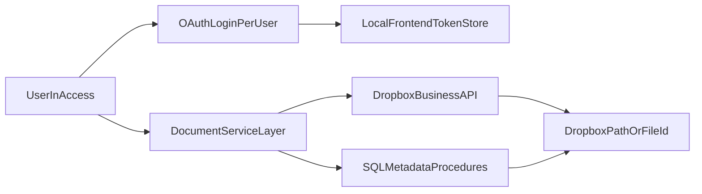

# TBCMS Dropbox Business Migration Plan

## Objectives
- Replace local/shared-folder document operations with Dropbox API operations in TBCMS.
- Require each user to authenticate with their own Dropbox Business account.
- Keep current business workflows (open folder/file, scan save, invoice PDF save, close/reopen case moves) while improving auditability and reducing shared-drive dependency.

## Current-State Findings (from codebase)
- Core file-management logic is centralized in [`C:/GitHub/TateByWater-DocumentManagement/msaccess/TBCMS/extract/vba/modules/DocumentManagement.txt`](C:/GitHub/TateByWater-DocumentManagement/msaccess/TBCMS/extract/vba/modules/DocumentManagement.txt).
- Main UI entry points for document actions are in [`C:/GitHub/TateByWater-DocumentManagement/msaccess/TBCMS/extract/vba/forms/frmClientLedger.txt`](C:/GitHub/TateByWater-DocumentManagement/msaccess/TBCMS/extract/vba/forms/frmClientLedger.txt) and related forms (invoice/intake/provider modules).
- Current implementation stores and opens local/UNC full file paths via SQL procedures (`spSaveCaseDocument`, `spGetCaseDocument`) and uses `FileCopy`, `Dir`, `FollowHyperlink`, and `Scripting.FileSystemObject`.
- Your POC in [`C:/GitHub/TateByWater-DocumentManagement/database_assessment/DropboxPOC/vba_code/DropboxAPI_POC.bas`](C:/GitHub/TateByWater-DocumentManagement/database_assessment/DropboxPOC/vba_code/DropboxAPI_POC.bas) provides a strong OAuth + API baseline, but is currently single-identity/global-token oriented.

## Target Architecture

## Design Decisions (confirmed)
- Integration mode: API-native Dropbox operations (not filesystem sync dependency).
- Token scope: per-user tokens stored in each user’s local Access frontend.
- Migration style: phased rollout with feature flags and fallback.

## Implementation Phases

### Phase 1: Discovery, Mapping, and Contract Freeze
- Inventory every document workflow and map each to Access entry points and SQL metadata contract:
  - Open folder/file
  - Scan upload/save-as
  - Invoice PDF generation and save
  - Case close/reopen document move/copy
- Freeze metadata contract updates required for Dropbox references (path/ID/link strategy).
- Produce source-to-target mapping for `DocumentType` folder conventions currently returned by SQL procedures.

### Phase 2: Data Model and Config Foundation
- Introduce Dropbox metadata model (in backend) for canonical references:
  - Dropbox logical path and/or file ID per case document
  - Optional revision/hash, content type, size, modified timestamp
- Keep local frontend per-user auth tables (token/config/log) from POC pattern, but harden for production:
  - User-scoped token load/save only
  - Explicit token lifecycle statuses (active/expired/revoked)
  - Remove global "deactivate all tokens" behavior
- Add environment/config table(s) for tenant settings (team root path, app key, redirect URI).

### Phase 3: Dropbox Service Module Hardening
- Create production `DropboxService` module based on POC with:
  - OAuth with `state` validation
  - Token refresh using returned expiry metadata
  - Centralized API wrapper with retry (`429` + `Retry-After`) and standardized error translation
  - Structured logging (without token leakage)
- Support required operations for TBCMS flows:
  - Upload/overwrite
  - Download to temp local file
  - Create folder hierarchy
  - Move/copy/delete (for case status changes)
  - Generate temporary shared links when required for viewing/opening

### Phase 4: Document Management Compatibility Layer
- Refactor `DocumentManagement` into a provider-based layer:
  - Legacy provider (existing filesystem behavior)
  - Dropbox provider (new API-native behavior)
- Add feature flag toggle at runtime (`StorageProvider = Local|Dropbox|Hybrid`) to allow controlled rollout.
- Ensure existing callers in forms keep stable signatures where possible to minimize UI churn.

### Phase 5: Workflow-by-Workflow Migration
- Migrate and validate in this order:
  1. Open document file/folder actions
  2. Scan save flow (`SaveScannedFileAs` equivalent)
  3. Invoice PDF save + metadata persistence
  4. Case close/reopen move/copy operations
  5. Intake and provider-specialized document flows
- For each workflow, implement:
  - Dropbox path normalization
  - Duplicate/conflict policy
  - User-facing failure messaging and retry guidance

### Phase 6: Security, Access Control, and Governance
- Enforce least-privilege Dropbox app scopes and document required admin setup in Dropbox Business.
- Define authorization boundary:
  - Each user authenticates with own Dropbox identity
  - Access is controlled by Dropbox Business shared-folder permissions
- Add audit trail for critical actions (upload, move, delete, open-link generation).
- Validate token-at-rest protection approach in local frontend and lock down frontend distribution/update process.

### Phase 7: Pilot, Cutover, and Rollback
- Run pilot with a small user group and selected document types/cases.
- Execute controlled backfill/migration for existing references (UNC/local paths -> Dropbox references).
- Define cutover checklist:
  - OAuth onboarding complete
  - Smoke tests pass by role
  - Helpdesk runbook available
- Keep rollback mode available via provider flag during stabilization window.

## Testing Strategy
- Unit-level VBA tests for path mapping, token lifecycle, and API error handling.
- Integration tests against Dropbox sandbox/team test area:
  - auth, upload/download, move/copy, link open
- UAT scripts for legal operations scenarios:
  - case lifecycle transitions, invoice generation, scanned docs retrieval.
- Non-functional checks:
  - concurrent users
  - network interruption/retry
  - token expiry mid-operation

## Risks and Mitigations
- Token mix-up across users -> local frontend token store + explicit identity checks at startup.
- Broken legacy links after migration -> compatibility layer + phased metadata migration with verification reports.
- API throttling/network instability -> centralized retry/backoff and resumable operator guidance.
- Permission mismatches in Dropbox Business -> pre-cutover permission matrix validation by team/role.

## Deliverables
- Architecture/design doc for Dropbox integration in TBCMS.
- Hardened `DropboxService` VBA module and provider abstraction in `DocumentManagement`.
- SQL/metadata migration scripts and verification query pack.
- Admin/user runbooks for OAuth onboarding, troubleshooting, and rollback.
- Pilot sign-off report with go-live checklist.
